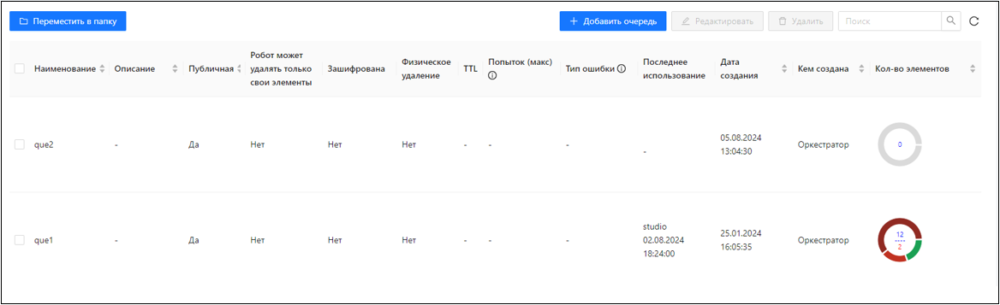
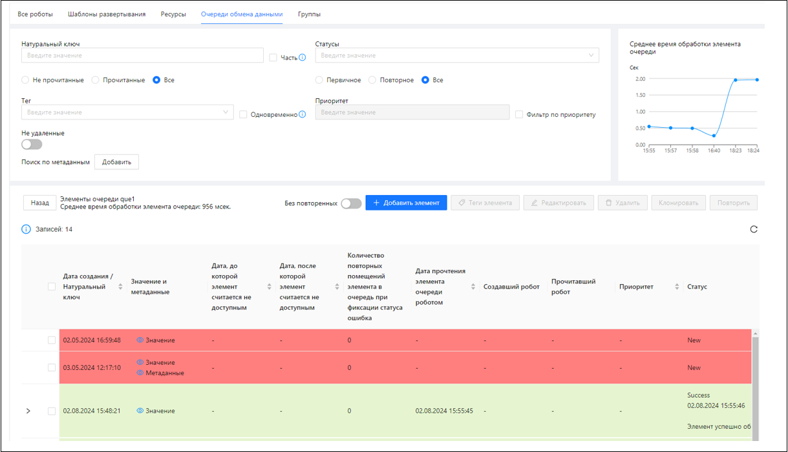
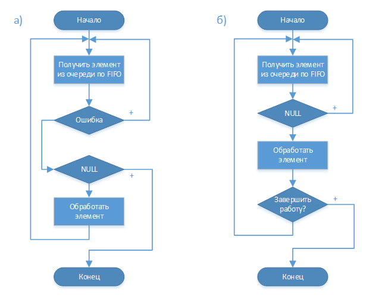
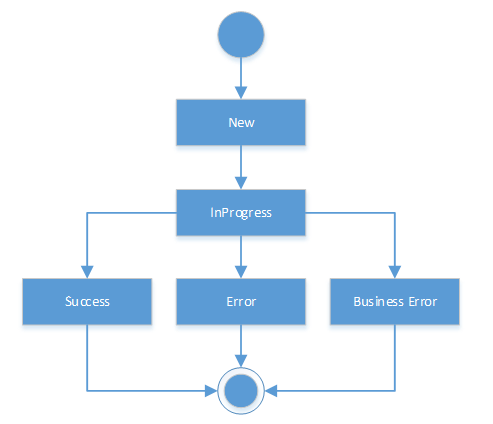

# Очереди обмена данными

Очереди обмена данными – это структуры данных в базе данных Оркестратора, использующие принцип «первым пришёл – первым обслужен» (FIFO)\*. Используются для организации коммуникации Роботов при выполнении RPA-проектов. 

>\* - *Изначальная реализация. В настоящей версии подход расширен. В частности, политику FIFO можно не использовать – можно использовать метод «чтение по фильтру с блокировкой» для Роботов, который обеспечивает логику «прочитать может только один»*

Данная структура может использоваться без FIFO:  
Робот может обратиться в очередь напрямую по ключу элемента – извлечь или удалить элемент, изменить у извлеченного элемента его статус.
Читать элементы по фильтру списком, в том числе с чекаутом. Чтение с чекаутом гарантирует, что больше никто не сможет прочитать прочитанные элементы очереди. Этот механизм можно считать примерным аналогом FIFO, только для множественного извлечения элементов из очереди и с более оптимальным использованием блокировок в БД.

Элементы очереди обмена данными:

Для создания очереди обмена данными нужно на вкладке **Роботы/Очереди обмена данными** нажать на кнопку **Добавить очередь»**.

Очередь обмена данными может создаваться с настройками (см. таблицу ниже), определяющими её поведение:

| №п/п | Наименование | Описание |
| --- | --- | --- |
| 1. | Время жизни элемента очереди (сек.) | Время, после которого элемент принудительно удаляется из очереди |
| 2. | Максимальное количество попыток поставить элемент в очередь повторно | Когда элемент очереди получает статус **Завершилось с ошибкой общего вида** или **Завершилось с бизнес-ошибкой**, он ставится в очередь по FIFO повторно. После превышения этого значения элемент в очередь повторно не ставится |
| 3. | На какие ошибки элемент должен ставиться в очередь повторно | **Завершилось с ошибкой общего вида** или **Завершилось с бизнес-ошибкой** |
| 4. | Specific JSON Schema | JSON-схемы, которым должен соответствовать элемент очереди |
| 5. | Output JSON Schema |
| 6. | Analytics JSON Schema |
| 7. | Робот может удалять только свои элементы | Робот по ключу сможет удалить только те элементы, которые он сам поместил в очередь |
| 8. | Публичная | Доступна либо всем роботам, либо только перечисленным |
| 9. | Зашифрована | Элементы очереди будут зашифрованы в БД. Если потом при редактировании очереди снять этот флаг, новые элементы останутся незашифрованными |
| 10. | Физическое удаление | Определяет, как элемент будет удален из очереди. Если логически, то они остаются в БД, их можно видеть в UI Оркестратора |
| 11. | Кол-во попыток при извлечении элемента по FIFO | Чтобы можно было обрабатывать очередь по схеме (принятие решения о завершении не показано), где возврат NULL означает пустую очередь (рисунок "а" ниже).В общем случае обработка очереди при получении NULL должна проходить с повторами получения (обработка ошибок не показана) элемента на стороне клиента (рисунок "б" ниже). |

Общие схемы алгоритмов для обработки очереди:

> Решение о терминальности статуса Success/Error/Busines Error принимается клиентом. В истории статусов может быть более одного элемента.

С дополнительными параметрами могут создаваться также элементы очереди:

| №п/п | Наименование | Описание |
| --- | --- | --- |
| 1. | Натуральный ключ | Содержательный идентификатор элемента очереди. Может быть глобальным в пределах очереди, в пределах всех очередей или уникальность может отсутствовать |
| 2. | Метаданные | Словарь *Ключ-значение* с произвольными строковыми данными. При обновлении метаданные полностью переписываются |
| 3. | Дата, до которой элемент считается не доступным |  |
| 4. | Дата, после которой элемент считается не доступным |  |
| 5. | Статус элемента очереди | Текущий статус элемента в истории его статусов: **Успешно**, **Ошибка общего вида**, **Бизнес-ошибка**. В UI статусы отображаются следующим образом (см. рисунок ниже): **New** – элемент добавлен в очередь, еще не извлечен; **In Progress** – элемент извлечен из очереди; **Success** – обработка элемента завершена успешно; **Error** – обработка элемента завершена с ошибкой общего вида; **Business Error** – обработка элемента завершена с бизнес-ошибкой. |
| 6. | Теги | Произвольные строки, по которым может осуществляться поиск элементов |
| 7. | Приоритет | См. статью ДОБАВИТЬ ССЫЛКУ [Сценарии работы основного пользователя]() |

Элементы очереди можно удалять, клонировать и повторять.  
При клонировании и повторении элементы снова ставятся в очередь:
* При клонировании элемента в очереди создается новый элемент (с новым идентификатором) со статусом *Новый*, полностью аналогичный оригиналу, но с нулевым счетчиком повторов.
* При повторении элемента у него сбрасывается признак прочтения (элемент переходит в состояние *Новый*), ссылка на текущий статус и счетчик повторов. Физически – это тот же самый элемент (не меняется идентификатор).

По событиям, связанным с работой роботов с очередью, вычисляется статистика по очереди – количество элементов очереди в разных статусах и график среднего времени (по окну) обработки элемента очереди роботом (разница времени прочтения элемента и проставления ему финального статуса).   

