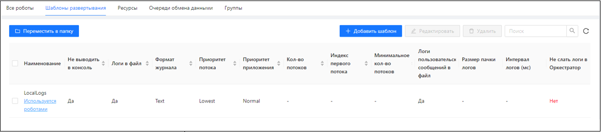
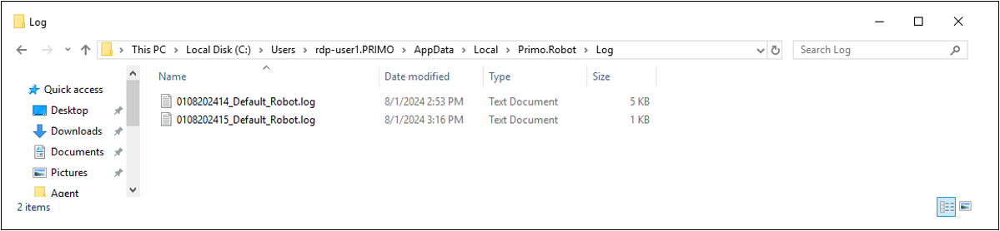
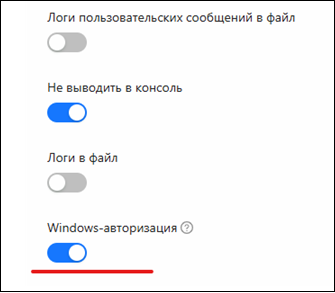

# Шаблоны развертывания

При развертывании робота можно указать различные параметры\*, которые будут определять его работу. 
Чтобы это не делать каждый раз для типовых случаев, все параметры можно сохранить как шаблон развертывания, и в дальнейшем указывать шаблон при развертывании робота на машине робота. 

>\* - *См. руководство пользователя Primo RPA Robot*

Для создания шаблона развертывания нужно на вкладке **Роботы/Шаблоны развертывания** нажать на кнопку **Добавить шаблон**: 

В частности, при помощи шаблонов развертывания настраивается локальное (в папку на машине робота) логирование робота. 
По умолчанию локальное логирование робота отключено. 
При включенном локальном логировании робот пишет логи в тестовые файлы в папке пользователя `C:/Users/{User}/AppData/Local/Primo.Robot/Log`:

Также, при помощи шаблона развертывания можно указать роботу, что робот должен авторизоваться в Оркестраторе под AD учетной записью – той самой, под которой для робота открывается RDP-сессия\*:

> \* - Начиная с версии 1.24.10.5, только для Windows.
