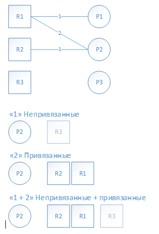
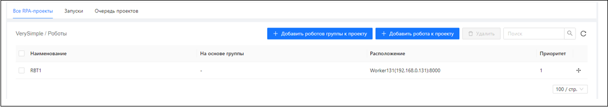
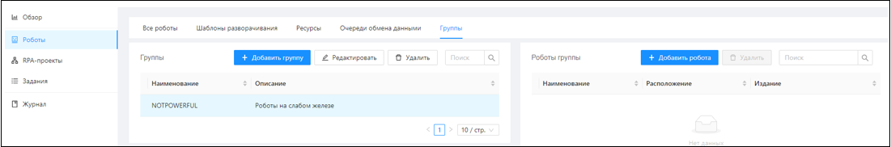

# Привязка Роботов к RPA-проекту, группы Роботов

Помещенный в очередь на выполнение RPA-проект назначается Роботу в зависимости от стратегии.

Стратегии назначения Роботов на выполнение RPA-проекта:

| №п/п | Наименование | Описание |
| --- | --- | --- |
| 1. | Проект могут выполнять роботы, не привязанные ни к какому проекту | Если робот не привязан ни к какому RPA-проекту, он может выполнять любой RPA-проект, если в настоящий момент свободен |
| 2. | Проект могут выполнять только роботы, привязанные к проекту | Если робот не привязан к RPA-проекту, он не может выполнять этот проект, даже если в настоящий момент робот свободен |

Возможны варианты «1», «2», «1 + 2»

Например, робот R1 привязан к проектам P1 и P2 с приоритетом 1 и 2 соответственно, робот R2 привязан к проекту P2, робот R3 не привязан ни к какому проекту:

На проект P2:
* Для стратегии «1» будет рассматриваться только робот R3.
* Для стратегии «2» будет рассматриваться сначала робот R2, потом R1.
* Для стратегии «1 + 2» будет рассматриваться сначала робот R2, потом R1, потом R3 (сначала отрабатывает стратегия «2»).

Стратегия назначения роботов на выполнение RPA-проекта настраивается администратором Оркестратора.

Привязка Роботов к RPA-проекту осуществляется на вкладке **RPA-проекты/Все RPA-проекты**. По кнопке **Все роботы проекта** откроется форма, на которой можно массово привязать роботов на основе принадлежности их к некоторой группе роботов (кнопка **Добавить роботов группы к проекту**), или индивидуально (кнопка **Добавить робота к проекту**):

У привязанных роботов назначается приоритет, согласно которому они будут рассматриваться как кандидаты на выполнение задания.
Создание групп роботов и привязка роботов к группам происходит на вкладке **Роботы/Группы**: 

