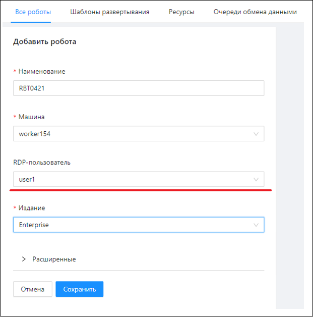
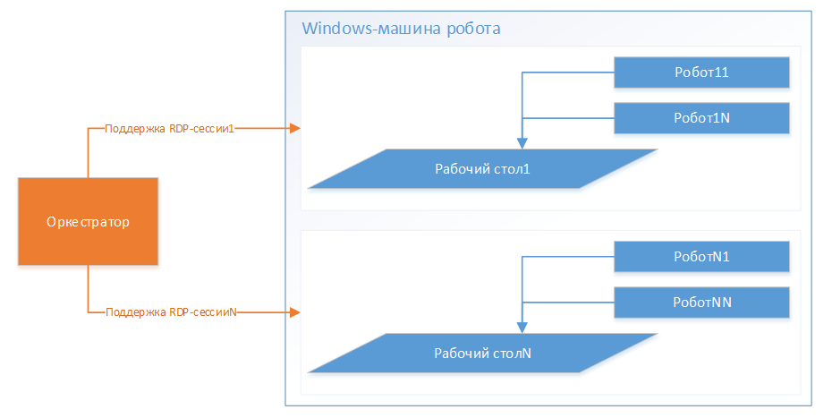
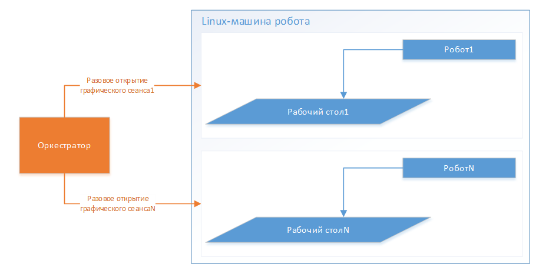

# Привязка пользователя к роботу (RDP-пользователя для Windows или пользователя графического сеанса для Linux)

Робота нужно привязать к пользователю при развертывании:

Каждую RDP-сессию (для Windows-машин) можно образно рассматривать как «отдельную машину робота»:

Роботы (их может быть одновременно несколько в одной сессии), работающие в разных RDP-сессиях, не зависят от рабочего стола друг друга.

Каждый графический сеанс (для Linux-машин) можно образно рассматривать как «отдельную машину робота с ровно одним роботом»:

**Для Windows-машин**:  

Если к роботу привязан RDP-пользователь, RDP-сессия автоматически открывается и поддерживается Оркестратором, пока все использующие эту RDP-сессию Роботы не отработают свои задания (если RPA-проект внесен в Оркестратор с флагом «Закрыть RDP-сессию»). После этого RDP-сессия после небольшой задержки автоматически закрывается Оркестратором, отключенный от RDP-сессии пользователь автоматически разлогинивается из системы.

**:bangbang: Подглядывать за работающим в RDP-сессии роботом можно только при помощи теневой RDP-сессии!!! (см. статью [Настройка теневого подключения к сессии робота](https://docs.primo-rpa.ru/primo-rpa/orchestrator-new/install/windows/additional-components-win/shadow-session-win)). Обычную RDP-сессию использовать нельзя, так как выполняющийся робот останется без RDP-сессии, что сломает его работу.**

**Для Linux-машин**:  

Графический сеанс открывается разово Агентом Оркестратора. Не требует внешней поддержки. Сеанс завершается после того, как робот отработает\*.

>\* - *Графический сеанс – виртуальный, существует, пока есть кого обслуживать. Когда процесс робота завершается, завершается автоматически и сеанс.*
