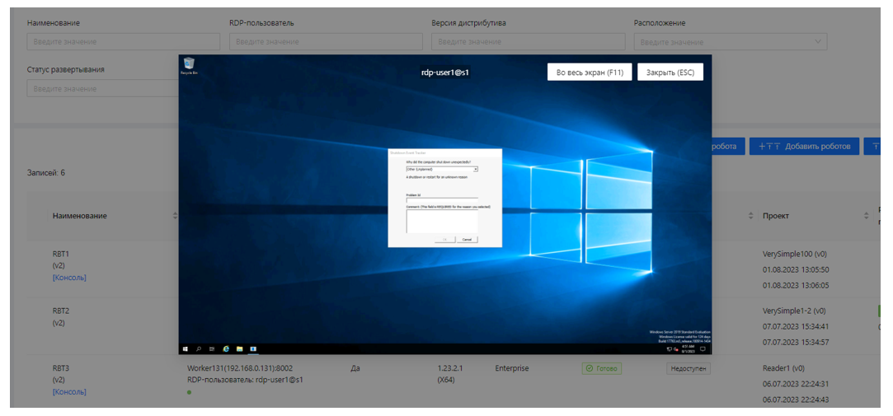
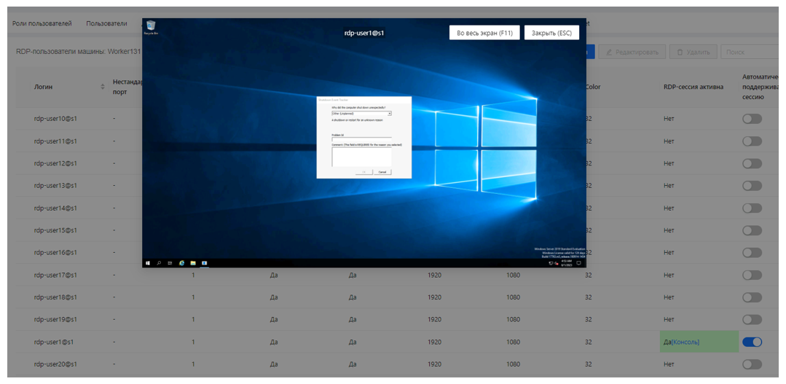

# Просмотр RDP-сессии (только для Windows-машин)

Просмотр активной RDP-сессии RDP-пользователя робота можно выполнить на странице Оркестратора **Роботы/Все роботы** по кнопке **Консоль**:

Также просмотр активной RDP-сессии RDP-пользователя доступен на странице **Машины роботов/RDP-пользователи**:

