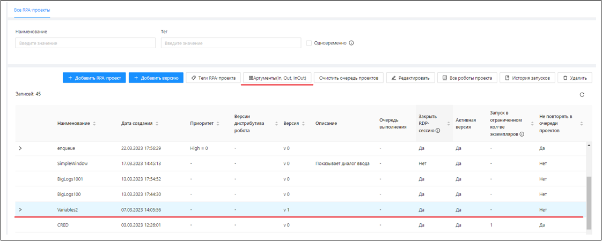
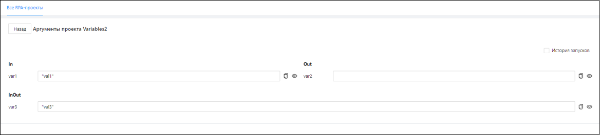
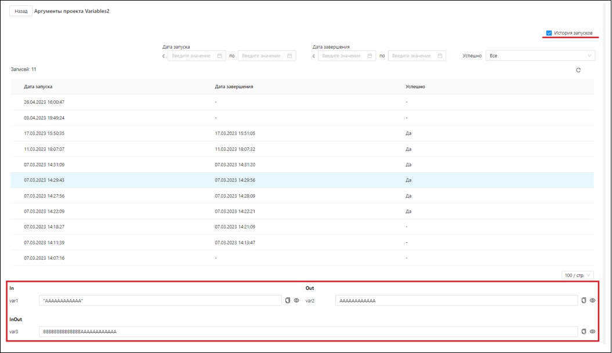
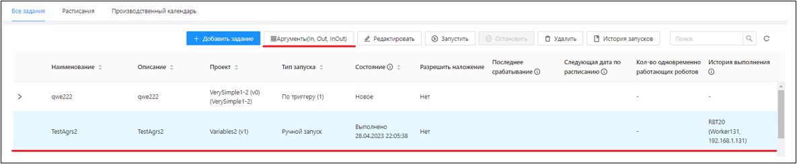
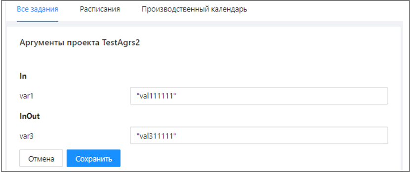

# Запуск через задания RPA-проектов с аргументами

Аргументы у проекта устанавливаются в Студии. В Оркестратор они автоматически загружаются вместе с архивом RPA-проекта. 
Подробнее об этом можно узнать в статье [Использование аргументов в Оркестраторе](https://docs.primo-rpa.ru/primo-rpa/primo-studio/process/args#argumenty-orkestratora).

Если у RPA-проекта есть аргументы, кнопка **Аргументы** становится активной:

По кнопке **Аргументы** отображаются все аргументы RPA-проекта со значениями (у входных и входных-выходных) по умолчанию:

Чтобы увидеть значения аргументов, которые были заданы в Оркестраторе (для входных/входных-выходных) до запуска проекта и получены от робота (для выходных/входных-выходных) после его завершения/в процессе работы, нужно установить галочку **История запусков**:

Для задания, которое запускает RPA-проект с аргументами, значения аргументов (входных/входных-выходных) задаются по кнопке **Аргументы**:

По этой кнопке откроется форма задания значений аргументов RPA-проектов для задания:

