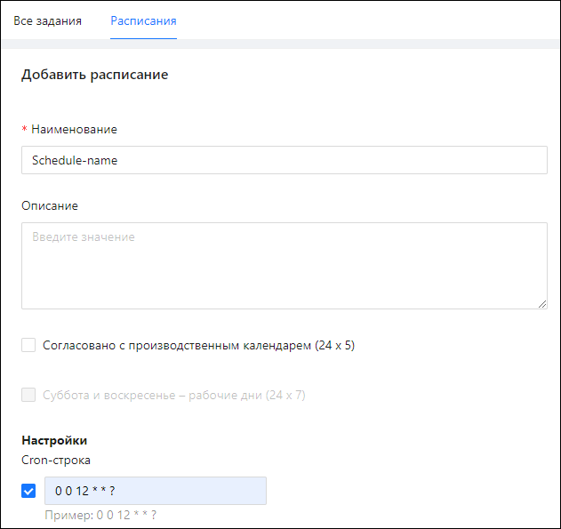
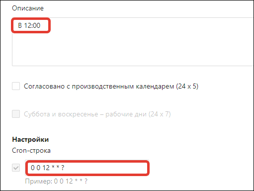

# Расписания

Расписания используются для выполнения заданий с триггером [**Запуск по расписанию**](https://docs.primo-rpa.ru/primo-rpa/orchestrator/orchestrator-user/tasks-overview#triggery). Прежде чем создать такое задание, пользователю необходимо добавить расписание в систему.

Для создания расписания перейдите в раздел **Задания > Расписания** и нажмите кнопку **Добавить расписание**:

Укажите название расписания и необходимые настройки запуска. Название должно состоять только из латинских букв и цифр, дефиса, символа подчеркивания и точки.

Отдельного внимания требуют настройки ниже.

### 1. **CRON-СТРОКА**

Чтобы правильно заполнить **Cron-строку**, изучите поддерживаемый формат, который приведен ниже. Для создания расписания используется библиотека [Quartz](https://www.quartz-scheduler.net/documentation/quartz-3.x/tutorial/crontriggers.html). Для удобства также можно воспользоваться [генератором cron-выражений](https://www.freeformatter.com/cron-expression-generator-quartz.html).

> *Формат cron-строки Quartz похож на формат UNIX, но имеет несколько значимых отличий. Одно из них заключается в том, что Quartz-формат поддерживает расписание с точностью до секунды, тогда как UNIX поддерживает расписания только до минуты. Также запуск можно построить на приращениях (например, каждые 45 секунд).*

Шаблон **cron-строки** Quartz состоит из 6 полей, разделенных пробелом, и имеет вид: `* * * * * *`, где:
   
    1) * - секунды (0-59). Разрешенные символы: , - * /
    2) * - минуты (0-59). Разрешенные символы: , - * /
    3) * - часы (0-23). Разрешенные символы: , - * /
    4) * - день месяца (1-31). Разрешенные символы: , - * ? / L W
    5) * - месяц (1-12). Разрешенные символы: , - * /
    6) * - день недели (1-7 или SUN-SAT). Разрешенные символы: , - * ? / L #
 
**Пример заполнения**: `0 0 12 * * ?` - задание будет запускаться каждый день с полудня.

**Примечания**:

* При установке символа `*` в одном из полей будет использоваться каждое возможное значение этого поля. Например, если в поле **Секунды** установлена `*`, то задание будет запускаться каждую секунду.

* Установка знака `?` допускается для полей **День месяца** или **День недели**. Он означает, что в поле **Нет конкретного значения**. Знак полезен в том случае, когда нужно указать значение только в одном из двух полей.

* Символ `/` используется для указания приращения значений. Например, если вы укажете `0/15` в поле **Минуты**, это означает, что задание будет запускаться **каждые 15 минут, начиная с нулевой минуты**. Если указать `3/20`, то запуск будет производиться **каждые 20 минут в течение часа, начиная с третьей минуты**.
* Подробнее об использовании других символов можно прочесть в [документации Quartz](https://www.quartz-scheduler.net/documentation/quartz-3.x/tutorial/crontriggers.html#cron-expressions).
* При создании расписания через cron-строку в поле **Описание** (если оно пустое) будет автоматически сформирована расшифровка созданного расписания. Если же пользователь ранее заполнил поле **Описание**, то введенное им описание останется без изменений и не будет перезаписано после изменения cron-строки. Пример автоматического заполнения расшифровки:

  

### 2. **Согласование с производственным календарем**

Расписание можно связать с производственным календарем. В этом случае задание не будет запускаться в выходные и праздничные дни, обозначенные в этом календаре.

Чтобы привязать расписание к производственному календарю, установите чекбокс **Согласовано с производственным календарем (24 x 5)**. Если вы хотите, чтобы задание автоматически запускалось в субботу и воскресенье, то дополнительно установите чекбокс **Суббота и воскресенье – рабочие дни (24 x 7)**.

:small_orange_diamond: *Если указанные параметры неактивны, это означает, что пользователь с административными правами не добавил производственный календарь в Оркестратор. Обратитесь к ответственному лицу для решения этого вопроса.*

В случае, если в Оркестраторе используется режим множественных производственных календарей, то с каждым расписанием можно связать индивидуальный календарь. Особенность таких календарей заключается в том, что их может быть несколько на один календарный год. Подробнее о том, как создаются множественные календари, читайте в разделе [Производственный календарь](https://docs.primo-rpa.ru/primo-rpa/orchestrator/orchestrator-admin/calendar).

После указания всех настроек, не забудьте сохранить изменения.

:white_check_mark: **Результат**: готовое расписание добавится в справочник и станет доступным для выбора при создании задания по расписанию.
