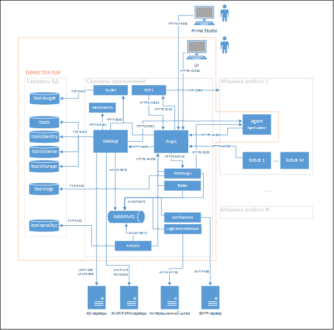

# Компоненты системы

На схеме ниже приведены компоненты Оркестратора и их связи между собой, со Студией, роботами и внешними сервисами\*. 

> \* *Распределение по машинам серверной части может отличаться в зависимости от комплекта поставки и/или принятых в организации решений по развертыванию Системы. Некоторые сервисы не показаны на рисунке.*

Оркестратор содержит следующие компоненты (подсистемы):

1.	**Серверы БД** (PostgreSQL 13 или MS SQL SERVER 2016+):
    * Основная БД с настройками/ресурсами Оркестратора – ltools (здесь и далее физическое название БД, которое используется в конфигурационных файлах).
    * БД с пользователями и правами – ltoolsidentity.
    * БД с лицензиями – ltoolslicense.
    * БД с логом событий – ltoolslogs.
    * БД NuGet-сервера – ltoolsnuget.
    * БД репозитория Ltw-файлов – ltoolsltwrepo.
    * Аналитическая БД – ltoolsanalytic.
2. **Серверы приложений**:
    * WebApi – REST веб-API.
    * NuGet-сервер.
    * RDP2 – служба для поддержки активных RDP-сессий для Windows-роботов. Также может использоваться для трансляции активных RDP-сессий в UI.
    * MachineInfo – служба определения параметров оборудования для работы с лицензиями.
    * Front – веб-сервер для отдачи статического контента (UI администрирования в браузере, SPA) и реверс-прокси для WebApi, RobotLogs, NuGet и RDP2 (Nginx или IIS).
    * States – служба вычисления системных состояний.
    * Notification – служба для рассылки уведомлений на email.
    * Analytic - служба сбора и предоставления аналитики по событиям Оркестратора.
    * RobotLogs – служба приема логов от Роботов и от Оркестратора. 
    * LogEventsWebhook – служба интеграции логов посредством веб-хуков\*.
    * RabbitMQ – брокер очередей сообщений.
3. **Агент Оркестратора**. Agent устанавливается на машине Робота как служба и используется для управления Роботом\*\* и машиной Робота (логически является автономным продолжением Оркестратора на машине Робота). 
Если одна машина Робота делится между несколькими тенантами, то для каждого тенанта устанавливается отдельный Агент на своем порту (5002, 5003, ...).
Для автоматического обновления агента используется утилита AgentUpdater (автоматически скачивается с узла WebApi).
4. **Программа для шифрования паролей в конфигурационных файлах**.

>  \* - Заказчик самостоятельно в соответствии со спецификацией разрабатывает интеграционный шлюз.  
>  \*\* - Не входит в комплект поставки, скачивается отдельно по предоставляемому вендором адресу.  

БД обязательно требуется развернуть на отдельной машине. Также, требуется БД ltoolslogs развернуть на отдельной машине от всех остальных БД, так как эта БД наиболее нагружена, настроить секционирование. 
Логи желательно сбрасывать в отдельное долговременное хранилище, например, через Logstash в ElasticSearch (на отдельном сервере) и периодически удалять из БД.

Робот – приложение\*, которое посредством Оркестратора разворачивается на специальным образом настроенной машине Робота и выполняет RPA-проект, который формируется заранее в Студии\*.

> \* - Робот и Студия не входят в комплект поставки Оркестратора.

На одной машине может работать несколько Роботов. Все машины Роботов должны быть настроены одинаково (версии ОС могут отличаться) и на каждой машине Робота должен быть установлен и настроен Agent. 
Машин Роботов может быть много.

Указанные на иллюстрации выше порты далее используются при настройке конфигурационных файлов компонентов Оркестратора, машин Роботов и открытия портов на файерволе (в том числе аппаратном в сети организации).
Перед установкой Оркестратора нужна (желательно\*) чистая  машина с последними обновлениями. И на неё должна быть скопирована папка с комплектом поставки. 
Это может быть любая папка, для определенности, пусть будет папка C:\Install (полный путь зависит от ОС).

> \* - Чтобы не возникло конфликтов занятых портов, файлов и т.п.

Для развертывания компонентов под OC Windows требуется PowerShell 7.1.3+. 

Для выполнения команд и скриптов cmd и PowerShell в ОС Windows должны запускаться из-под Администратора. В OC *nix под root (sudo).

## Дополнительно

#### Grafana

В [комплект поставки](https://docs.primo-rpa.ru/primo-rpa/orchestrator/orchestrator-sys-admin/deployment/kit) также включена внешняя аналитическая система Grafana, 
которая технически не является компонентом Оркестратора. Ее стоит рассматривать как стороннее средство для получения/визуализации аналитики 
по работе Оркестратора. Может быть заменена на любое аналогичное средство. Инструкция по установке Grafana приведена в статьях [**Установка и настройка Grafana под Windows 2016 Server**](https://docs.primo-rpa.ru/primo-rpa/orchestrator/orchestrator-sys-admin/install/windows/additional-components-win/grafana-win) и 
[**Установка и настройка Grafana под CentOS 8**](https://docs.primo-rpa.ru/primo-rpa/orchestrator/orchestrator-sys-admin/install/linux/additional-components-linux/grafana-linux-centos).

#### SMTP-сервер

Оркестратор может выполнять почтовую рассылку о событиях. Для этого он должен быть настроен для подключения к SMTP-серверу организации.

#### POP3/IMAP-сервер

Оркестратор может выполнять чтение писем для срабатывания триггеров заданий. Для этого он должен быть настроен для подключения к POP3/IMAP-серверам организации или MS Exchange Server.

:bangbang: **Системное время всех серверов должно быть синхронизировано**
