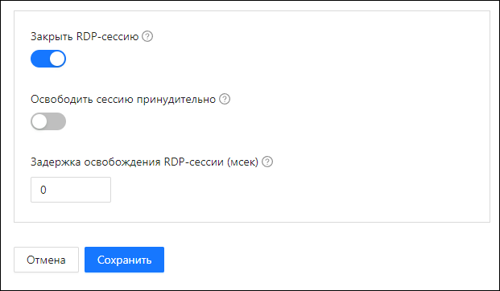

# Добавление RPA-проекта 

Добавить RPA-проект в Оркестратор можно, используя [инструменты Студии](https://docs.primo-rpa.ru/primo-rpa/primo-studio/projects/publish) или Оркестратора. Публикация через Оркестратор чаще всего применяется, если есть одно из ограничений:
* отсутствует издание Primo RPA Studio Enterprise (установлена Studio Community);
* нет прямого доступа к Студии;
* требуется удалить ненужные файлы из проекта перед тем, как загрузить его в Оркестратор.

## Публикация в Оркестраторе

### Предварительные условия

* RPA-проект должен быть [упакован](https://docs.primo-rpa.ru/primo-rpa/primo-studio/projects/publish#publikaciya-v-orkestratore) в ZIP-архив.
* Пользователь, который собирается добавить проект, должен иметь права на создание RPA-проекта. Права назначаются администратором в настройках [роли](https://docs.primo-rpa.ru/primo-rpa/orchestrator/settings/users/roles) этого пользователя.

### Как добавить проект

1. Перейдите в раздел **RPA-проекты > Все RPA-проекты**.
2. Нажмите кнопку **Добавить RPA-проект**.

3. Заполните форму с настройками проекта. Все обязательные поля отмечены символом `*`, остальные заполняются по желанию. Подробное описание параметров см. ниже.

4. Нажмите кнопку **Сохранить**, чтобы добавить сконфигурированный проект в Оркестратор.   

### Параметры проекта

#### Общие:
1. **Архив (zip)**\* - архив RPA-проекта. Нажмите на иконку, чтобы выбрать файл. Для приложенного проекта, в поле ниже, отобразится список процессов. Укажите стартовый процесс.

    

1. **Наименование**\* - название проекта, которое будет отображаться в Оркестраторе. Пробелы не допускаются. Разрешены буквы, цифры, дефис, символ подчеркивания и точки. Возможно использовать одинаковые названия проектов в разных тенантах.
1. **Описание** - краткое описание проекта для отображения в Оркестраторе. 
1. **Разрядность**\* - разрядность роботов, которые могут быть назначены на выполнение проекта. По умолчанию x64.
1. **Приоритет** - определяет порядок выхода проекта из очереди проектов. Проект может попасть в очередь, если при его запуске не был найден подходящий робот или лицензия. С версии 23.11 отображение значений в параметре зависит от используемого типа очереди: [на основе RabbitMQ](https://docs.primo-rpa.ru/primo-rpa/orchestrator/deployment/fine-tuning/project-queue#ochered-na-osnove-rabbitmq) или [на основе опроса БД](https://docs.primo-rpa.ru/primo-rpa/orchestrator/deployment/fine-tuning/project-queue#ochered-na-osnove-oprosa-bd). Система сама проверяет тип и выводит соответствующие значения в выпадающем списке.
   
   :white_medium_small_square: ***Очередь на основе RabbitMQ:*** приоритетность определяется временем задержки проекта в очереди ожидания (t). Высший приоритет будет иметь значение с минимальным временем задержки. Рассмотрим пример ниже:

   
   
   * P1 (t = 3) - высший приоритет, поскольку время задержки составляет 3 секунды. Время, отображаемое в скобках, берется системой из конфигурационного файла WebApi, и в вашем случае может быть другим. 
   * P2 (t = 7) - средний приоритет, поскольку время задержки составляет 7 секунд.
   * P3 (t = 20) - низкий приоритет, поскольку время задержки максимальное из всех представленных - 20 секунд.

   :white_medium_small_square: ***Очередь на основе опроса БД:*** проекты выходят из очереди на основе сортировки в БД. Приоритет определяет порядок этой сортировки. Доступные значения: 

    
   
    * High - высокий приоритет (0). Проекты с приоритетом High первыми выходят из очереди.
    * Medium - средний приоритет (1);
    * Low - низкий приоритет (2). 

1. **Использовать загрушки** - определяет, нужно ли применять [заглушки](https://docs.primo-rpa.ru/primo-rpa/g_elements/el_basic/testing/mock), если они добавлены в проект. По умолчанию не используются.

#### Конфигурация запуска проекта:
1. **Стандартная** - стандартная конфигурация запуска (_Workflow.RunConfig). Доступные значения:
   * отсутствует - по умолчанию;
   * отладка - проект запустится в режиме отладки;
   * релиз - проект запустится в режиме релиза.

   «Отладка» от «Релиза» отличается только названием, однако логика проекта может учитывать выбранную конфигурацию запуска. Например, при конфигурации отладки должно выполниться одно действие в сценарии, а при релизе другое. Пример: `if (_Workflow.RunConfig == "Debug") { что-то делаем }`. Если в логике не учитывается конфигурация, пропустите этот параметр.

1. **Специальная** - если нужно применить специальную конфигурацию (_Workflow.RunConfigCustom), укажите ее название в этом поле. Иначе оставьте пустым.
1. **Версии дистрибутива робота** - только роботы указанных версий будут считаться подходящими для выполнения проекта. 
1. **Запуск в ограниченном кол-ве экземпляров** - запуск по заданию будет пропущен, если проект уже выполняется в нескольких экземплярах (от 1 до N). ***Не распространяется на ручной запуск робота с проектом (не по заданию)!*** По умолчанию ограничение не установлено.
1. **Не повторять в очереди проектов** - настройка защищает от стремительного роста очереди проектов. Если установлена, то проект, который уже находится в очереди, не будет добавляться в нее повторно (в качестве нового экземпляра). По умолчанию отключена.

#### Параметры закрытия RDP-сессии:
1. **Закрыть RDP-сессию** - если чекбокс установлен, то при завершении проекта роботом RDP-сессия будет закрыта (при условии, что она больше не нужна).

    При активации этого чекбокса станут доступны настройки:
   * *Освободить сессию принудительно* - если включен, то робот, освобождая RDP-сессию, проигнорирует отсутствие признака освобождения RDP-сессии у других роботов. Следует использовать, только когда один робот освобождает RDP-сессию - иначе настройка может нарушить работу остальных роботов в этой RDP-сессии.
   * *Задержка освобождения RDP-сессии* - значение устанавливается в миллисекундах. Открытая RDP-сессия может быстро понадобиться другому роботу, задержка позволит не пересоздавать сессию заново.

   

