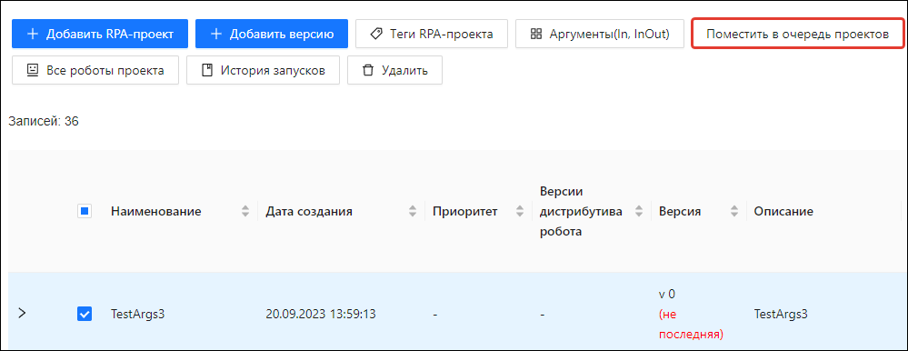

# Вручную поместить проект в очередь 

С версии Оркестратора 1.23.11 появилась возможность запускать проект вручную, не создавая для этого задание. Это альтернативный способ, который требует меньше пользовательских действий. Достаточно вручную выбрать один из загруженных проектов и поместить его в очередь на выполнение.

Кроме того, этот способ часто используется, чтобы вернуть в очередь проекты, которые были из нее удалены. Например, когда на пиках нагрузки оператор принял решение временно разгрузить очередь проектов.

## Как поместить проект в очередь

Чтобы вручную поместить RPA-проект в очередь проектов:

1. Перейдите на страницу **RPA-проекты > Все RPA-проекты**.
2. Выделите в таблице проект и нажмите кнопку **Поместить в очередь проектов**.

**Результат:**

Проект будет назначен первому подходящему для его выполнения роботу согласно [стратегии очереди проектов](https://docs.primo-rpa.ru/primo-rpa/orchestrator/settings/projects-queue). 
