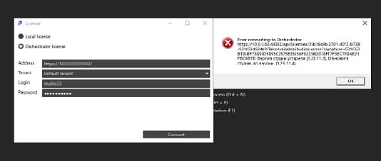

# Ограничение версии Студии 

С версии 1.23.9 появилась возможность устанавливать минимально допустимую версию Студии, которая имеет право получать лицензию из Оркестратора. Функция помогает снизить риск потенциальных ошибок, возникающих из-за несовместимости версий Студии и Оркестратора. Например, в случае, когда Студия устарела по отношению к Оркестратору.

Ограничение настраивается в конфигурационном файле WebApi в секции **StudioVersionChecker**.

Пример:

```
"StudioVersionChecker": {
    "MinimumStudioVersion": "", // "1.23.8.4",
    "StudioVersionExceptionBehaviorType": 1
  },
```

Если Студия не прошла проверку - ее версия оказалась меньше допустимой - то лицензию она не получит. Дальнейшее поведение Студии в этом случае является гибким и также зависит от настроек в конфиг-файле.

## Описание параметров

1. **MinimumStudioVersion** - минимально допустимая версия Студии. Строковое значение. Версия указывается в формате: `"1.23.8.4"`. Если значение не задано (пустая строка) – ограничение к версии Студии не применяется. 
2. **StudioVersionExceptionBehaviorType** - тип поведения Студии, если ее версия не проходит проверку при попытке получить лицензию у Оркестратора:
   * `0` – закрыть Студию без вывода пользователю какого-либо сообщения.
   * `1` – закрыть Студию, но перед этим вывести пользователю сообщение об ошибке.
   * `2` – не закрывать Студию, а только вывести пользователю сообщение об ошибке.
 

  Пример ошибки, которая отобразится пользователю в Студии:



