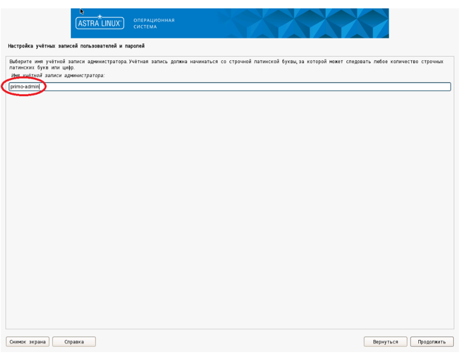

# Установка и настройка Агента версии 1.24.2.8 для Astra Linux 1.7

## Действия при установке Astra Linux 1.7

При установке машины робота под управлением Astra Linux 1.7 необходимо:

* на экране Настройка учётных записей и паролей создать пользователя-администратора (далее - primo-admin).



Для предоставления пользователю `primo-admin` необходимых прав после установки, выполните следующую команду:
```
[admin@astra-robot ~]$ sudo usermod -G cdrom,floppy,audio,dip,video,plugdev,netdev,lpadmin,astra-console,astra-admin primo-admin
```
Установка дополнительного ПО и создание дополнительных пользователей будет описана ниже.

## Настройка дополнительного ПО

1.	Выполните подключение машины робота к репозиториям `main`, `update`, `base` и `extended`.
Сами репозитории описаны в статье [Интернет-репозитории Astra Linux Special Edition x.7](https://wiki.astralinux.ru/pages/viewpage.action?pageId=158598882).
Настройка локальных зеркал этих репозиториев описана в статье [Создание репозиториев для операционной системы Astra Linux Special Edition x.7 в закрытом сегменте](https://wiki.astralinux.ru/pages/viewpage.action?pageId=199148426). 

**!!ВАЖНО!! Локальные репозитории необходимо выгружать на машине, имеющей доступ в Интернет.**

Рекомендуется выделить одну машину под управлением Astra Linux 1.7 для размещения на ней сервера репозиториев.

Для машины с доступом в Интернет файл `/etc/apt/sources.list` может выглядеть следующим образом:
```
deb https://download.astralinux.ru/astra/stable/1.7_x86-64/repository-main/ 1.7_x86-64 main contrib non-free
deb https://download.astralinux.ru/astra/stable/1.7_x86-64/repository-update/ 1.7_x86-64 main contrib non-free
deb https://download.astralinux.ru/astra/stable/1.7_x86-64/repository-base/ 1.7_x86-64 main contrib non-free
deb https://download.astralinux.ru/astra/stable/1.7_x86-64/repository-extended/ 1.7_x86-64 main contrib non-free
deb https://download.astralinux.ru/astra/stable/1.7_x86-64/repository-extended/ 1.7_x86-64 astra-ce
```
2.	Проверьте доступность репозиториев, используя следующую команду:
```
[primo-admin@astra-robot ~]$ sudo apt update
```
Репозитории `main`, `update`, `base` и `extended` должны присутствовать в выводе команды.

3.	Установите необходимое для работы робота ПО:
```
[primo-admin@astra-robot ~]$ sudo apt -y install at xvfb python3-numpy python3-opencv xdotool dotnet-sdk-6.0 graphicsmagick-imagemagick-compat
```
## Настройка учетной записи агента

Для работы агента оркестратора и роботов создайте общую группу:
```
[primo-admin@astra-robot ~]$ sudo groupadd primo-rpa
```
Для работы агента оркестратора создайте учётную запись:
```
[primo-admin@astra-robot ~]$ sudo useradd -g primo-rpa -m -s /bin/bash agent
```
Если необходимо, задайте пароль учётной записи:
```
[primo-admin@redos-robot ~]$ sudo passwd agent
Новый пароль : ***
Повторите ввод нового пароля : ***
passwd: пароль успешно обновлён
```
Начиная с версии 1.24.2.8 агент оркестратора может запускать роботов в одном из двух режимов: `atd` (классический) и `systemd` (современный). 
Классический режим рекомендуется использовать только для дистрибутивов Linux, не поддерживающих `systemd`. 
Так как дистрибутив Astra Linux 1.7 поддерживает `systemd`, то рекомендованным режимом запуска роботов для него является `systemd`.

### Режим запуска роботов `atd`

Для запуска заданий роботов без прав пользователя `root` файл `/etc/sudoers.d/primo-rpa-agent` должен выглядеть следующим образом:
```
agent ALL = (ALL) NOPASSWD: /usr/sbin/reboot
agent ALL = (%primo-rpa) NOPASSWD: /usr/bin/kill
agent ALL = (%primo-rpa) NOPASSWD: /usr/bin/at
```
Пояснения:
* первая строка разрешает пользователю `agent` запуск команды `/usr/sbin/reboot` с правами пользователя `root` без ввода пароля, то есть, позволяет агенту перезагрузить машину агента;
* вторая строка разрешает пользователю `agent` запуск команды `/usr/bin/kill` с правами любого пользователя из группы `primo-rpa` без ввода пароля, то есть, позволяет агенту завершить процесс любого робота;
* третья строка разрешает пользователю `agent` запуск команды `/usr/bin/at` с правами любого пользователя из группы `primo-rpa` без ввода пароля, то есть, позволяет агенту запустить робота с помощью службы `atd`.

**Внимание: Никаких других строк (кроме комментариев) в этом файле быть не должно!**

### Режим запуска роботов `systemd`

Для запуска заданий роботов без прав пользователя `root` файл `/etc/sudoers.d/primo-rpa-agent` должен выглядеть следующим образом:
```
agent ALL = (ALL) NOPASSWD: /usr/sbin/reboot
agent ALL = (%primo-rpa) NOPASSWD: /usr/bin/kill
agent ALL = (%primo-rpa) NOPASSWD:SETENV: /usr/bin/systemd-run -G --user --unit *
agent ALL = (%primo-rpa) NOPASSWD:SETENV: /usr/bin/systemctl --user stop *
agent ALL = (%primo-rpa) NOPASSWD: /usr/bin/loginctl enable-linger *
```
Пояснения:
* первая строка разрешает пользователю `agent` запуск команды `/usr/sbin/reboot` с правами пользователя `root` без ввода пароля, то есть, позволяет агенту перезагрузить машину агента;
* вторая строка разрешает пользователю `agent` запуск команды `/usr/bin/kill` с правами любого пользователя из группы `primo-rpa` без ввода пароля, то есть, позволяет агенту завершить процесс любого робота;
* третья строка разрешает пользователю `agent` запуск команды `/usr/bin/systemd-run` с правами любого пользователя из группы `primo-rpa` без ввода пароля, то есть, позволяет агенту запустить сеанс робота с помощью службы `systemd`;
* четвёртая строка разрешает пользователю `agent` запуск команды `/usr/bin/systemctl` с правами любого пользователя из группы `primo-rpa` без ввода пароля, то есть, позволяет агенту корректно остановить сеанс робота с помощью службы `systemd`;
* пятая строка разрешает пользователю `agent` запуск команды `/usr/bin/loginctl` с правами любого пользователя из группы `primo-rpa` без ввода пароля, то есть, позволяет агенту включить поддержку сеансов для робота.

**Внимание: Никаких других строк (кроме комментариев) в этом файле быть не должно!**

## Установка агента

Разворачивание файлов агента оркестратора на машине роботов (файл `Agent-linux.zip` должен находиться в каталоге `/srv/samba/shared/install`):
```
[primo-admin@astra-robot ~]$ sudo mkdir -p /opt/Primo/Agent /opt/Primo/AgentData /opt/LTools
[primo-admin@astra-robot ~]$ sudo unzip /srv/samba/shared/install/Agent-linux.zip -d /opt/Primo/Agent
[primo-admin@astra-robot ~]$ sudo chmod a+x /opt/Primo/Agent/Primo.Orchestrator.Agent /opt/Primo/Agent/LTools.Orchestrator.Agent.Runner
[primo-admin@astra-robot ~]$ sudo chown -R agent:primo-rpa /opt/Primo/Agent /opt/Primo/AgentData /opt/LTools
[primo-admin@astra-robot ~]$ sudo chmod -R g+w /opt/Primo/Agent /opt/Primo/AgentData /opt/LTools
```
Установите агент оркестратора как службу и настройте автозапуск:
```
[primo-admin@astra-robot ~]$ sudo cp /opt/Primo/Agent/Primo.Orchestrator.Agent.service /etc/systemd/system/
[primo-admin@astra-robot ~]$ sudo systemctl daemon-reload
[primo-admin@astra-robot ~]$ sudo systemctl enable /etc/systemd/system/Primo.Orchestrator.Agent.service
```
В конфигурационном файле `appsettings.ProdLinux.json` укажите адрес Оркестратора и TenantId (если эта машина не в тенанте по умолчанию) и пользователя из тенанта, а также адрес машины робота и режим запуска роботов:
```
  "Orchestrator": {
    "UserName": "agent",
    "Password": "Qwe123!@#",
    "BaseUrl": "https://192.168.1.154:5001",
    "DownloadRpaProject": true,
    "UserBaseUrlFromRequest": true,
    "TenantId": ""
  },
  ...
  "Agent": {
    ...
    "IpAddress": "192.168.0.20",
    ...
    "RobotStartMethod": "systemd",
  },
```
Убедитесь, что в конфигурационном файле `appsettings.ProdLinux.json` правильно указаны команды, с помощью которых агент запускает роботов и управляет машиной (здесь указаны правильные команды для Astra Linux 1.7):
```
  "AgentCommands": {
    "At": "/usr/bin/at",
    "Reboot": "/usr/sbin/reboot",
    "Session": "/usr/bin/fly-wm --execOnly {}"
  },
```
Для запуска графического сеанса и сеанса робота используется программа `LTools.Orchestrator.Agent.Runner`, идущая в комплекте с агентом. Файлом конфигурации этой программы является файл `appsettings.Runner.json`:
```
...
"MinimumLevel": {
  "Default": "Warning",
  "Override": {
    // "LTools.Orchestrator.Agent.Runner.XvfbSessionLogger": "Information",
    // "LTools.Orchestrator.Agent.Runner.RobotSessionLogger": "Information"
  }
},
...
```
Для расширенной диагностики запуска графического сеанса раскомментируйте строку с XvfbSessionLogger. Для расширенной диагностики запуска сеанса окружения рабочего стола и робота раскомментируйте строку с RobotSessionLogger. Файлы журналов по умолчанию находятся в `/opt/Primo/Agent/Logs`.

Запуск службы:
```
[primo-admin@astra-robot ~]$ sudo systemctl start Primo.Orchestrator.Agent
```
Просмотр статуса службы:
```
[primo-admin@astra-robot ~]$ sudo systemctl status Primo.Orchestrator.Agent
```
Просмотр журнала службы:
```
[primo-admin@astra-robot ~]$ sudo journalctl -u Primo.Orchestrator.Agent
```

## Настройка правила брандмауэра `ufw`

Установка и настройка брандмауэра `ufw` описана в статье [Межсетевой экран ufw](https://wiki.astralinux.ru/pages/viewpage.action?pageId=27362474).
Для разрешения доступа к API агента оркестратора выполните следующее:
```
[primo-admin@astra-robot ~]$ sudo ufw allow 5002/tcp
```

## Настройка учетной записи робота

Создание учётной записи робота robot1:
```
[primo-admin@astra-robot ~]$ sudo useradd -g primo-rpa -m -s /bin/bash robot1
```
Установка пароля учётной записи робота robot1:
```
[primo-admin@astra-robot ~]$ sudo passwd robot1
Новый пароль : ***
Повторите ввод нового пароля : ***
passwd: пароль успешно обновлён
```
После создания учётной записи робота на машине робота необходимо войти в графический сеанс этой учётной записи для инициализации графического окружения.

Рекомендуется отключить фон рабочего стола для экономии памяти. Для этого используйте:
*ПКМ на рабочем столе -> Свойства -> Обои, удалить обои и логотип*.

Запомните разрешение экрана, при котором тестируются действия робота - поиск изображений, клики и т.п., чтобы настроить такое же разрешение пользователю робота в Оркестраторе:
*Пуск -> Настройка монитора*.

**Рекомендации по настройке пользователя робота в Оркестраторе (пользователя РДП):**

Для экономии памяти используйте минимально необходимую глубину цвета экрана - 24 или 16 бит.

## Обновление агента оркестратора

Остановка службы:
```
[primo-admin@astra-robot ~]$ sudo systemctl stop Primo.Orchestrator.Agent
```
Обновление файлов агента оркестратора на машине роботов (файл `Agent-linux.zip` должен находиться в каталоге `/srv/samba/shared/install`):
```
[primo-admin@astra-robot ~]$ sudo unzip -o -u /srv/samba/shared/install/Agent-linux.zip -d /opt/Primo/Agent -x appsettings.ProdLinux.json appsettings.json appsettings.Runner.json
[primo-admin@astra-robot ~]$ sudo chown -R agent:primo-rpa /opt/Primo/Agent
[primo-admin@astra-robot ~]$ sudo chmod -R g+w /opt/Primo/Agent 
[primo-admin@astra-robot ~]$ sudo chmod a+x /opt/Primo/Agent/Primo.Orchestrator.Agent /opt/Primo/Agent/LTools.Orchestrator.Agent.Runner
```
Запуск службы:
```
[primo-admin@astra-robot ~]$ sudo systemctl start Primo.Orchestrator.Agent
```
Просмотр статуса службы:
```
[primo-admin@astra-robot ~]$ sudo systemctl status Primo.Orchestrator.Agent
```


