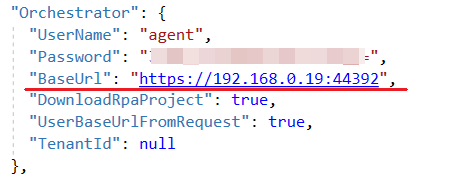

# Установка Агента Оркестратора

## Установка Агента Оркестратора

Для установки агента выполните следующие шаги:

1.  **Подключитесь к серверу по SSH с пользователем с правами root.**\
    Для этого скопируйте папку `/srv/samba/shared/install/Agent-linux` в `/opt/Primo/Agent`:

    ```
    # cp -R  /srv/samba/shared/install/Agent-linux /opt/Primo/Agent
    ```
2.  **Создайте службу,** для этого перейдите в каталог `/opt/Primo/Agent`:

    ```
    # cd /opt/Primo/Agent
    ```
3.  **И скопируйте файл службы (идет с комплектом поставки) в /etc/systemd/system:**

    ```
    # cp Primo.Orchestrator.Agent.service /etc/systemd/system/Primo.Orchestrator.Agent.service
    # systemctl daemon-reload
    ```
4.  **Поместите службу в автозапуск:**

    ```
    # systemctl enable /etc/systemd/system/Primo.Orchestrator.Agent.service
    ```
5.  **Дайте права на запуск:**

    ```
    # chmod -R 777 /opt/Primo/Agent/Primo.Orchestrator.Agent
    # chmod -R 777 /opt/Primo/Agent/BashScripts
    ```
6. В конфигурационном файле службы `appsettings.ProdLinux.json` **пропишите адрес Оркестратора и TenantId** (если эта машина не в тенанте по умолчанию), **а также пользователя тенанта** (встроенная учетная запись agent из тенанта по умолчанию):



7.  **Запустите службу:**

    ```
    # systemctl start Primo.Orchestrator.Agent
    ```
8.  **Проверьте состояние службы:**

    ```
    # systemctl status Primo.Orchestrator.Agent
    ```
9.  **Откройте порт на файерволе:**

    ```
    # firewall-cmd --zone=public --add-port=5002/tcp --permanent
    # firewall-cmd --reload

    # journalctl -u Primo.Orchestrator.Agent
    ```


## Проверка настройки машины Робота

Проверьте доступность машины Оркестратора с машины Робота.\
Для этого на машине Робота выполните команду:

```
# curl -k https://<IP-адрес-машины-Оркестратора>:5001/api/version
```

В ответе должна вернуться версия Оркестратора.
