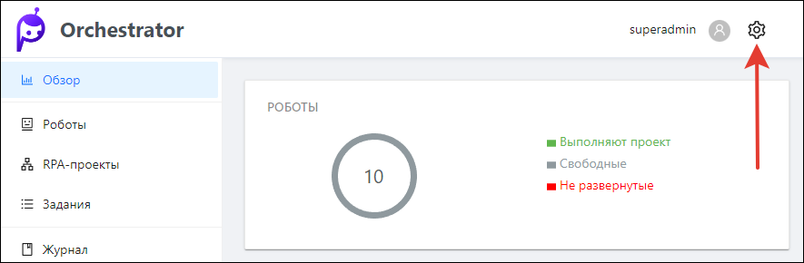

# Настройки Оркестратора

Раздел содержит описание настроек в UI Оркестратора, которыми управляет пользователь с правами администратора либо администратора тенанта\*. 

Все вкладки настроек открываются при помощи верхнего правого меню - иконка «Шестеренка».

Настройки делятся на системные и настройки тенанта.

> *\*Под тенантом подразумевается относительно независимый экземпляр Оркестратора.*

## Системные настройки

  * лицензии; 
  * дистрибутивы робота;
  * очереди проектов; 
  * журналы; 
  * производственный календарь.

## Настройки тенанта

  * управление машинами роботов; 
  * управление пользователями тенанта.

