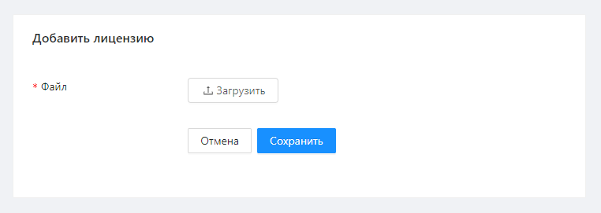

# Получение лицензии

Лицензия приобретается у вендора на основе запроса через интерфейс Оркестратора. Лицензия запрашивается на вкладке **Настройки ➝ Лицензии** при нажатии кнопки **Запрос на лицензию**:

В результате откроется форма создания запроса на лицензию:

>)

В поле **Продукт** выберите подходящий [тип лицензий](https://docs.primo-rpa.ru/primo-rpa/orchestrator/settings/licensing) на решение Primo RPA.

Сформированный запрос необходимо сохранить в текстовый файл (например, `robot.txt`) и отправить вендору. В ответ вендор отправит файл лицензии с расширением .license (например, `robot.license`).

## Добавление лицензии в Оркестратор

После получения файлов лицензий \*.license их необходимо добавить в Оркестратор по кнопке **Добавить лицензию** (раздел **Настройки ➝ Лицензии**):

Следует убедиться в валидности лицензии, а также в том, что ее срок не истек. Соответствующая информация появится при проверке добавленной лицензии:

Валидная непросроченная лицензия добавится в Оркестратор и отобразится в общем списке:

>)

Внесенная в Оркестратор лицензия по умолчанию считается выданной на дефолтный тенант. Если её нужно выдать на другой тенант, выделите лицензию и нажмите кнопку **Выдать на тенант**.

:bangbang: ***Лицензии между тенантами не делятся. У каждого тенанта свои лицензии.***

Дата истечения лицензии подсвечивается индикатором процента истечения. Красный индикатор (100%) свидетельствует об истечении срока лицензии.

Если впоследствии произошла смена оборудования БД лицензий (ltoolslicense) Заказчиком, то лицензии, добавленные в Оркестратор, становятся невалидными. В этом случае лицензию требуется заменить, подробнее процесс замены описан [здесь](https://docs.primo-rpa.ru/primo-rpa/orchestrator/settings/licensing/change-license).

