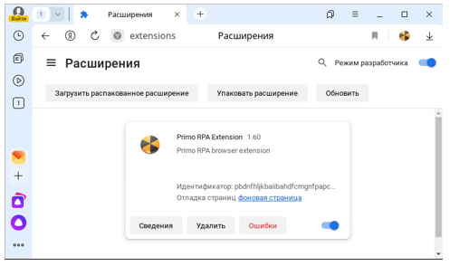

# Установка Primo RPA Studio Linux на Astra Linux средствами пакетов Debian

На экране **Настройка учётных записей пользователей и паролей** создайте пользователя-администратора (далее – primo-admin) машины Студии.


## Настройка дополнительного ПО

Выполните подключение машины Cтудии к репозиториям main`, `update`, `base` и `extended`. Сами репозитории описаны в статье [Интернет-репозитории Astra Linux Special Edition x.7](https://wiki.astralinux.ru/pages/viewpage.action?pageId=158598882) .
Настройка локальных зеркал этих репозиториев описана в статье [Создание репозиториев для операционной системы Astra Linux Special Edition x.7 в закрытом сегменте](https://wiki.astralinux.ru/pages/viewpage.action?pageId=199148426).

:large_orange_diamond: **Локальные репозитории необходимо выгружать на машину, имеющую доступ в Интернет.**

Рекомендуется выделить одну машину под управлением Astra Linux 1.7 для размещения на ней сервера репозиториев.

Проверьте доступность репозиториев, используя следующую команду:

`[primo-admin@astra-studio ~]$ sudo apt update`

Репозитории main, update, base и extended должны присутствовать в выводе команды.

Установите необходимое для работы студии ПО:

`[primo-admin@astra-studio ~]$ sudo apt -y install xsel at xvfb python3 python3-pyatspi python3-numpy xdotool imagemagick python3-opencv wmctrl`

## Установка браузера Chrome

Для регистрации репозиториев в качестве источников пакетов указанные ниже строки должны быть добавлены в файл `/etc/apt/sources.list`
```
deb [trusted=yes] https://deb.debian.org/debian/ buster main contrib non-free
deb https://security.debian.org/debian-security/ buster/updates main contrib non-free
```
Скачайте дистрибутив браузера; для этого необходимо из домашней папки выполнить

`[primo-admin@astra-studio ~]$ sudo wget https://dl.google.com/linux/direct/google-chrome-stable_current_amd64.deb`

Откройте домашнюю папку в проводнике и двойным щелчком на файле `google-chrome-stable_current_amd64.deb` выполните установку браузера. После установки файл `google-chrome-stable_current_amd64.deb` можно удалить.

Проверка: выполните указанную ниже команду. Если браузер запустится, установка прошла успешно:
```
[primo-admin@astra-studio ~]$ google-chrome
```
## Установка браузера Яндекс
Для установки браузера выполните команду:
```
[primo-admin@astra-studio ~]$ sudo apt-get install yandex-browser-stable
```

Проверка: выполните указанную ниже команду. Если браузер запустится, установка прошла успешно:
```
[primo-admin@astra-studio ~]$ yandex-browser-stable
```
## Установка компонентов Студии Линукс
Существуют следующие компоненты Студии Линукс, которые можно устанавливать на машину как отдельно, так и в некоторых комбинациях:

- `Studio Linux` - включает в себя инструмент разработчика и предназначен для создания и отладки процессов.
- `Robot Runner` - включает в себя инструмент запуска процессов как в ручном режиме, так и по расписанию.
- `Browser Extensions` - компонент, который позволяет взаимодействовать браузерным активностям с браузерами Яндекс и Google Chrome посредством специальных расширений для этих браузеров.

Типичные комбинации компонентов для установки:
- `Studio Linux` + `Robot Runner` + `Browser Extensions` - полный установочный набор для разработчика
- `Robot Runner` + `Browser Extensions` - установочный набор только для запуска процессов
- `Browser Extensions` - набор для установки на машины, где планируется запускать оркестраторных роботов.

### Установка компонента Studio Linux
Скопируйте пакет `primo-studio_1.25.1.3-1_all.deb`  в удобный каталог, например: `/home/<current_user>`.

> Имя пакета может отличаться в зависимости от версии продукта, не используйте буквально.

Перейдите в папку с этим пакетом и выполните установку пакета
```
[primo-admin@astra-studio ~]$ cd /home/<current_user>
[primo-admin@astra-studio ~]$ sudo apt install ./primo-studio_1.25.1.3-1_all.deb
```
В результате компонент должен установиться по пути `/opt/primo/studio/`

> Для возможности работать с компонентом необходимо будет настроить права для группы пользователей, как описано ниже.

### Установка компонента Robot Runner
Скопируйте пакет `primo-robot-runner_1.25.1.3-1_all.deb`  в удобный каталог, например: `/home/<current_user>`.

> Имя пакета может отличаться в зависимости от версии продукта, не используйте буквально.

Перейдите в папку с этим пакетом и выполните установку пакета
```
[primo-admin@astra-studio ~]$ cd /home/<current_user>
[primo-admin@astra-studio ~]$ sudo apt install ./primo-robot-runner_1.25.1.3-1_all.deb
```
В результате компонент должен установиться по пути `/opt/primo/robot-runner/`
> Для возможности работать с компонентом необходимо будет настроить права для группы пользователей, как описано ниже

### Установка компонента Browser Extensions
Скопируйте пакет `primo-web-browser-native_1.25.1.3-1_all.deb`  в удобный каталог, например: `/home/<current_user>`.

> Имя пакета может отличаться в зависимости от версии продукта, не используйте буквально.

Перейдите в папку с этим пакетом и выполните установку пакета
```
[primo-admin@astra-studio ~]$ cd /home/<current_user>
[primo-admin@astra-studio ~]$ sudo apt install ./primo-web-browser-native_1.25.1.3-1_all.deb
```
В результате компонент должен установиться по пути `/opt/primo/web-browser-native/`
>Для возможности работать с компонентом необходимо будет настроить права для группы пользователей и зарегистрировать расширение для браузеров, как описано ниже

## Создание группы пользователей
Для работы пользователя необходима общая группа:
```
[primo-admin@astra-studio ~]$ sudo groupadd primo-rpa
```
Задайте вновь созданную группу для папки Primo, куда были установленны необходимые компоненты Студии Линукс:
```
[primo-admin@astra-studio ~]$ sudo chgrp -R primo-rpa /opt/primo/
```
Задайте права:
```
[primo-admin@astra-studio ~]$ sudo chmod -R 770 /opt/primo/
```
## Настройка учетной записи пользователя
Создание учётной записи пользователя `<any_user>`:
```
[primo-admin@astra-studio ~]$ sudo useradd -g primo-rpa -m -s /bin/bash <any_user>
```
Установка пароля учётной записи пользователя `<any_user>`:
```
[primo-admin@astra-studio ~]$ sudo passwd <any_user>`
Новый пароль : ***
Повторите ввод нового пароля : ***
passwd: пароль успешно обновлён
```
После создания учётной записи пользователя на машине Студии войдите в графический сеанс этой учётной записи для инициализации графического окружения и дальнейшей настройки.

Рекомендуется отключить фон рабочего стола для экономии памяти. Для этого используйте:  
**ПКМ на рабочем столе -> Свойства -> Обои, удалить обои и логотип**.

## Установка расширения для браузера Chrome для текущего пользователя
Откройте браузер Chrome, выберите пункт меню **Настройки и управление Google Chrome > Расширения > Управление расширениями**, далее на странице **Расширения** установите настройку **Режим разработчика**:  


Выполните перетаскивание соответствующего файла в браузер Хром на страницу **Расширения**:
* файла `/opt/primo/web-browser-native/Extensions/Chrome/chrome.crx` для установки расширения с версией манифест v2,
* файла `/opt/primo/web-browser-native/ExtensionsV3/Chrome/chrome.crx` для установки расширения с версией манифест v3.

В результате на странице должно появиться расширение Primo RPA Extension:  


## Установка расширения для браузера Яндекс
Откройте браузер Яндекс, в строке адреса укажите browser://extensions/, нажмите Enter, далее на странице **Расширения** установите настройку **Режим разработчика**:  


Выполните перетаскивание соответствующего файла в браузер Яндекс на страницу **Расширения**:
* файла `/opt/primo/web-browser-native/Extensions/Chrome/chrome.crx` для установки расширения с версией манифест v2,
* файла `/opt/primo/web-browser-native/ExtensionsV3/Chrome/chrome.crx` для установки расширения с версией манифест v3.

В результате на странице должно появиться расширение Primo RPA Extension:  



## Настройка браузеров Chrome и Яндекс для текущего пользователя

Скрипт `browsers.sh` выполняет регистрацию расширения, установленного для браузеров Хром и Яндекс, для текущего пользователя.

Запустите скрипт (без sudo):

`/opt/primo/web-browser-native/browsers.sh`

Вывод консоли должен содержать повторяющуюся два раза строчку:

"Расширение успешно установлено. Перезапустите браузер."

Проверьте регистрацию расширения:

После перезапуска браузера Chrome или Яндекс должен появиться активный процесс LTools.WebBrowser.Native, который должен закрыться сразу после закрытия браузера. Процесс можно увидеть в утилите Системный монитор.

## Запуск Студии

Запустите:

`/opt/primo/studio/Primo.Studio`

## Дополнительные настройки

1. **Проблема**: «Отсутствие альфа канала при работе селектора с браузерами». Проблема проявляется как отображения черного экрана во время работы селектора для браузера.  
**Решение**: включите прозрачность в Композит-менеджер (по умолчанию ВЫКЛ):  
fly-admin-theme -> «Эффекты» -> «Композитинг» -> «Прозрачность»


В случае, если настройка Композит-менеджер недоступна в текущей конфигурации, откройте Студию и в настройках «Общие» установите настройку **Принудительная прозрачность окон**:  


2. **Проблема**: «Смещение элементов в браузере Яндекс». Проблема проявляется во время выбора элемента страницы при помощи пикера браузера, при этом границы выбранного элемента не совпадают с самим элементом.  
**Решение**: В настройках «Интерфейс» -> «Боковая панель» отключите настройку «Показывать боковую панель»


3. **Проблема**: «При запуске браузера Яндекс восстанавливаются закрытые вкладки страниц».  
**Решение**: В настройках «Интерфейс»-> «Вкладки и группы» выключите настройку «При запуске восстанавливать вкладки окон и список закрепленных групп»


