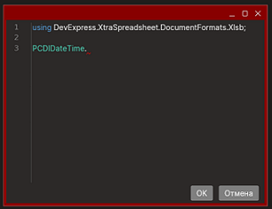

# Выполнение и отладка процессов

Primo RPA Studio Linux предоставляет возможность проверить работоспособность RPA-сценария до публикации проекта. Для этого можно запустить процесс встроенным роботом и пошагово отследить результат выполнения.

Запустить процесс можно следующими командами:
1. **Запустить процесс**  — при выполнении операции проигнорируются [точки останова](https://docs.primo-rpa.ru/primo-rpa/primo-studio-linux/process/debug#tochka-ostanova)  и [пропуск элементов](https://docs.primo-rpa.ru/primo-rpa/primo-studio-linux/process/debug#propusk-elementa) . Процесс выполнится быстрее, чем при отладке, но в журнал запишется меньше логов. 
2. **Отладить процесс**  — операция поддерживает все установленные на элементах точки останова и пропуски. Во время отладки будет выведена наиболее полная информация о действиях робота. 

Обе команды присутствуют на вкладке меню «Общие». 

## Консоль

Команда запуска/отладки запускает экземпляр робота для немедленного исполнения текущего процесса. Отследить его выполнение можно в панели «Консоль». Если выбрана отладка, то информация будет выводиться подробнее: отобразятся все действия робота.

Фильтры DEBUG, INFO, ERROR, NETWORK и TEST отвечают за сбор сообщений с соответствующим типом. 

Над ними расположены кнопки:

*  **Следовать за наполнением консоли** — текст консоли будет всегда фокусироваться на последнем полученном сообщении.
*  **Очистить консоль** — очищает содержимое консоли.

## Отладчик

Конфигурация отладчика настраивается в разделе **Файл > Настройки > Общие > Отладка**. 

Если отладку процесса нужно начать с произвольного места, выберите стартовый элемент, вызовите его контекстное меню и примените команду **Запуск с элемента**:

### Ошибки при отладке

Если выполнение какого-либо элемента завершилось ошибкой, то поведением по умолчанию является прекращение всего процесса. Однако возможно настроить паузу на исключении. Для этого в настройках [Отладчика](https://docs.primo-rpa.ru/primo-rpa/primo-studio/settings#otladchik) включите параметр **Приостанавливать отладку на исключении**.

В результате процесс будет останавливаться каждый раз при обнаружении исключения. Это дает возможность проанализировать и исправить ошибку, после чего вручную повторить выполнение элемента, не запуская заново весь процесс.

Возобновить процесс с того места, где возникла ошибка, можно при помощи кнопки **Возобновить процесс** .

### Пропуск элемента

:small_orange_diamond: ***Если файл \*.ltw закрыт в момент отладки, пропуск проигнорируется.***

Пропуск элемента — это встроенный инструмент, который позволяет отключить какой-либо элемент при отладке. Чтобы установить пропуск, нажмите иконку  в заголовке нужного элемента: 

. 

В результате элемент не будет выполнен при отладке сценария — робот его пропустит. 

### Точка останова 

:small_orange_diamond: ***Если файл \*.ltw закрыт в момент отладки, точка останова проигнорируется.***

Точка останова (breakpoint) — один из важнейших инструментов для разработчика. Точки устанавливаются везде, где нужно приостановить выполнение отладчика. Например, чтобы просмотреть текущее состояние переменных в панели «Вывод».

Чтобы включить точку останова, нажмите иконку  в заголовке нужного элемента. Когда отладчик дойдет до элемента с точкой останова, выполнение будет приостановлено. 

Чтобы возобновить отладку, выберите на вкладке меню «Отладка» одну из команд:

* **Сделать шаг**  — осуществляет переход к следующему элементу, после чего процесс снова будет остановлен.
* **Возобновить процесс**  — возобновляет свободное выполнение процесса до следующей точки останова.

Для принудительного завершения процесса используйте кнопку **Остановить отладку** . 

### Панель «Вывод»

Предоставляет возможность просмотреть значения всех переменных вывода, полученных при отладке. Чтобы она стала доступна, необходимо:

1. Установить в нужном месте точку останова.
2. Запустить отладку.
3. В левой части экрана, где располагаются панели **Проект** и **Элементы**, перейти на вкладку **Вывод**.

:small\_blue\_diamond: _**Примечание.** Когда отладка не запущена/завершена, нет данных вывода или точки останова, панель не отображается._

Значения переменных вывода можно подробно просмотреть, нажав на одну из двух кнопок:

* для просмотра данных в табличном виде;
* для просмотра данных в форматах Text/JSON/XML.

Если значение данных слишком большое и не вошло полностью в вывод, нажмите кнопку **Получить целиком**:

#### Редактирование переменной

Чтобы изменить текущее значение переменной, вызовите ее контекстное меню в панели «Вывод» и выберите пункт **Change value**.

Функциональность может пригодиться при возникновении паузы на исключении, позволяя быстро исправить значение и возобновить отладку процесса (кнопка **Повтор шага**).

### Панель «Наблюдение»

Работать с переменными и выражениями можно также в панели **Наблюдение**. По функциональности она соответствует панели Watch классических сред разработки. В таблице панели указывается вычисляемое выражение, тип данных результата вычисления и сам результат:

Для создания нового наблюдения нажмите кнопку **Создать наблюдение**:

. 

Введите текст вычисляемого выражения в появившемся окне:

Обновить результат вычисления можно по кнопке **Обновить**  соответствующего наблюдения. 

Для просмотра значения нажмите кнопку **Просмотр** . 

Изменить вычисляемое выражение можно в ячейке таблицы либо открыв окно редактирования двойным щелчком на нужном наблюдении. Чтобы удалить наблюдение, выделите его в таблице и нажмите кнопку **Удалить наблюдение** .

