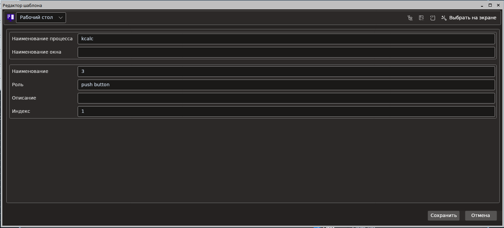
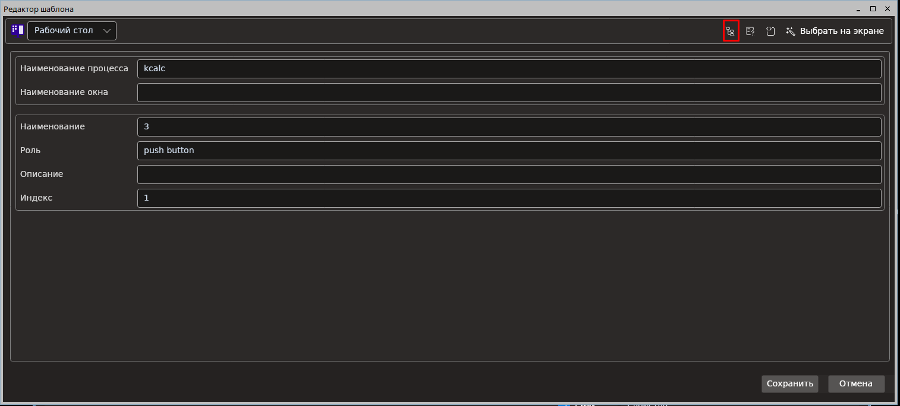
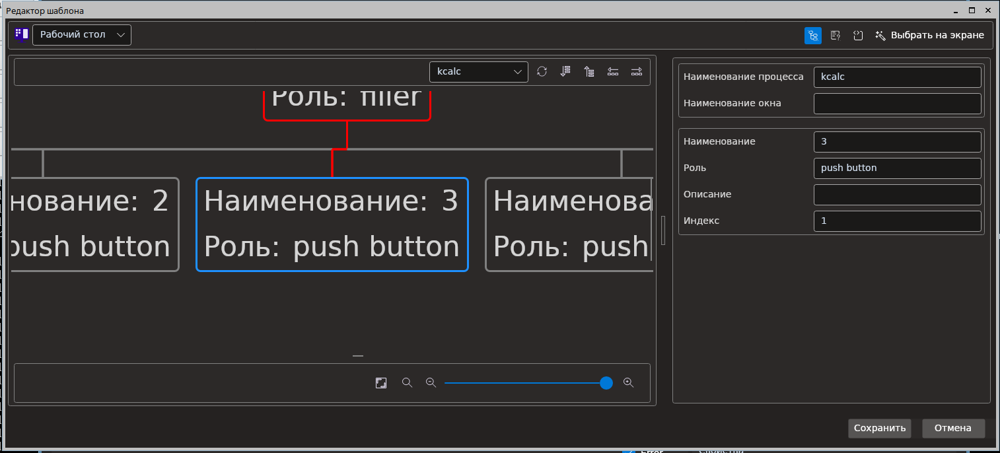
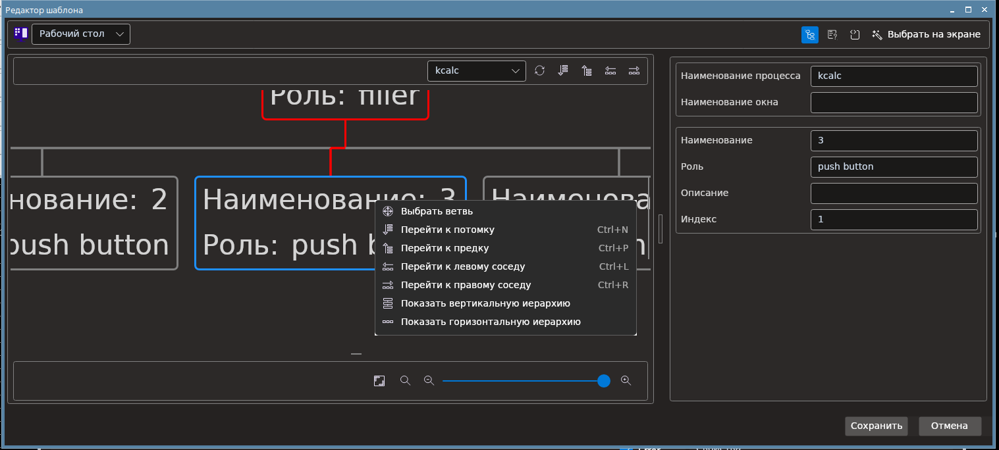
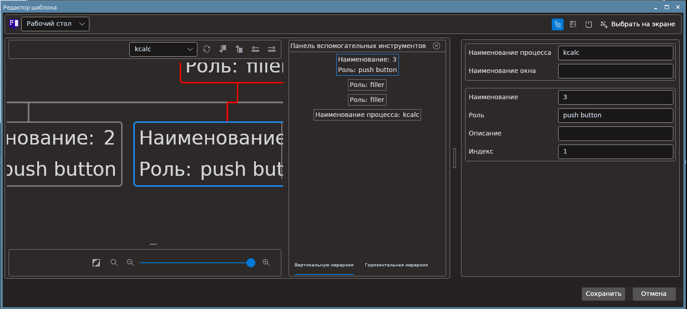
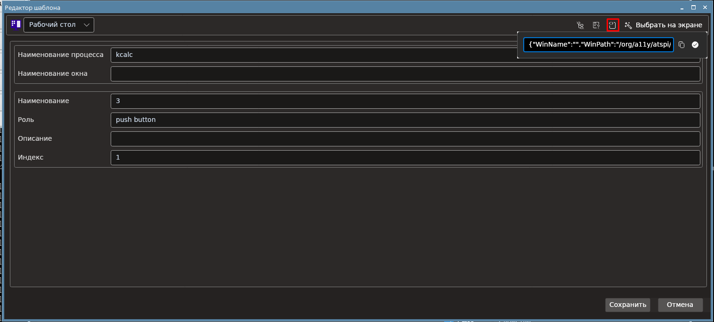
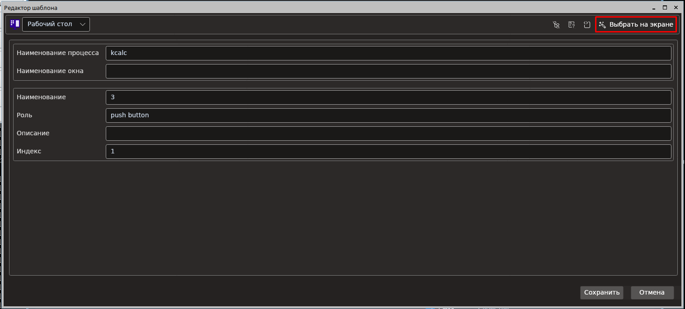

# Новый редактор шаблона поиска

  

В левом верхнем углу можно выбрать тип оптимизации.

  

Новый редактор шаблона поиска позволяет работать с деревьями элементов управления.

Чтобы открыть дерево, нажмите на кнопку в правой верхей части окна редактора:

  

Внешний вид дерева:

  

С помощью верхней панели инструментов можно производить следующие действия:
 * Выбрать дерево необходимого приложения
 * Обновить дерево
 * Перейти к потомку относительно выбраного узла
 * Перейти к предку относительно выбранного узла
 * Перейти к левому соседу относительно выбранного узла
 * Перейти к правому соседу относительно выбранного узла

 Кроме того, у каждого узла можно открыть контекстное меню, нажав на него правой кнопкой мыши.

   

Контекстное меню позволяет:

* Выбрать узел как целевой для шаблона поиска
* Перейти к потомку относительно выбраного узла
* Перейти к предку относительно выбранного узла
* Перейти к левому соседу относительно выбранного узла
* Перейти к правому соседу относительно выбранного узла
* Показать вертикальную иерархию относительно выбранного узла
* Показать горизонтальную иерархию относительно выбранного узла

Окно показа вертикальной и горизонтальной иерархии:

   

Для проверки корректности шаблона поиска используйте кнопку:

   

Новый редактор содержит возможность работать с шаблоном поиска в виде строки JSON. Для этого используется кнопка:

   

При ее нажатии откроется панель с представлением шаблона поиска в виде строки JSON. С помощью кнопок в данной панели можно:
 * Скопировать строку JSON в буфер обмена
 * Сохранить изменения шаблона поиска.

Также по нажатию кнопки "Выбрать на экране" можно выбрать элемент пикером.

   
