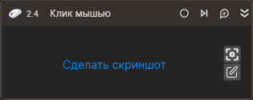
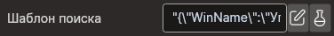
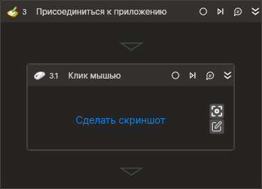
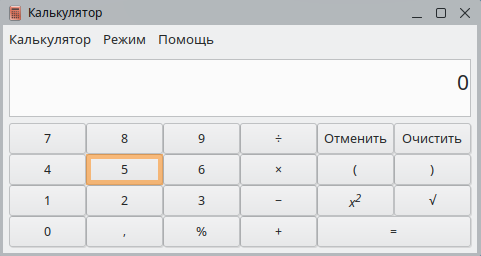
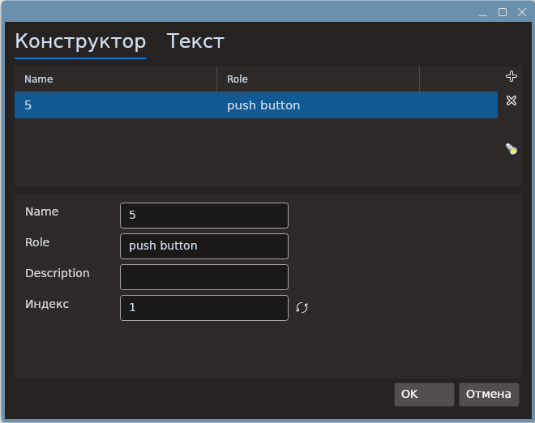
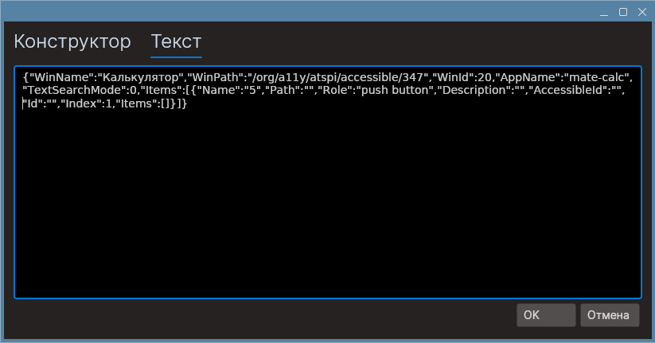
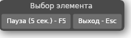

# Шаблоны поиска

**Шаблон поиска** — это свойство ряда элементов Студии, которое используется для взаимодействия с пользовательским интерфейсом программ. Шаблон позволяет идентифицировать компонент приложения и получить к нему программный доступ.

Свойство **Шаблон поиска** есть, например, у элемента [**Клик мышью**](https://docs.primo-rpa.ru/primo-rpa/g_elements/vstroennye-dlya-linux/els-uiinteraction/el-click) — с его помощью можно определить кнопку приложения, по которой нужно кликнуть.

## Общая информация

Шаблон представляет собой JSON-файл, который содержит заданный набор свойств для идентификации компонента. Его можно сформировать вручную или автоматически. Автоматическое формирование является предпочтительным сценарием, для этого используется кнопка **Выбрать компонент**  — она вызывает захват элемента управления в зависимости от категории приложения. Кнопку можно найти на панели элемента или в его свойствах, например:

Primo RPA поддерживает поиск в категориях:

* **Браузер**
* **Рабочий стол**

Редактировать шаблон можно двумя способами:

* **В формате правки JSON-файла.** Для открытия файла нажмите в свойстве **Шаблон поиска** значок редактирования. Пример: .
* **Через окно редактора шаблона**. Для открытия графического окна нажмите кнопку . Окно редактора видоизменяется в зависимости от категории приложения. Примеры интерфейса приведены в подразделе **Интерфейс редактора шаблона**.

## Интерфейс редактора шаблона

Интерфейс редактора шаблона для категорий **Браузер** и **Рабочий стол** имеет следующие общие элементы:

1. **Выбрать компонент**  — позволяет автоматически выбрать элемент управления и добавить его в шаблон.
2. **Отобразить компонент**  — выделяет элемент управления, который был задан в шаблоне. Используется для проверки правильности шаблона поиска.
3.  — кнопка для ручного добавления элемента управления в шаблон.
4.  — кнопка для удаления элемента из шаблона. Можно также использовать клавишу `Del`.

Кроме этого, окно редактора имеет две таблицы: первая - для добавления строк с компонентами, а вторая — для детализации каждой строки:

## Процесс поиска

Рассмотрим, как происходит поиск компонента на примере работы с приложением **Калькулятор** (**mate-calc**) (категория **Рабочий стол**).

С точки зрения Linux, приложение состоит из ряда компонентов (кнопки, текстовые поля, таблицы), объединенных в дерево. Любая кнопка, которую видит пользователь в интерфейсе программы, будет входить в данное дерево. В свою очередь, каждый компонент обладает набором свойств: они идентифицируют элемент приложения, предоставляют информацию о его специфике и назначении, разбивают все компоненты рабочего стола по ролям.

Для идентификации компонента Primo RPA также использует поиск по его свойствам.

Откроем приложение **Калькулятор**, для этого напишем в командной строке консоли **mate-calc** и нажмем клавишу **Еnter**. Создадим в Студии новый проект и выполним следующие действия:

1. Добавим контейнер [**Присоединиться к приложению**](https://docs.primo-rpa.ru/primo-rpa/g_elements/vstroennye-dlya-linux/els-desktop/el-desktop-attach). В свойстве **Заголовок** напишем заголовок окна **"Калькулятор"**.
2. Поместим в контейнер элемент [**Клик мышью**](https://docs.primo-rpa.ru/primo-rpa/g_elements/vstroennye-dlya-linux/els-uiinteraction/el-click).
3. На панели элемента **Клик мышью** нажмем кнопку **Выбрать компонент**  — для автоматического добавления компонента в шаблон.

**Внимание! Окно с приложением Калькулятор должно быть активным!**

После нажатия кнопки  мы переместимся в окно с **Калькулятором**, чтобы выбрать нужный компонент. При наведении указателя на элемент приложения, он подсветится:

Выберем **кнопку 5** — появится окно с выбором свойств для идентификации компонента:

> *В свойстве Index нумерация элементов начинается с 1.*

Необходимо выбрать такую комбинацию свойств, которая была бы уникальна и неизменна для данного компонента. Оставим только те свойства, которые являются надежными. Для нашего случая выберем параметры **Name**, **Role** и нажмем **ОК** — селектор создан. Он сохранится в JSON-файле шаблона поиска. Если просмотреть готовый шаблон через окно редактора, он будет выглядеть таким образом:

В дальнейшем, при обработке шаблона, робот возьмет заданные свойства и проанализирует дерево компонентов в поисках позиции, которая имеет указанные значения в параметрах **Name** и **Role**. При совпадении значений компонент будет найден.

## Окно Выбор элемента

Во время поиска элементов, в случае если работа происходит с браузером, в верхнем  левом  углу появляется окно **Выбор элемента**.

Данное окно предоставляет дополнительный функционал.
- Кнопка **Пауза** – выполняет паузу во время поиска элементов. Это может быть полезно в ситуациях, когда для выбора элемента необходимо выполнить дополнительные манипуляции мышкой. Например, если есть комбо-бокс и требуется выбрать одно из его значений, то для этого необходимо нажать кнопку Пауза и затем в течение 5 секунд успеть развернуть комбо-бокс и выбрать интересующий элемент. После того, как мышь остановится на необходимом элементе, следует ждать завершения паузы. Мышкой при этом рекомендуется больше не двигать, пока результат не зафиксируется, то есть, пока не появится оранжевая рамка на выбранном элементе.
- Кнопка **Выход** – позволяет выйти из режима поиска элементов. Другой вариант выхода из режима поиска – просто развернуть окно Студии.

Если окно перекрывает вид, его можно переместить в противоположный угол экрана, просто наведя мышку на заголовок окна.
