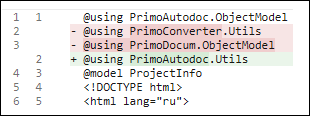

# Шаблоны AutoDoc

При генерации документации Робота (паспорт робота) в *AutoDoc* применяются несколько шаблонов для описания проектов и их структуры:

- [**Project.cshtml**](https://docs.primo-rpa.ru/primo-rpa/primo-rpa-studio/tools/autodoc/templ_project_cshtml) — Шаблон для описания проекта (*.ltp).
- [**Process.cshtml**](https://docs.primo-rpa.ru/primo-rpa/primo-rpa-studio/tools/autodoc/templ_process_cshtml) — Шаблон для описания процесса.
- [**ActivityInfo.cshtml**](https://docs.primo-rpa.ru/primo-rpa/primo-rpa-studio/tools/autodoc/templ_activityinfo_cshtml) — Шаблон для активностей проекта.
- [**Template.uml**](https://docs.primo-rpa.ru/primo-rpa/primo-rpa-studio/tools/autodoc/template_uml) - Шаблон UML для визуализации процессов.
- [**Template.docx**](https://docs.primo-rpa.ru/primo-rpa/primo-rpa-studio/tools/autodoc/template_docx) - Шаблон для автоматической генерации описания проекта в формате документа **MS Word**

Каждый из этих шаблонов использует свою модель данных, которая определяется директивой `@model`.

## Особенности шаблонов для ОС Linux

Версия AutoDoc для ОС Linux использует пространства имен, отличные от версии для ОС Windows. 

|            Windows                   |              Linux                  |
|--------------------------------------|-------------------------------------|
| PrimoConverter.Utils                 |   PrimoAutodoc.Utils                |
| PrimoDocum.ObjectModel               |   PrimoAutodoc.ObjectModel          |

Пользователям, использующим собственные шаблоны, необходимо сделать данные изменения, прежде чем использовать шаблоны в версии для ОС Linux.

Например, если в тексте шаблона встречается директива `PrimoConverter.Utils`, то ее следует заменить на `PrimoAutodoc.Utils`. Аналогично, `PrimoDocum.ObjectModel` следует поменять на `PrimoAutodoc.ObjectModel`.

Файлы шаблонов, в которых требуются изменения:
* project.cshtml
* process.cshtml
* ActivityInfo.cshtml

Необходимо избегать повторений в области объявлений, например:

В данном примере выделенную красным строку с `PrimoDocum.ObjectModel` следует удалить, так как уже присутствует объявление `PrimoAutodoc.ObjectModel`, а `PrimoConverter.Utils` следует переименовать в `PrimoAutodoc.Utils`.

## Структура папки Resources

Папка **Resources** содержит основные файлы и шаблоны для генерации документации. Она включает:

- **Шаблоны**: проектные файлы **project.cshtml**, **process.cshtml**, **ActivityInfo.cshtml** и файлы **Template.uml** и **Template.docx** для генерации документации.
- **Подпапки**: **assets* и *mazer* для стилей, скриптов и изображений, которые используются при оформлении выходных документов.
- **Файлы `.csv`**. Эти файлы представляют собой словари или списки соответствий для отображаемых значений, используемых при описании внутренних наименований типов, свойств и других элементов.
  - *tags.csv* — устанавливает соответствие между группами элементов и тегами.
  - *PropertiesDict.csv* — содержит отображаемые значения для некоторых свойств активностей.
  - *elements.csv* — описывает активности, включая группу, описание и название класса.

### Работа с шаблонами AutoDoc

Для создания пользовательских шаблонов рекомендуется скопировать папку **Resources** и внести необходимые изменения в шаблоны *AutoDoc*.
При запуске *AutoDoc* пользовательские шаблоны можно указать с параметрами `-t` или `-templates`. Рекомендуется ознакомиться со [справочником по синтаксису **Razor**](https://learn.microsoft.com/ru-ru/aspnet/core/mvc/views/razor?view=aspnetcore-8.0), чтобы лучше понять возможности синтаксиса разметки и внедренного кода в шаблонах.

**Формат готовых документов** зависит от параметров запуска:
- По умолчанию документы создаются в формате HTML.
- Для создания документов MS Word формата *.docx* используйте параметр `-word`.

### Типы и свойства данных в шаблонах AutoDoc

По ссылкам ниже представлены описания свойств используемых типов в шаблонах `.cshtml`. Каждому типу данных сопоставлен набор свойств.

1. [Тип ProjectInfo](https://docs.primo-rpa.ru/primo-rpa/primo-rpa-studio/tools/autodoc/templ_properties#id-1.-tip-projectinfo)  
2. [Тип ProcessInfo](https://docs.primo-rpa.ru/primo-rpa/primo-rpa-studio/tools/autodoc/templ_properties#id-2.-tip-processinfo)  
3. [Тип ToCItem](https://docs.primo-rpa.ru/primo-rpa/primo-rpa-studio/tools/autodoc/templ_properties#id-3.-tip-tocitem)  
4. [Тип ScriptVariable](https://docs.primo-rpa.ru/primo-rpa/primo-rpa-studio/tools/autodoc/templ_properties#id-4.-tip-scriptvariable)  
5. [Тип SerializationComponent](https://docs.primo-rpa.ru/primo-rpa/primo-rpa-studio/tools/autodoc/templ_properties#id-5.-tip-serializationcomponent)  
6. [Тип Components](https://docs.primo-rpa.ru/primo-rpa/primo-rpa-studio/tools/autodoc/templ_properties#id-6.-tip-components)  
7. [Тип Properties](https://docs.primo-rpa.ru/primo-rpa/primo-rpa-studio/tools/autodoc/templ_properties#id-7.-tip-properties)  
8. [Тип SerializationItem](https://docs.primo-rpa.ru/primo-rpa/primo-rpa-studio/tools/autodoc/templ_properties#id-8.-tip-serializationitem)  
9. [Тип ActivityInfo](https://docs.primo-rpa.ru/primo-rpa/primo-rpa-studio/tools/autodoc/templ_properties#id-9.-tip-activityinfo)  
10. [Тип ActivityProp](https://docs.primo-rpa.ru/primo-rpa/primo-rpa-studio/tools/autodoc/templ_properties#id-10.-tip-activityprop)
