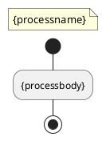
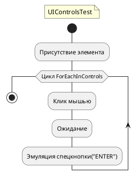

# Шаблон Template.uml

**Template.uml** — это шаблон UML для визуализации процессов в *AutoDoc*. Шаблон содержит два специальных тега:

- `{processname}` — вставка названия процесса.
- `{processbody}` — вставка описания схемы.

Эти теги используются *AutoDoc* для автоматического заполнения данных о процессе и его структуре при генерации документации.

По умолчанию **рендеринг схем** происходит удаленно с помощью сервера PlantUML. Если интернет-соединение недоступно, можно выполнить локальный рендеринг с помощью параметра `-local` в командной строке. В этом случае рендеринг всегда будет выполняться локально.

Для успешного локального рендеринга необходимо:
1. Установить **Java Development Kit (JDK)**.
2. Установить переменную среды `JAVA_HOME` (желательно, чтобы путь не содержал пробелов).
3. Убедиться, что в папке с программой находится файл **plantuml.jar** (~ 11 МБ), который входит в пакет установки версии 1.24.10.X.

**Пример использования Template.uml**:

### Template.uml

### UIControlsTest.uml

 

На изображении выше показан пример схемы, созданной с помощью **Template.uml**, с использованием тегов для отображения названия и содержимого процесса.
Эти блоки кода созданы для **PlantUML** и включают директивы для управления стилем, а также определяют процесс с циклом и действиями. 
