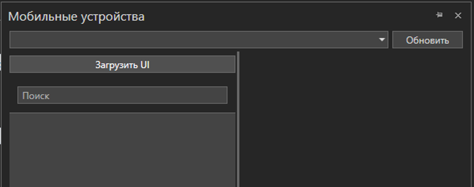

# Начало работы (устаревший интерфейс)

После успешного запуска на экране появится основное окно приветствия

.png>)

Из данного окна можно создать новый проект, открыть имеющийся, либо выбрать один из последних проектов, с которыми производилась работа. Если снять галку "Показывать при запуске", данное окно более не будет появляться. После закрытия окна приветствия, станет доступно окно студии

.png>)

В окне присутствуют следующие компоненты:&#x20;

Главное меню приложения

В данном меню имеются следующие пункты:

Файл&#x20;

* Создать проект
* Открыть проект
* Сохранить проект
* Настройки
* Недавние
* Закрыть проект
* Выход&#x20;

Правка&#x20;

* Поиск&#x20;
* Отменить&#x20;
* Повторить&#x20;
* Вырезать&#x20;
* Копировать&#x20;
* Вставить&#x20;

Вид&#x20;

* Проект&#x20;
* Элементы&#x20;
* Свойства&#x20;
* Перехват трафика&#x20;
* Свойства пакета&#x20;
* Фильтр трафика&#x20;
* Мобильные устройства&#x20;
* Инспектор UI&#x20;
* Инспектор SAP&#x20;
* Переменные&#x20;
* Аргументы&#x20;
* Наблюдение&#x20;
* Консоль&#x20;
* Ошибки
* Сброс панелей

Проект&#x20;

* Упаковать проект
* Git
*
  * Загрузить изменения
  * Отменить изменения
  * Сохранить изменения
  * Управление версиями
  * Ветви
  * Отсоединить
  * Удаленные репозитории

Процесс&#x20;

* Запустить процесс&#x20;
* Отладить процесс&#x20;
* Сделать шаг&#x20;
* Возобновить процесс&#x20;
* Остановить отладку&#x20;
* Запись Web&#x20;
* Запись рабочего стола

Помощь&#x20;

* Руководство пользователя
* О программе

Панель действий

В данной панели имеются следующие кнопки:

* Сохранить проект&#x20;
* Найти
* Вырезать&#x20;
* Копировать&#x20;
* Вставить&#x20;
* Отменить&#x20;
* Повторить&#x20;
* Запустить процесс&#x20;
* Конфигурация запуска
* Отладить процесс&#x20;
* Сделать шаг&#x20;
* Возобновить процесс&#x20;
* Остановить отладку&#x20;
* Запись&#x20;
*
  * Запись Web&#x20;
  * Запись рабочего стола
* Убрать все точки останова текущего процесса
* Убрать все точки отключения текущего процесса
* Издание робота
* Настройка меню и кнопок

Панель проекта

.png>)

В данной панели имеются следующие кнопки

* Создать папку&#x20;
* Редактировать элемент&#x20;
* Добавить файл
* Удалить элемент&#x20;
* Создать процесс

Панель элементов

.png>)

Основная рабочая область

.png>)

Панель свойств

.png>)

Панель перехвата трафика

Панель свойств пакета

Панель фильтра трафика

Панель мобильных устройств

Панель инспектора UI

Панель инспектора SAP

