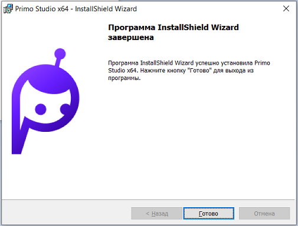

# Установка 

> *Перед установкой ознакомьтесь с [системными требованиями](https://docs.primo-rpa.ru/primo-rpa/primo-studio/systemreq) к компьютеру.*

Установку приложения Primo RPA Studio осуществляет инсталлятор, запускаемый файлом setup.exe. Для корректной работы Primo RPA Studio необходим Microsoft .NET Framework 4.6.1, установка которого производится вместе с установкой Студии.

После запуска инсталлятора пользователь увидит стандартный экран приветствия:

После нажатия кнопки **Далее** инсталлятор предложит выбрать папку для установки Primo RPA Studio:

После нажатия кнопки **Далее** инсталлятор предложит выбрать состав установки и подтвердить начало установки:

Последний экран инсталлятора оповещает об успешном завершении установки дистрибутива:

## Запуск

Primo RPA Studio поставляется в [двух изданиях](https://docs.primo-rpa.ru/primo-rpa/primo-studio/editions): 
* Community —  ознакомительная версия, имеет ограничения и не подлежит лицензированию. Если вы установили это издание, то можно сразу начинать работу со Студией. 
* Enterprise — полная версия, подлежит лицензированию. Если вы установили это издание, сначала ознакомьтесь с разделом [Запуск](https://docs.primo-rpa.ru/primo-rpa/primo-studio/enterprise).

## Обновление 
Процедуры обновления и удаления Студии описаны в [этом разделе](https://docs.primo-rpa.ru/primo-rpa/primo-studio/installation/update).

