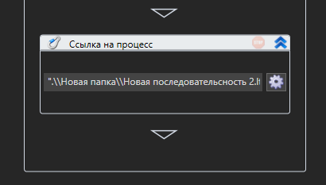
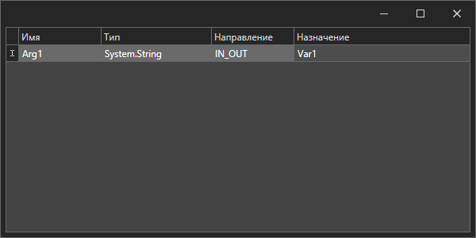

# Аргументы

Аргумент является переменной, предназначенной для обмена между процессами. Он отличается от обычной переменной наличием свойства **Направление**, которое определяет, сможет ли аргумент получать и передавать данные в вызывающий процесс. 

**Направление** имеет следующие значения:

* IN – аргумент работает только на прием;
* OUT – аргумент работает только на передачу;
* IN\_OUT – аргумент работает в обе стороны.

.png>)

Чтобы вызвать один процесс (далее - подпроцесс) из другого, необходимо перетащить его из панели **Проект** в треугольник, определяющий место вызова подпроцесса в сценарии:

Для подключения к аргументам подпроцесса нужно нажать кнопку .png>). В открывшемся окне, в колонке **Назначение**, укажите выражения на выбранном языке программирования (C#, Python или JavaScript) либо имена переменных, используемых при взаимодействии с подпроцессом. По завершении редактирования окно можно закрыть.

### Редактирование аргумента
Список всех аргументов отображается на панели **Аргументы**. Для вызова окна редактирования дважды кликните строку с аргументом, значение которого нужно изменить. 

**Важно!** Рекомендуем изменять имя аргумента не в окне редактирования, а по нажатию специальной кнопки **Переименовать аргумент** . Только в этом случае изменения применятся ко всему процессу, в котором аргумент используется.

# Аргументы Оркестратора

Аргументом Оркестратора называется аргумент, значение которого можно просмотреть или изменить напрямую из Оркестратора, не прибегая к открытию проекта в Студии. Изменение в Оркестраторе доступно только для аргументов с направлениями In и InOut.

По умолчанию аргументы возможно редактировать только из Студии. Редактирование из Оркестратора настраивается отдельно.

## Настройки в Студии
Для работы с аргументами Оркестратора выполните следующие условия:

1\. При создании процесса включите параметр **Использовать аргументы Оркестратора**.

**Важно!** Процесс Main.ltw по умолчанию создается с выключенной настройкой. В этом случае необходимо его отредактировать: выберите процесс на панели «Проект» и вызовите команду контекстного меню **Редактировать элемент**. После чего установите галочку и нажмите **ОК**.

2\. Удостоверьтесь, что установлено подключение к Оркестратору. Индикатор состояния находится в правом нижнем углу.

При нажатии выделенной области откроется окно с параметрами подключения к Оркестратору. Убедитесь, что все данные указаны верно.

3\. Проверьте, что всем аргументам заданы нужные направления. 

## Работа в Оркестраторе
Готовый проект следует упаковать в архив и загрузить в Оркестратор. После чего он станет доступен для выполнения роботом. 

:bangbang: ***Обратите внимание, что запустить проект с аргументами можно, только используя задание.*** 

Аргументы проекта возможно изменять в рамках созданного задания - см. раздел [Аргументы проекта](https://docs.primo-rpa.ru/primo-rpa/orchestrator/basics/tasks/orch-args).

