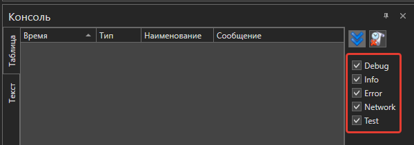
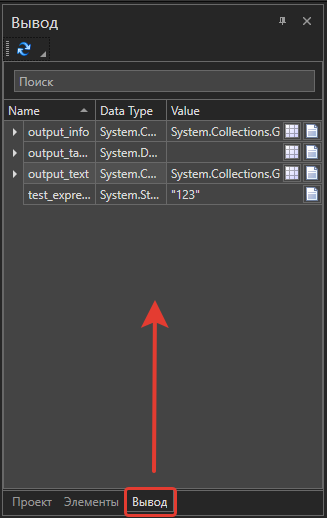
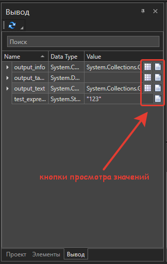
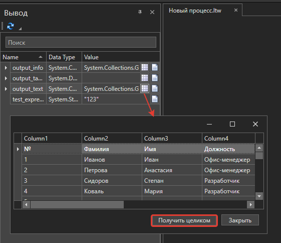
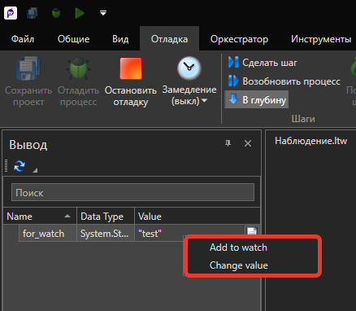
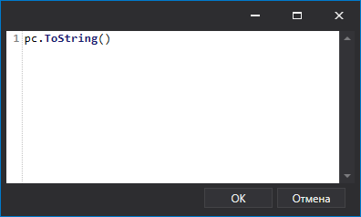

# Выполнение и отладка процессов

Студия предоставляет возможность проверить работоспособность RPA-сценария до публикации проекта. Сделать это можно, запустив процесс внутри Студии и пошагово отследив результат его выполнения.

Для этого существуют команды:
1. **Запустить процесс** .png>) - при выполнении проигнорируются [точки останова](https://docs.primo-rpa.ru/primo-rpa/primo-studio/process/debug#tochka-ostanova) .png>) (Breakpoint) и [пропуск элементов](https://docs.primo-rpa.ru/primo-rpa/primo-studio/process/debug#propusk-elementa) . Процесс выполнится быстрее, чем при отладке, но запишется меньше логов. 
2. **Отладить процесс** .png>) - поддерживаются точки останова и пропуск элементов. Выводится наиболее полная информация о действиях робота. 

Обе команды присутствуют на панели быстрого доступа и на вкладке меню «Общие». Кнопку **Отладить процесс** можно также найти на вкладке «Отладка».

## Консоль

Команда запуска/отладки запускает экземпляр робота для немедленного исполнения текущего процесса. Отследить его выполнение можно в панели «Консоль». Если выбрана отладка, то информация будет выводиться подробнее: отобразятся все действия робота.

.png>)

Консоль имеет два режима отображения: текстовый и табличный (по умолчанию). Переключить режим можно с помощью опций **Таблица**/**Текст**.

Фильтры DEBUG, INFO, ERROR, NETWORK и TEST отвечают за сбор сообщений с соответствующим типом. 

Над ними расположены кнопки:

* .png>) **Следовать за наполнением консоли** – текст консоли будет всегда фокусироваться на последнем полученном сообщении.
* .png>) **Очистить консоль** – очищает содержимое консоли.

Другие действия с сообщениями:

* Просмотр - двойной клик по сообщению вызывает окно просмотра.
* Копирование - команда доступна в контекстном меню выбранного сообщения (либо при нажатии `Ctrl` + `C`). Для множественного копирования выделите нужные сообщения, после чего примените команду.

Дополнительные параметры консоли настраиваются в ее контекстном меню. Так, команда **Показать выбор колонок** управляет отображением столбцов таблицы.

***Обратите внимание на колонку «Номер». В ней выводится информация о номере, присвоенном элементу\* в процессе. Колонка не отображается по умолчанию, ее нужно выбирать в меню.***

> *\*Отключить автонумерацию элементов можно в настройках [оформления](https://docs.primo-rpa.ru/primo-rpa/primo-studio/settings#oformlenie) Студии.*

## Отладчик

Конфигурация отладчика настраивается в разделе **Файл > Настройки > Общие > Отладчик**. Описание всех параметров см. [здесь](https://docs.primo-rpa.ru/primo-rpa/primo-studio/settings#otladchik).

Перед началом отладки укажите тип робота, который будет ее выполнять. Для этого на вкладке «Отладка» в параметре [**Издание робота**](https://docs.primo-rpa.ru/primo-rpa/primo-robot/intro#izdaniya) выберите нужное значение. Например, Enterprise.

Если отладку процесса нужно начать с произвольного места, выберите стартовый элемент, вызовите его контекстное меню и примените команду **Запуск с элемента**:

### Ошибки при отладке

Если выполнение какого-либо элемента завершилось ошибкой, то поведением по умолчанию является прекращение всего процесса. Однако возможно настроить паузу на исключении. Для этого в настройках [Отладчика](https://docs.primo-rpa.ru/primo-rpa/primo-studio/settings#otladchik) включите параметр **Приостанавливать отладку на исключении**.

В результате процесс будет останавливаться каждый раз при обнаружении исключения. Это дает возможность проанализировать и исправить ошибку, после чего вручную повторить выполнение элемента, не запуская заново весь процесс.

Возобновить процесс с того места, где возникла ошибка, можно при помощи кнопки **Повтор шага**  (вкладка «Отладка»).

### Пропуск элемента

:small_orange_diamond: ***Если файл \*.ltw закрыт в момент отладки, пропуск проигнорируется.***

Пропуск элемента - это встроенный инструмент, который позволяет отключить какой-либо элемент при отладке. Чтобы установить пропуск, нажмите иконку  в заголовке нужного элемента: 

. 

В результате элемент не будет выполнен при отладке сценария - робот его пропустит. 

### Точка останова 

:small_orange_diamond: ***Если файл \*.ltw закрыт в момент отладки, точка останова проигнорируется.***

Точка останова (breakpoint) - один из важнейших инструментов для разработчика. Точки устанавливаются везде, где нужно приостановить выполнение отладчика. Например, чтобы просмотреть состояние переменных в панели «Вывод».

Чтобы включить точку останова, нажмите иконку .png>) в заголовке нужного элемента. Когда отладчик дойдет до элемента с точкой останова, выполнение будет приостановлено. 

Чтобы возобновить отладку, выберите на вкладке меню «Отладка» одну из команд:

* **Сделать шаг** .png>) - осуществляет переход к следующему элементу, после чего процесс снова будет остановлен.
* **Возобновить процесс**  - возобновляет свободное выполнение процесса до следующей точки останова.

Для принудительного завершения процесса используйте кнопку **Остановить отладку** .png>). 

:bangbang: ***[См. как установить точку останова в процессе с типом «Только код» (Pure code)](https://docs.primo-rpa.ru/primo-rpa/primo-studio/process/coding#tochka-ostanova-i-vyvod).***

### Панель «Вывод»

Предоставляет возможность просмотреть значения всех переменных вывода, полученных при отладке. Чтобы она стала доступна, необходимо:

1. Установить в нужном месте точку останова.
2. В [настройках отладчика](https://docs.primo-rpa.ru/primo-rpa/primo-studio/settings#otladchik) включить параметр **Отображать вывод**.
3. Запустить отладку.
4. В левой части экрана, где располагаются панели **Проект** и **Элементы**, перейти на вкладку **Вывод**.

:small\_blue\_diamond: _**Примечание.** Когда отладка не запущена/завершена, нет данных вывода или точки останова, панель не отображается._

Значения переменных вывода можно подробно просмотреть, нажав на одну из двух кнопок:

* для просмотра данных в табличном виде;
* для просмотра данных в форматах Text/JSON/XML.

Если значение данных слишком большое и не вошло полностью в вывод, нажмите кнопку **Получить целиком**:

#### Редактирование переменной

Чтобы изменить текущее значение переменной, вызовите ее контекстное меню в панели «Вывод» и выберите пункт **Change value**.

Функциональность может пригодиться при возникновении паузы на исключении, позволяя быстро исправить значение и возобновить отладку процесса (кнопка **Повтор шага**).

### Панель «Наблюдение»

Работать с переменными и выражениями можно также в панели **Наблюдение**. По функциональности она соответствует панели Watch классических сред разработки. В таблице панели указывается вычисляемое выражение, тип данных результата вычисления и сам результат:

.png>)

Для создания нового наблюдения нажмите кнопку **Создать наблюдение**  (3) (1) (1) (2) (1) (2).png>). Введите текст вычисляемого выражения в появившемся окне:

Обновить результат вычисления можно по кнопке **Обновить**  соответствующего наблюдения. 

Для просмотра значения нажмите кнопку **Просмотр** . Выбранное значение можно скопировать комбинацией клавиш `Ctrl` + `C` либо командой контекстного меню.

Изменить вычисляемое выражение можно в ячейке таблицы либо открыв окно редактирования двойным щелчком на нужном наблюдении. Чтобы удалить наблюдение, выделите его в таблице и нажмите кнопку **Удалить наблюдение**  (1) (2) (1) (1) (2) (1) (8).png>) либо клавишу `Delete`.

### Замедленное выполнение

Для отладки быстрых процессов можно ввести искусственные паузы между действиями. За создание паузы отвечает кнопка **Замедление**  на вкладке «Отладка». В выпадающем списке данной кнопки можно выбрать протяженность паузы в секундах.

Паузы также возможно установить [в общих свойствах элементов](https://docs.primo-rpa.ru/primo-rpa/primo-studio/process/elements#svoistva-elementa): в параметрах **Пауза до (мс)** и **Пауза после (мс)**.

### Подсветка компонентов

Робот может подсветить визуальные компоненты приложений перед взаимодействием с ними. Для этого используйте кнопку **Подсветка компонентов**  на вкладке «Отладка».

