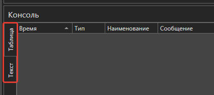

# Выполнение и отладка процессов

Студия предоставляет возможность протестировать готовый RPA-сценарий до публикации проекта. 

Для этого существуют команды:
1. **Запустить процесс** .png>) - в сценарии проигнорируются [точки останова](https://docs.primo-rpa.ru/primo-rpa/primo-studio/process/debug#tochka-ostanova) .png>) (Breakpoint) и [пропуск элементов](https://docs.primo-rpa.ru/primo-rpa/primo-studio/process/debug#propusk-elementa) . Процесс выполнится быстрее, чем при отладке, но запишется меньше логов. Кнопка запуска присутствует на панели быстрого доступа, а также на вкладке меню «Общие». 
2. **Отладить процесс** .png>) - поддерживаются точки останова и пропуск элементов. Выводится наиболее полная информация о действиях робота. Команда доступна на панели быстрого доступа, а также на вкладках «Общие» и «Отладка».

## Настройка отладчика

Конфигурацию отладчика возможно задать в меню **Файл > Настройки > Общие > Отладка**. Описание всех параметров см. в разделе [**Отладчик**](https://docs.primo-rpa.ru/primo-rpa/primo-studio/settings#otladchik).

Пример настроек:

* **Сворачивать Студию** - определяет, нужно ли сворачивать приложение Студии во время отладки.
* **Приостанавливать отладку на исключении** - определяет, нужно ли совершать паузу при обнаружении ошибки во время отладки, чтобы вручную исправить. Подробности см. [ниже](https://docs.primo-rpa.ru/primo-rpa/primo-studio/process/debug#oshibka-pri-otladke).
* **Проверять синтаксис** - определяет, нужно ли автоматически проверять синтаксис кода.

## Отладка
Перед началом отладки укажите тип робота, который будет ее выполнять. Для этого на вкладке «Отладка» в параметре [**Издание робота**](https://docs.primo-rpa.ru/primo-rpa/primo-robot/intro#izdaniya) выберите нужное значение. Например, Enterprise.

Если отладку процесса нужно начать с произвольного места, выберите стартовый элемент, вызовите его контекстное меню и щелкните команду **Запуск с элемента**:

## Консоль

Команда запуска/отладки запускает экземпляр робота для немедленного исполнения текущего процесса. Отследить его выполнение можно в панели «Консоль». Если выбрана отладка, то информация будет выводиться подробно: отобразятся все действия робота.

.png>)

Консоль имеет два режима отображения: текстовый и табличный (по умолчанию). Выбрать режим можно с помощью кнопок **Таблица**/**Текст**:

В правой части консоли расположены кнопки:

* .png>) **Следовать за наполнением консоли** – текст консоли будет всегда фокусироваться на последнем полученном сообщении.
* .png>) **Очистить консоль** – очищает содержимое консоли.

Под ними находятся фильтры DEBUG, INFO, ERROR, NETWORK и TEST. Они отвечают за сбор сообщений с соответствующим типом.

Возможные действия с сообщениями:

* Просмотр - двойной клик по сообщению вызывает окно просмотра.
* Копирование - выделите сообщение, вызовите его контекстное меню и выберите команду **Копировать** (либо нажмите горячие клавиши `Ctrl` + `C`). Доступно множественное копирование - для этого выделите все нужные сообщения и примените команду копирования.

Дополнительные настройки консоли доступны в контекстном меню. Чтобы его вызвать, кликните правой кнопкой мыши по названию любого столбца. Так, команда **Показать выбор колонок** позволяет настроить отображение столбцов таблицы.

:bangbang: Обратите внимание на колонку **Номер** - в ней выводится информация о номере, присвоенном элементу в процессе. Колонка отображается, только если специально отметить ее в окне выбора колонок. Отключить автонумерацию элементов можно на вкладке [Настройки > Общие > Оформление](https://docs.primo-rpa.ru/primo-rpa/primo-studio/settings#oformlenie), сняв чекбокс **Отображать нумерацию**.

## Пропуск элемента

При выполнении процесса возможно отключить тот или иной элемент. Для этого нажмите иконку  в заголовке элемента, и он будет проигнорирован во время прохождения сценария. Функция работает только в режиме отладки.

## Точка останова

**Точка останова** (Breakpoint) - один из важнейших инструментов для выполнения отладки. Точки устанавливаются везде, где нужно приостановить выполнение отладчика. Например, чтобы просмотреть состояние переменных в панели «Вывод».

Для установки точки нажмите иконку .png>) в заголовке нужного элемента: .

Когда отладчик дойдет до элемента с точкой останова, выполнение будет поставлено на паузу. Чтобы его возобновить, нажмите одну из кнопок на вкладке _Отладка_:

* **Сделать шаг** .png>) - осуществляет переход к следующему элементу, после чего процесс снова будет остановлен.
* **Возобновить процесс**  - возобновляет свободное выполнение процесса до следующей точки останова.

Для принудительного завершения процесса необходимо нажать кнопку **Остановить отладку** .png>).

## Ошибки при отладке

Если при отладке выполнение какого-либо элемента завершилось ошибкой, то поведением по умолчанию является прекращение всего процесса. Однако возможно настроить паузу на исключении. Для этого в настройках Студии на вкладке [Общие ➝ Отладчик](https://docs.primo-rpa.ru/primo-rpa/primo-studio/settings#otladchik) включите параметр **Приостанавливать отладку на исключении**.

В результате процесс будет останавливаться каждый раз при обнаружении исключения. Это дает возможность проанализировать и исправить ошибку, после чего вручную повторить выполнение элемента, не запуская заново весь процесс.

Возобновить процесс с того места, на котором возникла ошибка, можно при помощи кнопки **Повтор шага**  на вкладке _Отладка_.

## Панель «Вывод»

Панель вывода (Output) предоставляет возможность просмотреть значения всех переменных вывода, полученные при отладке. Чтобы она стала доступна, необходимо:

* установить в нужном месте точку останова;
* в настройках отладчика включить параметр **Отображать вывод** (Файл > Настройки > Общие > Отладчик);
* запустить отладку;
* в левой части экрана, где располагаются панели **Проект** и **Элементы**, перейти на вкладку **Вывод**.

:small\_blue\_diamond: _**Примечание.** Когда отладка не запущена/завершена, нет данных вывода или точки останова, панель не отображается._

Значения переменных вывода можно подробно просмотреть, нажав на одну из двух кнопок:

* для просмотра данных в табличном виде;
* для просмотра данных в форматах Text/JSON/XML.

Если значение данных слишком большое и не вошло полностью в вывод, нажмите кнопку **Получить целиком**:

## Значения переменных

Состояния переменных отображаются на панели **Переменные** в колонке _Текущее значение_:

.png>)

Для удобного просмотра текущего значения нажмите кнопку **Просмотр**  - откроется окно просмотра значения в формате JSON. Выбранное значение можно скопировать в буфер обмена горячими клавишами `Ctrl` + `C` либо командой **Копировать** (контекстное меню). Значение попадет в буфер обмена в текстовом виде. Структурированные данные сериализуются в JSON-формат и также будут доступны в виде текста.

.png>)

### Изменение значения переменной

.png>)

Для изменения значения во время выполнения процесса нажмите кнопку **Изменить значение** . В появившемся окне вставьте новое значение и нажмите кнопку **ОК**:

.png>)

## Наблюдение

Работать с переменными и выражениями можно в панели **Наблюдение** (по функциональности соответствующей панели Watch классических сред разработки):

.png>)

В таблице панели указывается вычисляемое выражение, тип данных результата вычисления и сам результат. Для создания нового наблюдения нужно нажать кнопку **Создать наблюдение**  (3) (1) (1) (2) (1) (2).png>) и ввести текст вычисляемого выражения в появившемся окне:

Для обновления результатов вычисления нужно нажать кнопку **Обновить**  соответствующего наблюдения. Для удобства в данной панели также есть кнопка **Просмотр**  значения. Выбранное значение можно скопировать в буфер обмена горячими клавишами `Ctrl` + `C` либо при помощи команды **Копировать** контекстного меню.

Изменить вычисляемое выражение можно, отредактировав текст прямо в ячейке таблицы либо открыв окно редактирования двойным щелчком на нужном наблюдении.\
Чтобы удалить наблюдение, выделите его в таблице и нажмите кнопку **Удалить наблюдение**  (1) (2) (1) (1) (2) (1) (8).png>) либо клавишу `Delete`.

## Замедленное выполнение

Для отладки быстрых процессов можно ввести искусственные паузы между действиями. За создание паузы отвечает кнопка **Замедление**  на вкладке _Отладка_. В выпадающем списке данной кнопки можно выбрать протяженность паузы в секундах.

Паузы также возможно установить [в общих свойствах элементов](https://docs.primo-rpa.ru/primo-rpa/primo-studio/process/elements#svoistva-elementa): в параметрах **Пауза до (мс)** и **Пауза после (мс)**.

## Подсветка компонентов

Робот обладает возможностью подсвечивания визуальных компонентов приложений перед взаимодействием с ними. Для включения данной опции используйте кнопку **Подсветка компонентов**  на вкладке _Отладка_.
