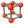

# Работа с диаграммой

Создать диаграмму можно несколькими способами:&#x20;

1\) можно выбрать тип Диаграмма при создании Процесса

.png>)

2\) или добавить элемент Диаграмма   в последовательность или в диаграмму

Диаграмма может включать в себя следующие элементы:

* Начало диаграммы
* Последовательность
* Принятие решения
* Диаграмма
* Состояние&#x20;

Они находятся в группе Диаграмма панели элементов.&#x20;

Также, диаграмма может включать в себя любые другие элементы. При переносе их в диаграмму, они будут автоматически обернуты в элемент Последовательность.

Элемент Начало диаграммы присутствует всегда и обозначается символом зеленого круга

.png>)

Элемент Последовательность представляет собой прямоугольник, заключающий в себе стандартную последовательность. Для перехода к хранимой последовательности нужно совершить двойной клик на элементе Последовательность

.png>)

Для возвращения к диаграмме нужно нажать на кнопку Назад в левом верхнем углу диаграммы

.png>)

Для добавления последовательности, необходимо перетащить ее из панели Элементы

Элемент принятие решения представляет собой синий ромб и служит для разветвления выполнения процесса (аналогично конструкции Switch классических языков программирования). Для создания условия необходимо указать вычисляемое выражение в свойстве Выражения панели свойств элемента.

.png>)

Для добавления принятия решения, необходимо перетащить его из панели Элементы

Элемент Диаграмма представляет собой прямоугольник, заключающий в себе другую диаграмму.&#x20;

.png>)

Для добавления диаграммы, необходимо перетащить его из панели Элементы &#x20;

Элемент Состояние представляет собой прямоугольник, заключающий в себе состояния процесса, между которыми можно выставить переходы.

.png>)

Для добавления состояния, необходимо перетащить его из панели Элементы &#x20;

**Состояния**

.png>)

Состояние работает по следующему алгоритму:

1. Выполняется последовательность "Исполняемый алгоритм"
2. Выполняются Триггеры каждого Перехода
3. Проверяются Условия
4. Осуществляется переход по первому корректному Условию

**Работа с диаграммой**

Для настройки диаграммы используется панель действий диаграммы

.png>)

Для создания связей между элементами необходимо нажать кнопку Связь  на панели действий диаграммы.  Далее зажать кнопку мыши на зеленом квадрате на любой грани элемента (если необходимо задать конкретную точку начала стрелки) или зажать кнопку мыши в целом на элементе (при этом элемент выделится зеленой рамкой, а расположение начала стрелки будет задано автоматически) и перетащить полученную стрелку к квадрату нужного элемента, так же к любой из граней или в целом к элементу.

.png>)

.png>)

Для возврата к обычному курсору и продолжения работы с другими элементами диаграммы необходимо нажать кнопку Указатель  на панели действий диаграммы.

Связи диаграмм могут иметь три различных формы:

.png>)

.png>)

.png>)

Форма связи выбирается в ее свойствах и становится формой по-умолчанию для новых связей.

Для ветвления процесса необходимо задать проверяемые условия. Для этого, нужно выделить стрелку, исходящую из нижнего квадрата элемента Принятие решения и в свойстве Результат проверки указать значение, соответствующее принимаемому решению. Стрелка без указанного результата будет являться решением по умолчанию.

.png>)

Для удобства выравнивания элементов на диаграмме предусмотрены функции: сетка и привязка к сетке.&#x20;

Для включения/выключения сетки необходимо нажать кнопку Сетка на панели действий диаграммы. При включении данной функции основная рабочая область будет разлинована для удобства выравнивания элементов.

.png>)

Для включения/выключения привязки к сетке необходимо нажать кнопку Привязка к сетке на панели действий диаграммы. При включении данной функции перемещение элементов на основной рабочей области будет с привязкой к сетке.&#x20;

.png>)

Также для удобства выравнивания при перемещении элементов отображаются направляющие линии, по которым можно расположить элемент относительно других.

В остальном, диаграмма в своей работе полностью соответствует последовательности.
