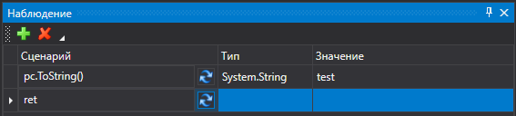

# Работа с последовательностью

Все элементы процесса-последовательность делятся на две категории:

* стандартный элемент
* контейнер

Новый процесс-последовательность состоит из одного чистого контейнера

.png>)

В своей основе процесс-последовательность может иметь только один контейнер Последовательность, который и будет содержать всю логику сценария.

Для добавления элементов в контейнер необходимо перетащить нужный элемент из панели Элементы в знак треугольника контейнера, при этом вокруг треугольника должна появиться желтая рамка

.png>)

Аналогичным способом происходит добавление новых контейнеров и элементов, а также добавление элементов в новые контейнеры

.png>)

Для перемещения элементов внутри процесса существует два варианта

1. Перетаскивание. Необходимо захватить мышью заголовок элемента и перенести его на нужный треугольник, при этом вокруг треугольника появится желтая рамка.

.png>)

1. Выделить нужный элемент, нажав на него мышью, либо выделить несколько элементов, зажав кнопку Ctrl. После завершения выделения нужно нажать либо кнопку Копировать, либо кнопку Вырезать меню Правка, либо аналогичные кнопки Панели действий .png>).png>), либо сочетания клавиш Ctrl+C, CTRL+X соответственно. Для переноса необходимо выделить элемент после которого произойдет вставка, либо контейнер, внутрь которого произойдет вставка и нажать кнопку Вставить меню Правка либо аналогичную кнопку Панели действий .png>) либо сочетание клавиш Ctrl+V.

Для отмены последнего изменения необходимо нажать кнопку Отменить меню Правка, либо аналогичную кнопку Панели действий .png>), либо сочетание клавиш Ctrl+Z.

Для возвращения к последнему отмененному действию необходимо нажать кнопку Повторить меню Правка, либо аналогичную кнопку Панели действий .png>), либо сочетание клавиш Ctrl+Y.

.png>)

Символ  обозначает, что в элементе присутствуют ошибки. При наведении мыши на значок, появится подсказка о содержании ошибок.

В случае внесения изменений в процесс, в заголовке закладки процесса появится символ \*

.png>)

При попытке закрытия закладки измененного процесса будет выведено соответствующее сообщение

.png>)

Для переноса элементов в новую последовательность можно воспользоваться соответствующим пунктом контекстного меню

.png>)

Если элемент занимает слишком много места, его можно свернуть нажатием кнопки Свернуть данного элемента .png>). Чтобы развернуть элемент обратно нужно нажать кнопку Развернуть  (1).png>).

Для удаления элемента необходимо выделить его мышью, либо выбрать группу элементов зажав кнопку Ctrl, после чего нажать кнопку Del.

Для изменения масштаба отображения процесса присутствует специальный элемент управления

