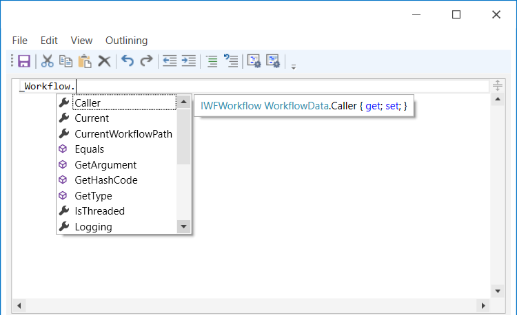

# Переменные. Глобальная переменная

## Переменные

Переменные используются в работе сценариев для хранения промежуточных данных. Управление ими осуществляется на панели **Переменные**:

.png>)

Состав переменной:

* **Имя переменной** – задается в соответствии с правилами выбранного языка (C#, Python или JavaScript).
* **Тип данных** – тип данных переменной на выбранном языке.
* **Значение по умолчанию** – выражение на выбранном языке программирования. Результат выполнения выражения будет присвоен переменной. Если переменной не задано значение по умолчанию, то ее начальное значение будет NULL.
* **Комментарий** – текст, описывающий назначение переменной (необязательно).

### Создание переменной

Добавить переменную можно двумя способами:

**Способ 1.** Вызвать контекстное меню соответствующего свойства элемента и выбрать команду **Создать переменную**:

.png>)

В этом случае тип данных для переменной будет определен автоматически - в соответствии с типом данных выбранного свойства.

**Способ 2**. На панели **Переменные** нажать кнопку **Создать переменную** .png>) и в появившемся окне заполнить информацию о ее составе. Поля **Значение по умолчанию**, **Группа** и **Комментарий** необязательны для заполнения. Если переменной не задано значение по умолчанию, то ее начальное значение будет NULL. Поле **Группа** позволяет группировать переменные по общему признаку.

Тип данных переменной является автодополняемым значением, например, достаточно ввести `List<String>` и нажать `Enter`. Система сама приведет тип к `System.Collections.Generic.List<System.String>`. Чтобы увидеть полный список доступных типов, нажмите кнопку **"…"** рядом с соответствующим полем и в открывшемся окне **Тип данных** выберите нужный:

.png>)

Для работы с обобщенными типами существует ассистент выбора обобщенного типа:

.png>)

### Редактирование переменной
Список всех созданных переменных отображается на панели **Переменные**. Для вызова окна редактирования дважды кликните строку с переменной, значение которой нужно изменить. 

Изменять имя переменной рекомендуется иначе: не в окне редактирования, а по нажатию специальной кнопки **Переименовать переменную**  на панели. Только в этом случае изменения применятся ко всему процессу, в котором она используется.

**Важно! Имя переменной не должно совпадать с именем параметра из шаблона поиска. Иначе она не переименуется. Пример: если для переменной задано имя Items, но в процессе также используется шаблон поиска с параметром Items, то переименование переменной не приведет к ожидаемому результату.**

Для удаления переменной выделите нужную строку в таблице и нажмите кнопку **Удалить переменную**  (1) (2) (1) (1) (2) (2).png>) либо клавишу `Delete`.

## Глобальная переменная \_Workflow

В Студии доступна глобальная переменная \_Workflow. При ее вызове в расширенном редакторе элемента (например, в элементе **Присвоение**) будут доступны следующие свойства:

1. **Caller** - ссылка на объект процесса, который вызвал текущий процесс.
2. **Current** - ccылка на объект текущего процесса.
3. **CurrentWorkflowPath** - ссылка на путь текущего процесса, то есть к конкретному ltw-файлу.
4. **GetArgument** - позволяет получить агрумент.
5. **RunConfig** - конфигурация запуска робота. Значение конфигурации возможно установить в Студии на вкладке меню **Отладка** в параметре **Конфигурация**. Доступные значения: 1) None - отсутствует; 2) Debug - режим отладки; 3) Release - режим релиза. Фактически Debug от Release отличается только названием. Однако присвоив то или иное значение конфигурации, в проекте можно будет создать логику, которая его учитывает. Например, использовать ветвление и т.п., где при конфигурации отладки должно произойти одно действие, а при релизе другое. Пример: `if (_Workflow.RunConfig == "Debug") { что-то делаем }`. В дальнейшем, при загрузке проекта в Оркестратор, также будет доступна возможность выбрать значение конфигурации, чтобы в итоге отработала нужная логика. Если проект выполняется через Robot Runner, конфигурацию возможно выбрать при создании задания на вкладке **Общие**.
7. **RunConfigCustom** - специальная конфигурация запуска. Позволяет присвоить свойству индивидуальное значение. Задается на вкладке меню **Отладка** во втором параметре **Конфигурация** (текстовое поле). В дальнейшем, при загрузке проекта в Оркестратор либо запуске из Robot Runner, также можно будет выбрать нужное значение специальной конфигурации, чтобы именно она применилась при запуске.
8. **SetArgument** - позволяет изменить агрумент.
9. **Logging.ScreenshotsPath** - с помощью этого свойства можно изменить путь по умолчанию до папки со скриншотами. Пример: в C# script укажите свой путь к файлам скриншотов, используя синтаксис `_Workflow.Logging.ScreenshotsPath = "<screens_folder>"`, где `screens_folder` - новая папка для сохранения скриншотов, назначенная по умолчанию, которая будет создана в папке проекта.
