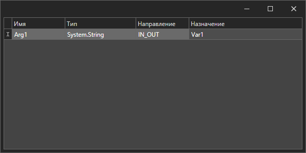

# Переменные и аргументы

## Переменные

В работе сценариев для хранения промежуточных данных имеются переменные. Для управления переменными существует панель **Переменные**.

.png>)

Переменная состоит из следующих частей:

* **Имя переменной** – задается в соответствии с правилами выбранного языка (C#, Python или JavaScript).
* **Тип переменной** – тип данных переменной на выбранном языке.
* **Комментарий** – текст, описывающий назначение переменной (необязательно).
* **Значение по умолчанию** – выражение на выбранном языке программирования. Результат выполнения выражения будет присвоен переменной. Необязательно для заполнения. Если переменной не задано значение по умолчанию, то ее начальное значение будет NULL.

Для добавления переменной можно использовать опцию быстрого создания переменной из контекстного меню соответствующего свойства:

.png>)

Или можно нажать кнопку **Создать переменную** .png>) и в появившемся окне ввести информацию о переменной.

Для более удобного выбора типа переменной можно нажать кнопку "…" и в окне **Типы данных** найти нужный:

.png>)

Для работы с обобщенными типами в окне **Тип данных** существует ассистент выбора обобщенного типа:

.png>)

Для удаления переменной необходимо выделить строчку с ней в таблице и либо нажать кнопку **Удалить переменную**  (1) (2) (1) (1) (2).png>), либо кнопку **Delete**.

Для редактирования переменной необходимо дважды кликнуть на строке, значение которой нужно изменить.

Тип переменной является автодополняемым значением, например, достаточно ввести List\<String> и нажать Enter. Система сама приведет тип к System.Collections.Generic.List\<System.String>.

## Аргументы

Аргументы являются переменными, предназначенными для обмена между процессами. Отличием от обычной переменной является наличие свойства **Направление**, определяющего, сможет ли аргумент получать и передавать данные в вызывающий процесс. Свойство **Направление** имеет следующие значения:

* IN – аргумент работает только на прием.
* OUT – аргумент работает только на передачу.
* IN\_OUT – аргумент работает в обе стороны.

.png>)

Также переменную можно перетащить в панель свойств выбранного элемента.

Для вызова одного процесса из другого необходимо перетащить вызываемый процесс из панели **Проект** в треугольник, определяющий место вызова подпроцесса в сценарии:

Для подключения к аргументам подпроцесса нужно нажать кнопку .png>). В открывшемся окне, в колонке **Назначение**, укажите выражения на выбранном языке программирования (C#, Python или JavaScript) либо имена переменных, используемых при взаимодействии с подпроцессом. По завершении редактирования окно можно закрыть.

## Глобальная переменная \_Workflow

Дополнительно в Студии доступна глобальная переменная \_Workfow.

При вызове данной переменной в расширенном редакторе элемента (например, в элементе **Присвоение**) будут доступны следующие свойства:

1. Caller - ссылка на объект процесса, который вызвал текущий процесс.
2. Current - ccылка на объект текущего процесса.
3. CurrentWorkflowPath - ссылка на путь текущего процесса, то есть к конкретному ltw-файлу (с версии 1.1.29).
4. GetArgument - позволяет получить агрумент.
5. SetArgument - позволяет изменить агрумент.

