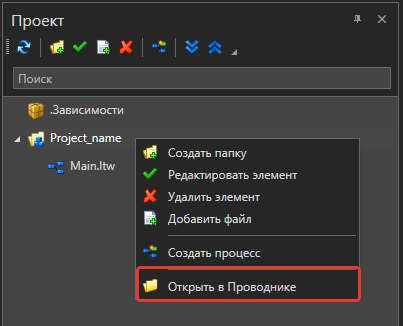
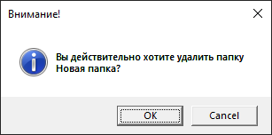

# Работа с проектами

RPA-проект — один или несколько [сценариев](https://docs.primo-rpa.ru/primo-rpa/primo-studio/process) автоматизации бизнес-процессов, направленных на достижение общей бизнес-цели. 

Каталог проекта содержит следующие файлы:
* **.Dependencies** — папка с зависимостями проекта. В ней можно увидеть все установленные библиотеки, необходимые для работы вашего проекта. Подробнее о том, как добавлять библиотеки, см. в разделе [Управление зависимостями](https://docs.primo-rpa.ru/primo-rpa/primo-studio/projects/manage-dependencies).
* **dependencies.xml** — xml-файл с установленными зависимостями и пространствами имен (Namespaces).
* **Screenshots** — папка, в которую по умолчанию сохраняются скриншоты. Создается автоматически при наличии скриншотов, иначе отсутствует. ...при соответствующей включенной галке в активностях
* **Main.ltw** — главный процесс проекта, создается по умолчанию.
* **Main.ltw.bak** — копия файла процесса (бэкапы процессов).  можно отключить создание этих файлов. Настройки > Общие > [Автосохранение процессов](https://docs.primo-rpa.ru/primo-rpa/primo-studio/settings#obshie). Каждые 5 минут (если не установлено другое время) все изменения (даже если не нажали кнопку сохранить) записываются в одноименный процессу bak файл рядом с файлом ltw. (bak есть только у Main?)
* **project.ltp** — корневой файл проекта. 
* **project.ltr** — xml-файл с конфигурацией проекта. В нем автоматически прописываются все установленные в проекте точки останова, пропуски, наблюдения, настройки Git, последние открытые закладки. 
* **<Папка>** — любая подпапка проекта, созданная вручную для группировки сценариев или других файлов проекта. Например, для документов, которые могут понадобиться при работе проекта.

В Primo RPA Studio структура проекта имеет вид дерева и отображается на панели «Проект». Пример:

```
Папка проекта:

 * Папка1
    * Сценарий1.ltw
    * Сценарий2.ltw
    * …
 * Папка2
    * …
 * Main.ltw
 * …
```

## Создать проект

1. Перейдите в меню **Файл ➝ Проект** и нажмите кнопку **Создать проект** .png>). В результате откроется форма добавления проекта.
2. Укажите имя проекта, путь к месту хранения и, при желании, краткое описание. Если установлен чекбокс **Создать папку**, то проект будет создан в папке с указанным именем.
3. В завершение нажмите **ОК**.

.png>)

**Готово**. Структура проекта отобразится в левой части экрана, на панели «Проект»:


## Сохранить проект

На вкладке меню «Общие» нажмите кнопку **Сохранить проект** .png>) — сохранятся все изменения в открытых процессах проекта. 

Опытные пользователи могут воспользоваться горячими клавишами:
* `Ctrl` + `S` — комбинация для сохранения текущего процесса (файл \*.ltw).
* `Ctrl` + `Shift` + `S` — комбинация для сохранения всего проекта.

По умолчанию проект сохранится в документах пользователя, если при создании проекта не был задан другой путь. Пример пути по умолчанию: `C:\Users\<user_name>\Documents\Primo\<Project_name>`.

Если вы не помните, куда сохранили проект, это всегда можно проверить в Студии. Для этого на панели «Проект» вызовите контекстное меню открытого проекта/процесса и выберите пункт **Открыть в проводнике**.



:small_blue_diamond: **Примечание**. Поддерживается возможность настроить автосохранение проекта. Просто перейдите в раздел **Файл ➝ Настройки ➝ Общие** и задайте в параметре **Автосохранение процессов** нужный период.


## Открыть проект

Открыть существующий проект можно в меню **Файл ➝ Проект** кнопкой **Открыть проект** .png>). В диалоговом окне укажите корневой файл (`project.ltp`) проекта.


## Другие действия с проектом

В верхней части панели «Проект» располагаются следующие кнопки действий: 


* **[Создать папку](https://docs.primo-rpa.ru/primo-rpa/primo-studio/projects#sozdat-papku)** .png>)
* **[Добавить файл](https://docs.primo-rpa.ru/primo-rpa/primo-studio/projects#dobavit-fail)** .png>)
* **[Обновить проект](https://docs.primo-rpa.ru/primo-rpa/primo-studio/projects#obnovit-proekt)** 
* **[Редактировать элемент](https://docs.primo-rpa.ru/primo-rpa/primo-studio/projects#redaktirovat-element)**  (1) (2) (1) (1) (1) (2) (1) (7).png>)
* **[Удалить элемент](https://docs.primo-rpa.ru/primo-rpa/primo-studio/projects#udalit-element)**  (1) (2) (1) (1) (1) (2) (1) (6).png>)
* **[Создать процесс](https://docs.primo-rpa.ru/primo-rpa/primo-studio/projects#sozdat-process)** 
* **[Раскрыть/свернуть папки](https://docs.primo-rpa.ru/primo-rpa/primo-studio/projects#svernut-razvernut-papki)**  либо 

### Создать папку

Кнопка **Создать папку** .png>) добавляет новую папку в структуру вашего проекта. Для этого на панели «Проект» кликните папку, которая станет родительской, и нажмите **Создать папку**. 

В появившемся диалоге введите название папки и нажмите **ОК**.

.png>)

Папка будет создана на диске и отобразится в структуре проекта:

.png>)

### Создать процесс

Кнопка **Создать процесс**  добавляет новый файл сценария (\*.ltw) в проект. Добавить процесс можно также сочетанием клавиш `Ctrl` + `N`.

Для перемещения процессов/папок достаточно их перетянуть в нужный узел проекта.

Более подробную информацию о работе с процессом см. [здесь](https://docs.primo-rpa.ru/primo-rpa/primo-studio/process).

### Добавить файл

Кнопка **Добавить файл** .png>) добавляет в проект файл, к которому робот может обратиться при выполнении процесса.

Для этого кликните папку проекта и нажмите **Добавить файл** либо воспользуйтесь одноименной командой контекстного меню. В появившемся диалоге выберите файл и нажмите **Открыть**. 

Добавить файл можно еще легче: просто перетащите его из Проводника в панель вашего проекта.

### Обновить проект

При добавлении файла вручную иногда требуется перечитать структуру проекта — для этого используйте кнопку **Обновить проект** . В результате будет перечитана структура проекта с диска.

### Редактировать элемент

Кнопка **Редактировать элемент**  (1) (2) (1) (1) (1) (2) (1) (7).png>) позволяет изменить созданную папку или процесс.

:small_orange_diamond: **Внимание**. Нельзя изменить путь проекта, указанный при его создании.

.png>)

### Удалить элемент

Кнопка **Удалить элемент**  (1) (2) (1) (1) (1) (2) (1) (6).png>) удаляет в проекте нужный элемент — файл, процесс или папку. Для этого выберите элемент, используйте кнопку и подтвердите действие.



### Свернуть/Развернуть папки

Кнопки **Свернуть/Развернуть папки** помогают показать либо скрыть содержимое папок на панели «Проект».


