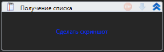

# Шаблоны проектов

Проекты можно создавать из шаблонов. Для этого в меню Файл -> Проект присутствует список доступных шаблонов. Для создания проекта достаточно кликнуть на нужный шаблон

<figure><figcaption></figcaption></figure>

Для создания собственного шаблона нужно проделать следующие манипуляции:

1. Создать проект, который в дальнейшем послужит шаблоном и упаковать его в архив project.zip
2. Выбрать иконку для шаблона (в дальнейшем icon.png)
3. Создать файл-манифест manifest.xml

```xml
<?xml version="1.0" encoding="utf-16"?>
<ProjectTemplateItem xmlns:xsi="http://www.w3.org/2001/XMLSchema-instance" xmlns:xsd="http://www.w3.org/2001/XMLSchema">
    <Name>Наименование шаблона</Name>
    <Description>Описание шаблона</Description>
    <Version>Версия (1.0)</Version>
    <MainProcessPath>Имя основного процесса (Main.ltw)</MainProcessPath>
</ProjectTemplateItem>
```

4\.  Полученные файлы project.zip, icon.png и manifest.xml поместить в папку внутри каталога ProjectTemplates студии Primo
