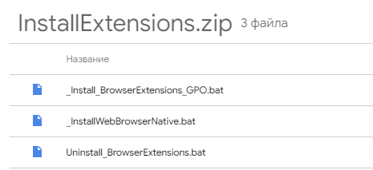
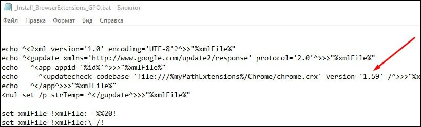

# Автоматизация установки расширения 

Для взаимодействия Primo RPA с веб-браузерами следует установить расширение **Primo RPA Extension**. Оно подходит для браузеров Chrome, Firefox, Edge, Yandex. 

В данном разделе приводится инструкция по автоматизации установки расширения Primo RPA Extension.\*

> \**По умолчанию устанавливается расширение на базе Манифеста V2. Выбрать Манифест V3 можно только при ручном способе установки*. 


## Общие сведения

Дистрибутив расширения расположен в папке `\Extensions` программ Primo RPA Studio или Primo RPA Robot. Эти программы должны быть предварительно установлены на компьютере. 

Для браузеров Chrome, Edge и Yandex используется дистрибутив `\Extensions\Chrome\chrome.crx`. Для браузера Firefox — файл `\Extensions\primo_rpa_extension-1.2-fx.xpi`.

Расширение может быть установлено одним из следующих способов:
1. Вручную после установки программ Primo RPA Studio/Primo RPA Robot. Установка осуществляется согласно [данной инструкции](https://docs.primo-rpa.ru/primo-rpa/primo-studio/settings/plugin-install).
2. Автоматически с помощью скриптов `_Install_BrowserExtensions_GPO.bat` и `_InstallWebBrowserNative.bat`. Об этом способе речь пойдет ниже.

Студия и робот взаимодействуют с браузером и его расширением через файл `LTools.WebBrowser.Native.exe`. Он находится в папке с программами Primo RPA Studio и Primo RPA Robot. Расширение связывается с этим файлом через:
* реестр Windows, соответствующий браузеру и его плагину;
* и файл json, в котором указан путь к LTools.WebBrowser.Native.exe. 

Если связь установлена корректно, то запуск браузера с непустым URL при включенном расширении автоматически запускает `LTools.WebBrowser.Native.exe`. После чего происходит обмен данными между роботом и браузером: робот управляет веб-страницей, кликает по ее HTML-элементам, обновляет страницу, переходит на другие URL-адреса, в общем, выполняет все действия в соответствии с запущенным RPA-проектом.


## Автоматическая установка расширения

:small_orange_diamond: ***Важно**. По умолчанию устанавливается расширение на базе Манифеста 2. Выбрать Манифест 3 можно только при ручном способе установки*. 


1. Скачайте архив [InstallExtensions.zip](https://drive.google.com/file/d/1cIXwlojb_9nkF3KSDDsggSldqjjvaScM/view?usp=sharing) и распакуйте его.

   
   
2. Скопируйте файлы `_Install_BrowserExtensions_GPO.bat` и `_InstallWebBrowserNative.bat` в папку с программой Студии/Робота, чтобы они были расположены рядом с файлом Primo.Robot.exe. Например, в папку `C:\Program Files\Primo\Primo Studio`.
3. Последовательно запустите скрипты. Скрипт `_Install_BrowserExtensions_GPO.bat` необходимо запускать от имени администратора. Для запуска файла `_InstallWebBrowserNative.bat` права администратора не требуются.

Если у текущего пользователя уже было установлено расширение Primo RPA Extension, и в меню расширений браузера оно отображается, включено и имеет последнюю версию, то достаточно использовать только скрипт `_InstallWebBrowserNative.bat`.


### Альтернативный вариант установки

Скопируйте скрипты в любую папку, но впоследствии запускайте их с аргументом, указывающим на папку Студии/Робота (без слеша в конце). Например:
```
C:\Scripts\_InstallWebBrowserNative.bat “C:\Program Files\Primo\Primo Robot x64”
```

### Изменение версии расширения

По умолчанию устанавливается версия расширения 1.59. Чтобы изменить версию на актуальную, потребуется внести изменения в скрипт `_Install_BrowserExtensions_GPO.bat`:
1. Откройте файл скрипта и проверьте версию устанавливаемого расширения в параметре **version**.
2. При необходимости измените значение. Узнать актуальную версию можно при посещении [интернет-магазина Chrome](https://chromewebstore.google.com/detail/primo-rpa-extension/pbdnfhljkbaiibahdfcmgnfpapchlmmp).




## Описание установки
Процесс автоматической установки можно разделить на два этапа:

1. Установка расширения браузера, чтобы он был виден и включен в браузере для текущего пользователя.
2. Связывание расширения с файлом LTools.WebBrowser.Native.exe через реестр Windows и файл json для каждого пользователя.

Файл `_Install_BrowserExtensions_GPO.bat` запускается один раз на сервере. Он автоматически устанавливает групповую политику установки расширения для всех браузеров и для всех пользователей, под которыми будет работать Primo RPA Robot на этом компьютере (терминальном сервере). Запустить его может пользователь, обладающий правами администратора на этом сервере. Повторный запуск этого скрипта требуется только в случае обновления версии плагина в новом дистрибутиве Студии/Робота. Наличие интернета для установки не требуется, что важно для использования в корпоративных средах.

Принудительная установка расширения основана на групповой политике [ExtensionInstallForcelist](https://chromeenterprise.google/policies/#ExtensionInstallForcelist). Аналогичная политика также применяется для Edge и Yandex. Расширение для этих браузеров устанавливается из локального файла `\Extensions\Chrome\chrome.crx`.

Для Firefox используется другая политика, которая описана [здесь](https://github.com/mozilla/policy-templates#extensions). Установка Firefox производится из файла `\Extensions\primo_rpa_extension-1.2-fx.xpi`.

Скрипт `_InstallWebBrowserNative.bat` запускается один раз ***для каждого пользователя*** из папки, где расположен соответствующий Primo RPA Robot и его `LTools.WebBrowser.Native.exe`. Запуск не требует прав администратора и может быть выполнен вручную двойным кликом или скриптом, в том числе из процесса Primo — например, заданием из Оркестратора, если в текущем профиле пользователя он еще не запускался. Повторный запуск потребуется, только если профиль пользователя был обновлен по какой-то причине или папка Студии/Робота вместе с файлом `LTools.WebBrowser.Native.exe` была перенесена в другое место.

Если расширение у текущего пользователя было установлено ранее, в меню расширений браузера оно отображается, включено и имеет последнюю версию, то достаточно связать его с `LTools.WebBrowser.Native.exe`, то есть использовать только скрипт `_InstallWebBrowserNative.bat`.

При использовании скриптов следует учесть, что установится только расширение Primo RPA Extension, зарегистрированное в [магазине приложений Chrome](https://chrome.google.com/webstore/detail/primo-rpa-extension/pbdnfhljkbaiibahdfcmgnfpapchlmmp) под идентификатором id=`pbdnfhljkbaiibahdfcmgnfpapchlmmp`. 


## Удаление расширения

Чтобы удалить расширение изо всех браузеров, воспользуйтесь скриптом `Uninstall_BrowserExtensions.bat`, который вы извлекли ранее из архива InstallExtensions.zip. Файл достаточно запустить от имени администратора из любой папки.

Скрипт удаляет плагин изо всех браузеров при помощи отката изменений установки — он удаляет групповую политику установки расширения, которая включалась скриптом `_Install_BrowserExtensions_GPO.bat`.
