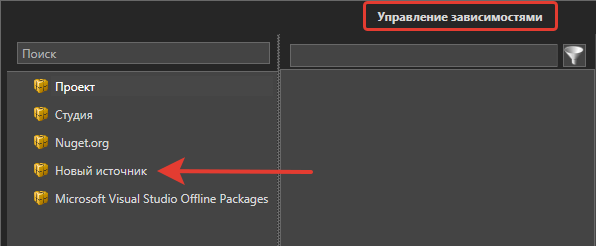

# NuGet

Primo Studio позволяет подключать собственные источники пакетов NuGet. Это можно сделать:
* в Студии в разделе **Файл > Настройки > Network > Nuget**;
* используя глобальную конфигурацию NuGet: см. [статью Microsoft](https://docs.microsoft.com/ru-ru/nuget/reference/cli-reference/cli-ref-sources).

## Подключение из Студии

1. Перейдите в раздел **Файл > Настройки > Network > Nuget**.
2. Для управления источниками имеются кнопки: «Создать», «Редактировать», «Удалить». Они отображаются в правом верхнем углу в виде иконок:

<figure><figcaption></figcaption></figure>

3. По нажатию кнопки **Создать** откроется окно с настройками источника. Обязательными к заполнению являются поля **Наименование** и **Источник**, остальные - опциональны.

<figure><figcaption></figcaption></figure>

4. После сохранения настроек новый источник будет доступен для выбора в окне [Управления зависимостями](https://docs.primo-rpa.ru/primo-rpa/primo-studio/projects/manage-dependencies#menedzher-zavisimostei). Пример:

## Дополнительно 
В качестве источника также можно указать и [локальный сервер NuGet](https://docs.primo-rpa.ru/primo-rpa/orchestrator/settings/nuget), который входит в комплект поставки Оркестратора.
