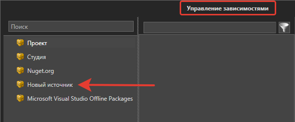

# NuGet

Primo Studio позволяет подключать собственные источники пакетов NuGet. Это можно сделать:
* в Студии в разделе **Файл > Настройки > Network > Nuget**;
* используя глобальную конфигурацию NuGet: см. [статью Microsoft](https://docs.microsoft.com/ru-ru/nuget/reference/cli-reference/cli-ref-sources).

## Подключение из Студии

1. Перейдите в раздел **Файл > Настройки > Network > Nuget**.
2. Для управления источниками имеются кнопки: «Создать», «Редактировать», «Удалить». Они отображаются в правом верхнем углу в виде иконок:

<figure><figcaption></figcaption></figure>

3. По нажатию кнопки **Создать** откроется окно с настройками источника. Обязательными к заполнению являются поля **Наименование** и **Источник**, остальные - опциональны.

<figure><figcaption></figcaption></figure>

4. После сохранения настроек новый источник будет доступен для выбора в окне [Управления зависимостями](https://docs.primo-rpa.ru/primo-rpa/primo-studio/projects/manage-dependencies#menedzher-zavisimostei). Пример:

## Дополнительно 
В качестве источника также можно указать и [локальный сервер NuGet](https://docs.primo-rpa.ru/primo-rpa/orchestrator/settings/nuget), который входит в комплект поставки Оркестратора.

## Исправления багов

- **Установка предыдущих версий зависимостей**: Ранее из окна "Управления зависимостями" невозможно было установить предыдущие версии зависимостей. Всегда устанавливалась последняя версия зависимости. Теперь этот баг устранен, и вы можете выбирать и устанавливать конкретные версии зависимостей, как требуется.
  
## Изменения в работе Зависимостей

**Вкладка Nuget**

- **Добавление зависимостей**:
  - Теперь при инициации действия "Установить", зависимость добавляется в папку .Dependencies активного проекта, если проект был открыт в Студии, или в папку .Dependencies "Студии", если проект не был открыт.
  
- **Обновление зависимостей**:
  - При инициации действия "Обновить", обновление зависимости осуществляется в папке .Dependencies активного проекта или в папке .Dependencies "Студии", в зависимости от того, был ли проект открыт.
  
- **Удаление зависимостей** (в разработке):
  - В разработке функциональность удаления зависимостей. На данный момент удаление зависимости осуществляется только в папке .Dependencies активного проекта. В будущих версиях будет добавлена возможность удаления зависимостей также из папки .Dependencies "Студии".
  
**Вкладка Студия**

- **Добавление зависимостей**:
  - При инициации действия "Установить", зависимость добавляется в папку .Dependencies активного проекта.
  
- **Обновление зависимостей**:
  - При инициации действия "Обновить", обновление зависимости осуществляется в папке .Dependencies активного проекта. При этом старая версия зависимости не удаляется.

**Вкладка Проект**

- **Добавление версий зависимостей**:
  - Во вкладке "Проект" возможно добавление версии только у тех зависимостей, которые уже есть в активном проекте. Фактически это "обновление" версии расширения.
  
- **Обновление зависимостей**:
  - При инициации действия "Обновить", обновление зависимости осуществляется в папке .Dependencies активного проекта. Если ранее версия зависимости не существовала, то она добавляется.

