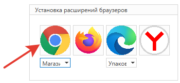

# Chrome

После каждого обновления Студии требуется либо переустанавливать расширение, либо изначально соблюдать рекомендации при [обновлении](https://docs.primo-rpa.ru/primo-rpa/primo-studio/installation/update), касающиеся файла `manifest_ch.json`. Исключением является ситуация, когда расширение было установлено с помощью [скриптов](https://docs.primo-rpa.ru/primo-rpa/primo-studio/settings/autoinstall-browser-extension).

## Способы установки

Перейдите в раздел Студии **Файл > Настройки > Инструменты > Расширения**. Дальнейшие шаги зависят от выбранного способа установки.

### Магазин (текущий пользователь)

Cпособ установки по умолчанию. Требуется подключение к интернету.

1. Под иконкой браузера Chrome выберите из списка значение **Магазин (текущий пользователь)**. 

   

1. Над иконкой браузера определите состояние параметра **Использовать манифест V3**:
   * **галочка отсутствует** — значение по умолчанию. В этом случае будет установлено стандартное расширение на базе манифеста V2. Нумерация расширения имеет вид 1.xx.
   * **галочка установлена** — установится расширение на базе нового манифеста V3, который предлагает более современные и безопасные возможности. Нумерация расширения имеет вид 3.xx. Поскольку расширение на базе V3 является новым, рекомендуется сначала проверить работоспособность RPA-проекта в Студии и только затем использовать в Оркестраторе или Robor Runner'е. 
   

Если вы меняете версию манифеста для расширения, то сначала удалите расширение на базе старого манифеста, и только затем устанавливайте новое. 


1. Нажмите на иконку Chrome.

   
   
Расширение автоматически установится из [интернет-магазина Chrome](https://chrome.google.com/webstore/detail/primo-rpa-extension/pbdnfhljkbaiibahdfcmgnfpapchlmmp) и зарегистрируется в реестре Windows в ветке текущего пользователя.

### Упакованное расширение

Установка не требует подключения к интернету. 

1. Под иконкой браузера Chrome выберите из выпадающего списка значение **Упакованное**.

   

1. Над иконкой браузера определите состояние параметра **Использовать манифест V3**: 
   * **галочка отсутствует** — значение по умолчанию. В этом случае будет установлено стандартное расширение на базе манифеста V2. Нумерация расширения имеет вид 1.xx.
   * **галочка установлена** — установится расширение на базе нового манифеста V3, который предлагает более современные и безопасные возможности. Нумерация расширения имеет вид 3.xx. Поскольку расширение на базе V3 является новым, рекомендуется сначала проверить работоспособность RPA-проекта в Студии и только затем использовать в Оркестраторе или Robor Runner'е. 


Если вы меняете версию манифеста для расширения, то сначала удалите расширение на базе старого манифеста, и только затем устанавливайте новое. 


3. Нажмите на иконку Chrome — откроется окно c сохраненными файлами расширения и экземпляр браузера Chrome.

   
   
4. В браузере Chrome перейдите в раздел **Настройки > Расширения > Управление расширениями**.
5. Перетащите файл `chrome.crx` в окно Chrome.
6. Нажмите кнопку **Установить расширение**.


Если у вас нет кнопки **Установить расширение**, включите режим разработчика.


### Распакованное расширение

Этот способ установки не требует подключения к интернету.

1\. Под иконкой браузера Chrome выберите значение **Распакованное**.\
2\. Над иконкой браузера определите состояние параметра **Использовать манифест V3**: 
   * **галочка отсутствует** — значение по умолчанию. В этом случае будет установлено стандартное расширение на базе манифеста V2. Нумерация расширения имеет вид 1.xx.
   * **галочка установлена** — установится расширение на базе нового манифеста V3, который предлагает более современные и безопасные возможности. Нумерация расширения имеет вид 3.xx. Поскольку расширение на базе V3 является новым, рекомендуется сначала проверить работоспособность RPA-проекта в Студии и только затем использовать в Оркестраторе или Robor Runner'е. 


Если вы меняете версию манифеста для расширения, то сначала удалите расширение на базе старого манифеста, и только затем устанавливайте новое. 


3\. Далее нажмите на иконку Chrome. По нажатию иконки откроются:
  * экземпляр браузера Chrome;
  * окно с сохраненными файлами расширения:
 
 
   
  * окно инсталляции с подсказками и полем ввода — с ним пока ничего не делаем:
 
 

4\. В браузере Chrome перейдите в раздел **Настройки > Расширения > Управление расширениями**.\
5\. В управлении расширениями нажмите на кнопку **Загрузить распакованное расширение** (Load unpacked) — цифра 1 на рисунке.\


Если такой кнопки нет, включите режим разработчика — цифра 2 на рисунке.


 

6\. Проверьте, что в окне загрузки указан путь до сохраненных файлов расширения (1 на рисунке), и нажмите кнопку **Выбор папки** (2 на рисунке). Пример пути: `C:\Program Files\Primo\Primo Studio x64\Extensions\Chrome`:

 

7\. Находясь в разделе расширений браузера Chrome, скопируйте идентификатор установленного расширения. Если его не видно полностью, нажмите кнопку **Сведения**:

 

8\. Вставьте скопированный идентификатор в окно инсталляции (см. шаг 2) и нажмите **ОК**:

 

### Магазин (машина)

Требуется подключение к интернету.

1. В настройках Студии, под иконкой браузера Chrome, выберите из списка значение **Магазин (машина)**.
2. Нажмите на иконку Chrome.
3. Расширение автоматически установится из [интернет-магазина Chrome](https://chrome.google.com/webstore/detail/primo-rpa-extension/pbdnfhljkbaiibahdfcmgnfpapchlmmp) и зарегистрируется в ветке реестра Windows. 

