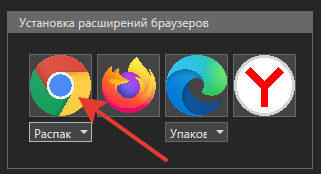

# Chrome

## Распакованное расширение

Для установки распакованного расширения:

1\. Находясь в Студии, перейдите в раздел **Файл ➝ Настройки ➝ Инструменты ➝ Расширения**.\
2\. Под иконкой браузера Chrome щелкните выпадающий список и установите значение **Распакованное**. Это режим установки расширения.\
3\. После чего нажмите на иконку Chrome:

  

4\. По нажатию иконки откроются:
  * окно браузера Chrome;
  * окно с сохраненными файлами расширения:
 
 
   
  * окно инсталляции с подсказками и полем ввода - с ним пока ничего не делаем:
 
 

5\. В открывшемся браузере Chrome перейдите в раздел **Настройки ➝ Расширения ➝ Управление расширениями**.\
6\. В управлении расширениями нажмите на кнопку **Загрузить распакованное расширение** (Load unpacked).\
    :small_blue_diamond: *Если такой кнопки нет, включите режим разработчика (цифра 2 на рисунке).*

 

7\. Проверьте, что в окне загрузки указан путь до сохраненных файлов расширения (п.4), и нажмите кнопку **Выбор папки**.\
 Пример пути: `C:\Program Files\Primo\Primo Studio x64\Extensions\Chrome`:

 

8\. Находясь в разделе расширений браузера Chrome, скопируйте идентификатор установленного расширения. Если его видно не полностью, нажмите кнопку **Сведения**:

 

9\. Вставьте скопированный идентификатор в окно инсталляции (п.4) и нажмите **ОК**:

 

:white_check_mark: Результат: расширение Primo RPA Extenssions успешно установлено.

## Упакованное расширение

Для установки упакованного расширения необходимо:

* Перейти в раздел Студии **Файл ➝ Настройки ➝ Инструменты ➝ Расширения**. Под иконкой браузера Chrome выбрать значение **Упакованное** из выпадающего списка. 
* Нажать на иконку Chrome в Primo.
* Откроется окно, содержащее сохранения файлы расширения.
* Далее перейдите в браузере Chrome в раздел **Настройки ➝ Расширения**.
* Перетащите файл `chrome.crx` в окно Chrome.

## Магазин (машина)

Расширение автоматически устанавливается из [интернет-магазина Chrome](https://chrome.google.com/webstore/detail/primo-rpa-extension/pbdnfhljkbaiibahdfcmgnfpapchlmmp) и регистрируется в ветке реестра компьютера. 

## Магазин (текущий пользователь)

Так же, как и **Магазин (машина)**, устанавливается автоматически из интернета, но регистрируется в реестре в ветке текущего пользователя.
