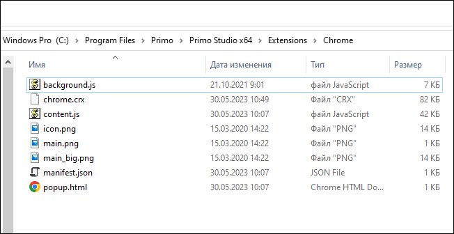

# Chrome

Чтобы установить расширение браузера Chrome вручную, перейдите в раздел Студии **Файл > Настройки > Инструменты > Расширения**. Дальнейшие шаги зависят от выбранного способа установки.

### Рекомендации

После каждого обновления Студии требуется либо переустанавливать расширение, либо изначально соблюдать рекомендации при [обновлении](https://docs.primo-rpa.ru/primo-rpa/primo-studio/installation/update), касающиеся файла `manifest_ch.json`. 

Исключением является ситуация, когда расширение было установлено с помощью [скриптов](https://docs.primo-rpa.ru/primo-rpa/primo-studio/settings/autoinstall-browser-extension).

## Способы установки

### Магазин (текущий пользователь)

Cпособ установки по умолчанию. Требуется подключение к интернету.

1. В настройках Студии, под иконкой браузера Chrome, выберите из списка значение **Магазин (текущий пользователь)**. Это режим установки расширения.

   

2. Нажмите на иконку Chrome.

   
   
3. Расширение автоматически установится из [интернет-магазина Chrome](https://chrome.google.com/webstore/detail/primo-rpa-extension/pbdnfhljkbaiibahdfcmgnfpapchlmmp) и зарегистрируется в реестре Windows в ветке текущего пользователя.

### Упакованное расширение

Установка не требует подключения к интернету. 

1. Под иконкой браузера Chrome выберите из выпадающего списка значение **Упакованное**.

   

2. Нажмите на иконку Chrome - откроется окно c сохраненными файлами расширения и экземпляр браузера Chrome.

   
   
3. В браузере Chrome перейдите в раздел **Настройки > Расширения > Управление расширениями**.
4. Перетащите файл `chrome.crx` в окно Chrome.
5. Нажмите кнопку **Установить расширение**.

### Распакованное расширение

Установка не требует подключения к интернету.

1\. Под иконкой браузера Chrome выберите значение **Распакованное**.\
2\. Нажмите на иконку Chrome. По нажатию иконки откроются:
  * экземпляр браузера Chrome;
  * окно с сохраненными файлами расширения:
 
 
   
  * окно инсталляции с подсказками и полем ввода - с ним пока ничего не делаем:
 
 

3\. В браузере Chrome перейдите в раздел **Настройки > Расширения > Управление расширениями**.\
4\. В управлении расширениями нажмите на кнопку **Загрузить распакованное расширение** (Load unpacked) - цифра 1 на рисунке.\
    :small_blue_diamond: *Если такой кнопки нет, включите режим разработчика - цифра 2 на рисунке.*

 

5\. Проверьте, что в окне загрузки указан путь до сохраненных файлов расширения (1 на рисунке), и нажмите кнопку **Выбор папки** (2 на рисунке). Пример пути: `C:\Program Files\Primo\Primo Studio x64\Extensions\Chrome`:

 

6\. Находясь в разделе расширений браузера Chrome, скопируйте идентификатор установленного расширения. Если его не видно полностью, нажмите кнопку **Сведения**:

 

7\. Вставьте скопированный идентификатор в окно инсталляции (см. шаг 2) и нажмите **ОК**:

 

### Магазин (машина)

Требуется подключение к интернету.

1. В настройках Студии, под иконкой браузера Chrome, выберите из списка значение **Магазин (машина)**.
2. Нажмите на иконку Chrome.
3. Расширение автоматически установится из [интернет-магазина Chrome](https://chrome.google.com/webstore/detail/primo-rpa-extension/pbdnfhljkbaiibahdfcmgnfpapchlmmp) и зарегистрируется в ветке реестра Windows. 

