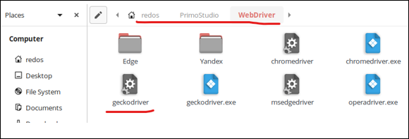
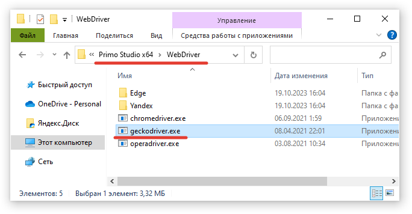

# Обновление Selenium WebDriver 

Ниже приводится инструкция по обновлению Selenium WebDriver для работы с браузером. Шаги являются общими:
* для различных ОС - Windows, Linux, MacOS;
* для различных браузеров - Firefox, Chrome, Edge, Opera, Yandex.

**Чтобы обновить веб-драйвер:**

1. Проверьте установленную версию вашего браузера на ОС.
2. Проверьте совместимость драйвера и браузера. Например, для Firefox это можно сделать [здесь](https://firefox-source-docs.mozilla.org/testing/geckodriver/Support.html).
3. Скачайте совместимую версию webdriver для вашей ОС. Пример:
   * [для Firefox](https://github.com/mozilla/geckodriver/releases);
   * [для Chrome](https://chromedriver.chromium.org/downloads);
   * [для Edge](https://developer.microsoft.com/ru-ru/microsoft-edge/tools/webdriver/);
   * [для Yandex](https://github.com/yandex/YandexDriver);
   * [для Opera](https://github.com/operasoftware/operachromiumdriver)

4. Замените geckodriver в папке `<путь до студии>/WebDriver`.

   Пример для Linux:

   

   Пример для Windows:

   
 
