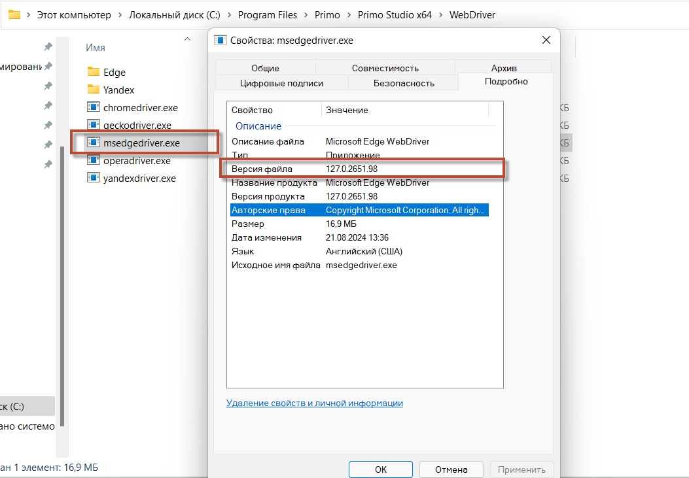
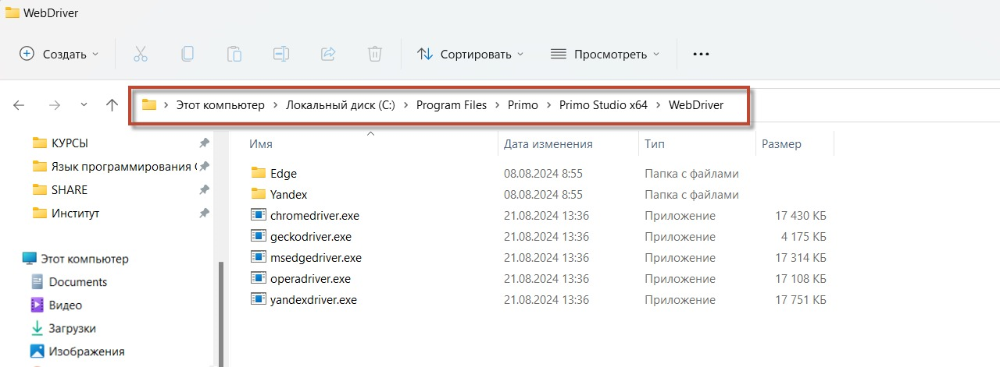

# Обновление Selenium WebDriver 

Ниже приводится инструкция по обновлению  WebDriver для работы с браузером. Шаги являются общими:
* для ОС Windows, Linux, MacOS;
* для браузеров Firefox, Chrome, Edge, Opera, Yandex.

### **Как обновить WebDriver:**

1. Проверьте установленную версию вашего браузера на ОС. Убедитесь, что у вас установлена последняя версия браузера, с которым вы планируете работать. 
Для этого перейдите в раздел "О программе" (обычно находится в меню настроек браузера). 
2. Убедитесь, что версия WebDriver совместима с версией вашего браузера. Например, для Firefox совместимые версии драйверов можно найти [на официальной странице Geckodriver](https://firefox-source-docs.mozilla.org/testing/geckodriver/Support.html).
3. Узнайте текущую версию WebDriver:
   
**Проверка версии WebDriver в папке с драйверами:**
   - Перейдите в папку с драйверами  **C:\Program Files\Primo\Primo Studio x64\WebDriver**
   - Найдите нужный драйвер, например, *msedgedriver.exe*, Щёлкните правой кнопкой мыши на файле, выберите `Свойства`, а затем перейдите на вкладку `Подробности`, где будет указана версия драйвера.

       

 **Проверка версии WebDriver через командную строку:**
   - Для большинства драйверов (например, *ChromeDriver* или *GeckoDriver*), вы можете открыть командную строку (или терминал на Mac/Linux) и ввести следующую команду:
     - Для *ChromeDriver*:
       bash
       chromedriver --version
       
     - Для *GeckoDriver* (Firefox):
       bash
       geckodriver --version

       Эти команды отобразят текущую версию установленного WebDriver.

4. Скачайте совместимую версию Webdriver для вашей ОС. Пример:
   * [для Firefox](https://github.com/mozilla/geckodriver/releases);
   * [для Chrome](https://chromedriver.chromium.org/downloads);
   * [для Edge](https://developer.microsoft.com/ru-ru/microsoft-edge/tools/webdriver/);
   * [для Yandex](https://github.com/yandex/YandexDriver);
   * [для Opera](https://github.com/operasoftware/operachromiumdriver).

5. После загрузки замените текущий драйвер в папке <путь до студии>/WebDriver на новую версию.
   - Например, для Firefox замените geckodriver.exe на новую версию.

   * Пример для Linux:

   

   * Пример для Windows:

   

### Улучшения в версии 1.24.8:

   - В комплекте с Primo RPA Studio 1.24.8 новые версии веб-драйверов (Chrome, Yandex, Firefox (Gecko), Edge, Opera).
   - Актуализированы пути до компонентов WebDriver по умолчанию
   - Обновление пакета Selenium.WebDriver. Добавлена поддержка веб-драйвера для версии Firefox 121 и старше.

Важно, чтобы версия веб-драйвера точно соответствовала версии браузера. Использование более свежего веб-драйвера может привести к некорректной работе, если браузер давно не обновлялся.
 
