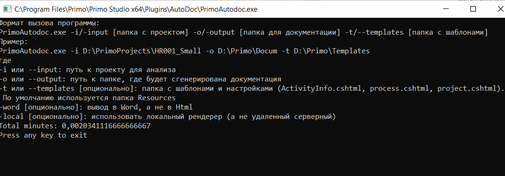

# Автодок (AutoDoc)

*AutoDoc* — это утилита командной строки, разработанная для автоматического формирования документации по проектам Primo. 
С её помощью можно сгенерировать подробные отчёты по переменным, аргументам, структуре процессов и диаграммам, которые помогут в анализе и сопровождении проектов.
По умолчанию *AutoDoc* устанавливается в директорию *Plugins\AutoDoc* в папке установки **Primo RPA Studio**. 
Конкретный путь может отличаться в зависимости от операционной системы и разрядности, например:

- *Windows* (x64): C:\Program Files\Primo\Primo Studio x64\Plugins\AutoDoc
- *Windows* (x86): C:\Program Files (x86)\Primo\Primo Studio\Plugins\AutoDoc
- *Linux*: /opt/primo/plugins/AutoDoc
- *MacOS*: /Applications/Primo/Plugins/AutoDoc

## Системные требования AutoDoc 
AutoDoc требует установленной платформы *.NET 6.0*
 Минимальные требования:
- *Microsoft .NET 6.0 LTS*
- *Операционные системы*:
  - Windows 11, Windows 10 (версия 1607+), Windows Server 2019, Windows 8.1
  - Linux (Ubuntu, Debian, CentOS)
  - macOS (10.13 и выше)
- *Процессор*: x64, Arm64 или Arm32
- *Память*: Минимум 1 ГБ ОЗУ
- *Java Development Kit (JDK)* (необходим для использования локального рендерера)


## Основные параметры запуска

AutoDoc запускается через командную строку с использованием следующих параметров:
```
PrimoAutodoc.exe -i/-input [папка с Primo-проектом] -o/-output [выходная папка] -t/templates [папка с шаблонами (необязательно)] [-word] [-local]
```
Описание параметров:
- *-i / -input*: Путь к папке с проектом Primo.
- *-o / -output*: Путь к выходной папке, в которую будет сгенерирована документация.
- *-t / -templates*: Путь к папке с шаблонами (опционально).
- *-word*: Генерация документации в формате Word. По умолчанию используется HTML.
- *-local*: Использование локального рендерера для создания диаграмм.

### Пример команды:

```
PrimoAutodoc.exe -i D:\Primo\PrimoProjects\HR001_Small -o D:\Primo\Docum -t D:\Primo\Templates
```
- *HR001_Small* — папка с проектом. Внутри неё находятся файлы проекта (.ltp, .ltw и др.).
- *Docum* — выходная папка, в которой будет создан файл Proj_HR001_Small.html с документацией.
- *Templates* — папка с шаблонами для документации (необязательно).

    

## Описание файлов и шаблонов
В папке Resources содержатся настроечные файлы и шаблоны, используемые для генерации документации.

- *AppsAndSites.txt* — описания для приложений и сайтов.
- *DocsRegexp.txt* — регулярные выражения для файлов-документов.
- *elements.csv* — описания активностей проекта: группа — описание — название класса
- *PropertiesDict.csv* — описания свойств активностей.
- *tags.csv* — соответствие тегов и групп активностей.
- *Template.uml* — шаблон для UML диаграмм.

### Razor-шаблоны для HTML-документации:
- *project.cshtml* — шаблон для описания проекта.
- *process.cshtml* — шаблон для описания процесса, где строка {Activities} заменяется списком активностей.
- *ActivityInfo.cshtml* — шаблон для активностей проекта.

## Конфигурация

Конфигурационный файл *appsettings.json* используется для настройки программы, что характерно для приложений, разработанных на *.NET Core**
В нем можно указать путь к внешним программам для автоматической обработки тегов. Несколько программ могут быть указаны одновременно, разделяясь вертикальной чертой (|).

Пример содержимого файла *appsettings.json*:

```
{
  "UseCustomTagger": "True",
  "Tagger": "D:\\DEV\\TaggerStub.exe | D:\\DEV\\Tagger_01.exe"
}
```

- *UseCustomTagger* — включает использование внешних программ для обработки тегов. Если значение установлено в True, система будет использовать внешние программы, указанные в поле *Tagger*.
- *Tagger* — путь к программам, которые проставляют теги.

## Локальный рендеринг изображений

Для генерации диаграмм с использованием локального рендерера необходимо:
1. Установить *Java Development Kit (JDK)*.
2. Прописать переменную среды *JAVA_HOME* (желательно без пробелов в пути).
3. Убедиться, что в папке с программой есть файл *plantuml.jar*.

## Примечание

AutoDoc не имеет графического интерфейса, но можно создать *.bat* файл для удобного запуска с нужными параметрами.

AutoDoc автоматически присваивает имя итоговому файлу на основе названия проекта. 
Чтобы увидеть результат, перейдите в папку, указанную в параметре *-o, и откройте сгенерированный *.docx** (если использовался -word) или *.html* файл в соответствующей программе.


    

