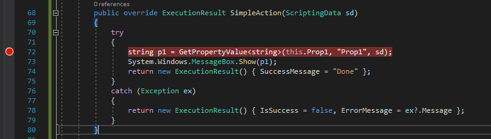
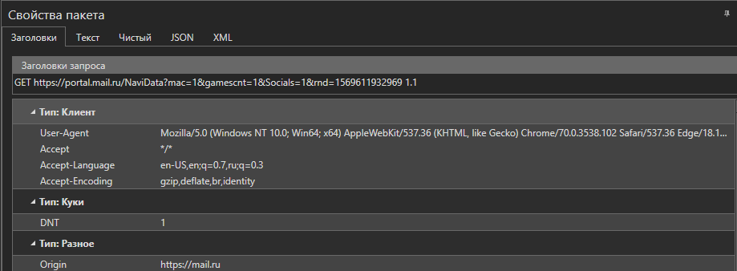
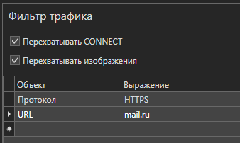

# Запись трафика

Подсистема слежения за трафиком Primo Studio позволяет быстро и легко анализировать обмен с порталами, сайтами и веб-сервисами, а также формировать Web-запросы в сценариях на основе полученных данных.

**ВНИМАНИЕ! Для работы Инспектора трафика необходимо запустить Студию с правами локального администратора**

Подсистема слежения представлена панелями "Перехват трафика", "Свойства пакета" и "Фильтр трафика".

Панель "Перехват трафика" отображает в хронологическом порядке все запросы и ответы, происходящие на рабочем месте пользователя в реальном времени. Для начала записи трафика необходимо нажать кнопку "Начать перехват" .png>). После нажатия в таблице панели начнут появляться запросы, производимы с рабочего места. В таблице запросов отображаются данные:

* Результат: код события запроса
* Протокол: тип протокола запроса
* Host: имя удаленной машины
* URL: адрес удаленной машины
* Тело: размер тела запроса в байтах
* Кеширование: информация о кешировании
* Тип контента

Текст тела запроса и ответа можно узнать, нажав на значок + в заголовке запроса

.png>)

Для остановки записи нужно нажать кнопку "Остановить перехват" 

Для удаления из списка выделенных запросов, нужно нажать кнопку "Удалить"  (1) (2) (1) (1) (1) (2) (1) (2).png>)

Для очистки списка запросов нужно нажать кнопку "Очистить" 

Чтобы получить более подробную информацию о запросе и ответе, нужно выделить его в панели "Перехват трафика", после чего информация о нем будет отражена в панели "Свойства пакета".

В верхней части панели находится информация о запросе, в нижней, информация об ответе. Информация в панели делится на категории:

* Заголовки: информация о заголовках
* Текст: текст тела запроса
* Чистый: текст запроса/ответа в чистом виде (заголовки и тело)
* JSON: просмотр данных тела в виде JSON
* XML: просмотр данных тела в виде XML

Для пред-фильтрации трафика имеется панель "Фильтр трафика".

В данной панели можно:

* Включить отслеживание запросов типа CONNECT
* Включить перехват запросов мультимедиа-контента
* Создать специальные фильтры

В таблице специальных фильтров можно создавать фильтры определенных элементов запроса/ответа на основе регулярных выражений. Фильтр содержит следующие элементы:

* Результат
* Протокол
* Host
* URL
* Тип контента (запрос)
* Тип контента (ответ)
* Заголовок (запрос)
* Заголовок (ответ)
* Тело (запрос)
* Тело (ответ)

Например, для фильтрации запросов только к сайтам с URL включающей mail, необходимо создать фильтр с Объектом URL и Выражением .\*mail.\*
