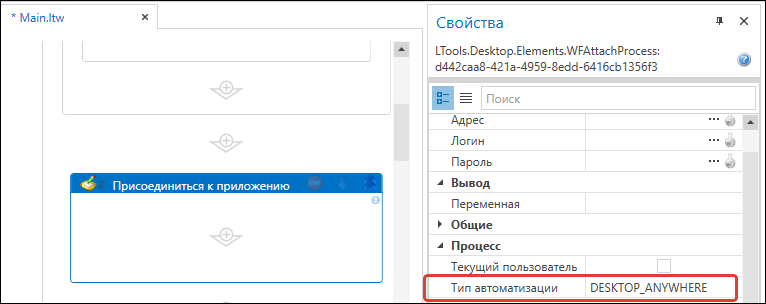

# Desktop Anywhere

Утилита **Desktop Anywhere** позволяет взаимодействовать с приложенияеми, запущенными на удаленном рабочем столе (RDP, Citrix, VMWare и т.д.). 

Для работы с удаленным приложением необходимо установить агента **Desktop Anywhere** на удаленной машине, а в элементе [**Присоединиться к приложению**](https://docs.primo-rpa.ru/primo-rpa/g_elements/el_basic/els_desktop/el_desktop_attach) выбрать тип подключения **Desktop Anywhere**.

