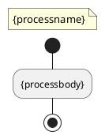
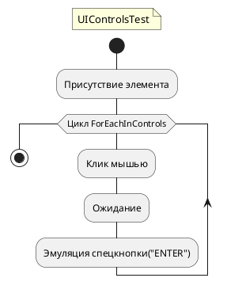

# Шаблоны AutoDoc

При создании документации Робота (паспорт робота) в *AutoDoc* применяются несколько шаблонов для описания проектов и их структуры:

- **project.cshtml** — Шаблон для описания проекта (*.ltp). Использует модель данных `ProjectInfo`.
- **process.cshtml** — Шаблон для описания процесса, где строка `{Activities}` заменяется списком активностей.
- **ActivityInfo.cshtml** — Шаблон для активностей проекта.
- **Template.uml** - Шаблон UML для визуализации процессов.
- **Template.docx** - Шаблон для автоматической генерации описания проекта в формате документа **MS Word**

Каждый шаблон использует свою модель данных, которая определяется директивой `@model`.

В *AutoDoc* все шаблоны расположены в папке **Resources**. Она содержит файлы настроек и шаблоны, необходимые для генерации документации. Внутри этой папки также находятся подпапки **assets** и **mazer**, которые включают скрипты, шрифты и файлы изображений для оформления выходных документов.

При создании пользовательских шаблонов в *AutoDoc* важно понимать синтаксис разметки и внедренного кода. Рекомендуется изучить справочник по синтаксису Razor, доступный по следующей ссылке: [Справочник по синтаксису Razor](https://learn.microsoft.com/ru-ru/aspnet/core/mvc/views/razor?view=aspnetcore-8.0).
Чтобы создать собственный шаблон, рекомендуется скопировать папку **Resources** и внести необходимые изменения в шаблоны *AutoDoc* под свои требования. Пользовательские шаблоны можно указать при запуске *AutoDoc* с параметрами `-t` или `-templates`.

Формат готовых документов зависит от параметров запуска:
- По умолчанию документы создаются в формате HTML.
- Для создания документов MS Word формата *.docx* используйте параметр `-word`.

#### Шаблон process.cshtml

**process.cshtml** — это шаблон, предназначенный для описания файла процесса (*.ltw). В этом шаблоне используется модель данных `ProcessInfo`, подключаемая с помощью директивы `@model`. 

```csharp
@using PrimoConverter.PrimoModel
@using PrimoDocum.ObjectModel
@model ProcessInfo
```

В шаблоне **process.cshtml** предусмотрен специальный тег `{Activities}`, который обозначает место, куда *AutoDoc* автоматически вставляет результат заполнения шаблона **ActivityInfo**. Это позволяет легко интегрировать информацию об активностях процесса в итоговый документ.

*Пример структуры шаблона project.cshtml:*

Шаблон **project.cshtml** предназначен для описания проекта в формате HTML. Для этого используется модель данных `ProjectInfo`, которая подключается через директиву `@model`:

```csharp
@using PrimoAutodoc.ObjectModel
@using PrimoConverter.Utils
@using PrimoDocum.ObjectModel
@model ProjectInfo
```

Модель данных `ProjectInfo` определяет доступ к информации о проекте, такой как имя, описание и список компонентов, которые можно включить в выходной документ.

#### Шаблон ActivityInfo.cshtml

**ActivityInfo.cshtml** — это шаблон активностей, предназначенный для описания элементов процесса. В этом шаблоне используется модель данных `IEnumerable<ActivityInfo>`, которая подключается с помощью директивы `@model`.

```csharp
@using PrimoAutodoc.ObjectModel
@using PrimoConverter.Utils
@using PrimoDocum.ObjectModel
@using System.Collections.Generic
@using System.Linq
@model IEnumerable<ActivityInfo>
```

Шаблон **ActivityInfo.cshtml** выполняет обход дерева элементов процесса в порядке их вызова. Для отображения структуры элементов используется метод `ShowTree(@Model)`, который обеспечивает последовательное отображение всех активностей внутри процесса.


#### Шаблон Template.uml

**Template.uml** — это шаблон UML для визуализации процессов в *AutoDoc*. Шаблон содержит два специальных тега:

- `{processname}` — вставка названия процесса.
- `{processbody}` — вставка описания схемы.

Эти теги используются *AutoDoc* для автоматического заполнения данных о процессе и его структуре при генерации документации.

**Пример использования Template.uml**:

### Template.uml


### UIControlsTest.uml


 

На изображении выше показан пример схемы, созданной с помощью **Template.uml**, с использованием тегов для отображения названия и содержимого процесса.
Эти блоки кода созданы для **PlantUML** и включают директивы для управления стилем, а также определяют процесс с циклом и действиями. 


### Шаблон документа **Template.docx**

Шаблон **Template.docx** предназначен для автоматической генерации описания проекта в формате MS Word с использованием тегов автодока для вставки данных. Шаблон условно состоит из трех основных частей:

1. **Оглавление**
2. **Статистика по проекту**
3. **Описание каждого процесса, входящего в проект**


 

На скриншоте представлены ключевые элементы структуры шаблона, включая специальные **граничные маркеры**  в начале и конце каждого блока информации. Эти маркеры служат для обозначения границ блока данных и необходимы для корректной работы автодока.

В шаблоне используются следующие теги:
- `[ProcessName]` — название процесса.
- `[ActivityCount]`, `[VarCount]`, `[ArgCount]`, `[QueueCount]`, `[AssetCount]` — параметры, отображающие количество элементов, переменных, аргументов, очередей и ассетов соответственно.
- `[Tags]`, `[Structure]`, `[MainScheme]` — дополнительные данные, такие как теги, структура и схема процесса.

Эти теги заполняются автоматически данными из системы, создавая итоговый отчет о проекте.

- Из шаблона можно безопасно удалить логотип и оглавление, поскольку их можно восстановить на любом этапе создания пользовательского шаблона.
- **Важно:** Не удаляйте и не изменяйте **граничные маркеры** и основные теги блока информации о процессе (такие как `[ProcessName]`, `[Tags]`, `[Structure]` и т. д.). Эти элементы необходимы для корректного формирования документа. Без них автодок не сможет обработать шаблон и выдаст ошибку.


Если теги и граничные маркеры были удалены, их можно восстановить, создав группу следующим образом:

1. **Откройте шаблон** в MS Word и перейдите на вкладку **Разработчик** (Developer), включите **Режим конструктора** (Design Mode).

2. **Создайте группу** для блока с тегами:
   - Выделите текст, содержащий основные теги для автодока (например, `[ProcessName]`, `[ActivityCount]`, `[VarCount]`, `[ArgCount]`, `[QueueCount]`, `[AssetCount]`, `[Tags]`, `[Structure]`, `[MainScheme]`), и используйте команду **Группировать** (Group) для создания единого блока.
   
3. **Проверьте структуру**:
 Сформированная группа с основными тегами и таблицей, где каждая строка отображает параметр и его соответствующий тег.
   
4. **Сохраните документ** для того, чтобы изменения вступили в силу.


После обработки Автодоком, эта группа будет скопирована и заполнена данными для каждого процесса, входящего в проект. 
Это позволит автоматически генерировать полноценные отчеты, где для каждого процесса будут представлены его характеристики и структура.


### Описание тегов для Template.docx

Шаблон **Template.docx** включает в себя ряд тегов, предназначенных для автоматического заполнения данных о проекте и процессах. Каждый тег выполняет определенную функцию, вставляя данные о проекте или процессах. Ниже приведено описание всех используемых тегов:

| Тег               | Назначение                                           |
|-------------------|------------------------------------------------------|
| **Проект**        |                                                      |
| `[ProjectName]`   | Имя проекта                                          |
| `[ProcessCount]`  | Количество процессов                                 |
| `[ActivityCount]` | Общее количество элементов в проекте                 |
| `[VarCount]`      | Общее количество переменных в проекте                |
| `[ArgCount]`      | Общее количество аргументов в проекте                |
| `[QueueCount]`    | Общее количество очередей в проекте                  |
| `[AssetCount]`    | Общее количество ресурсов (ассетов) в проекте        |
| `[LibCount]`      | Количество библиотек                                 |
| `[ProjectTags]`   | Теги проекта                                         |
| **Процесс**       |                                                      |
| `[ActivityCount]` | Количество элементов процесса                        |
| `[VarCount]`      | Количество переменных процесса                       |
| `[ArgCount]`      | Количество аргументов процесса                       |
| `[QueueCount]`    | Количество очередей процесса                         |
| `[AssetCount]`    | Количество ресурсов процесса                         |
| `[Tags]`          | Теги процесса                                        |
| `[Structure]`     | Структура (содержание) процесса                      |
| `[MainScheme]`    | Краткая схема процесса                               |


> **Важно:** Теги должны быть использованы в соответствующих местах шаблона и, при необходимости, заключены в группы с использованием **граничных маркеров**. Это позволит автодоку корректно обработать и заполнить шаблон.


### Описание свойств, используемых в шаблонах `*.cshtml`

Раздел содержит подробное описание свойств и типов данных, которые применяются в шаблонах `*.cshtml` для создания отчетов и документации.

####  Типы данных и их описание

**1. Тип *`ProjectInfo`***

Этот тип описывает общие данные о проекте, такие как его компоненты, теги, ресурсы и т. д.

| Свойство          | Тип                   | Описание                                          |
|-------------------|-----------------------|---------------------------------------------------|
| **ArgumentCount** | `int`                 | Общее количество аргументов                       |
| **Assets**        | `HashSet<string>`     | Общий список ресурсов                             |
| **ComponentCount**| `int`                 | Общее количество компонентов                      |
| **Descr**         | `string`              | Описание проекта из файла ITP                     |
| **GitRepo**       | `string`              | Путь к репозиторию GIT                            |
| **GroupUsage**    | `Dictionary<string, int>` | Группы элементов (наименование, количество)  |
| **HtmlKeywords**  | `string`              | Ключевые слова для метаданных страницы            |
| **Libraries**     | `HashSet<string>`     | Общий список библиотек                            |
| **Name**          | `string`              | Наименование проекта из файла ITP                 |
| **ProcessCount**  | `int`                 | Общее количество процессов                        |
| **Queues**        | `HashSet<string>`     | Общий список очередей                             |
| **Tags**          | `HashSet<string>`     | Общий список тегов                                |
| **Toc**           | `List<ToCItem>`       | Содержание — список элементов проекта             |
| **VariableCount** | `int`                 | Общее количество переменных                       |

**2. *Тип `ProcessInfo`***

Этот тип описывает информацию о каждом процессе, включая переменные, компоненты, аргументы и другие свойства, специфичные для процесса.

| Свойство               | Тип                           | Описание                                                         |
|------------------------|-------------------------------|------------------------------------------------------------------|
| **Activities**         | `List<ActivityInfo>`          | Список элементов процесса верхнего уровня                        |
| **Arguments**          | `List<ScriptVariable>`        | Аргументы                                                        |
| **ArgumentsGroups**    | `List<string>`                | Список групп аргументов                                          |
| **Assets**             | `HashSet<string>`             | Ресурсы                                                          |
| **BackPath**           | `string`                      | Относительный путь от папки процесса до папки проекта ("../..")          |
| **Components**         | `List<SerializationComponent>`| Компоненты процесса верхнего уровня                              |
| **Description**        | `string`                      | Описание проекта из файла Itw                                    |
| **GetTotalActivitiesCount** | `int`                   | Общее количество элементов                                       |
| **GlobalVariables**    | `List<ScriptVariable>`        | Переменные                                                       |
| **GlobalVariablesGroups** | `List<string>`            | Список групп переменных                                          |
| **HtmlKeywords**       | `string`                      | Ключевые слова для метаданных страницы                           |
| **HtmlText**           | `string`                      | Часть пути от папки отчетной документации до файла отчета html (с расширением файла) |                             |
| **HtmlPathName**       | `string`                      | Часть пути от папки отчетной документации до файла отчета HTML (без расширения файла)                        |
| **HtmlTreePrefix**     | `string`                      | Html строка неразрывных пробелов (&nbsp;), соответствующая уровню вложенности процесса (Кол-во пробелов соответствует кол-ву папок в RelativePath)                    |
| **Name**               | `string`                      | Наименование процесса из файла Ltw                               |
| **ProjectHtml**        | `string`                      | Наименование файла с описанием проекта                           |
| **Queues**             | `HashSet<string>`             | Очереди                                                          |
| **RelativePath**       | `string`                      | Часть пути от папки проекта к подпапке с файлом процесса         |
| **SvgFileNameBigFull** | `string`                      |Устаревшее название (не использовать) 
| **SvgFileNameBig**     | `string`                      |  Путь к полной диаграмме процесса                           |
| **SvgFileNameSmall**   | `string`                      | Путь к краткой диаграмме процесса                                |
| **Tags**               | `HashSet<string>`             | Список тегов   tags.csv                                                  |
| **TocTodo**            | `List<ToCItem>`               | Список задач  (элементы WFToDo)                                                   |

***3. Тип `ToCItem`***

Этот тип описывает отдельные элементы содержания проекта, такие как описание, имя и ссылку на документ.

| Свойство      | Тип       | Описание                                    |
|---------------|-----------|---------------------------------------------|
| **Descr**     | `string`  | Описание элемента                           |
| **IsFolder**  | `string`  | Признак папки                               |
| **Name**      | `string`  | Имя элемента                                |
| **Prefix**    | `string`  | Префикс (путь до вложенного элемента)       |
| **Link**      | `string`  | Ссылка на документ — описание шаблона       |

***4. Тип `ScriptVariable`****

Тип `ScriptVariable` содержит информацию о переменных сценария, таких как имя, тип и значение по умолчанию.

| Свойство            | Тип          | Описание                                     |
|---------------------|--------------|----------------------------------------------|
| **subsheetid**      | `string`     | Идентификатор на листе                       |
| **IsGlobal**        | `bool`       | Признак глобальной переменной                |
| **Name**            | `string`     | Имя переменной                               |
| **Group**           | `string`     | Группа                                       |
| **Comment**         | `string`     | Комментарий                                  |
| **DataTypeString**  | `string`     | Тип переменной в строковом виде              |
| **Direction**       | `string`     | Назначение                                   |
| **DefaultValue**    | `DefaultValue`| Значение по умолчанию                       |
| **DefaultValueText**| `string`     | Значение по умолчанию в текстовом виде       |
| **ToHtml()**        | `string`     | Строка описания переменной для вставки в HTML|

**5. *Тип `SerializationComponent`****

Тип `SerializationComponent` описывает компоненты процесса, включая название, версию сборки и свойства компонента.

| Свойство           | Тип                   | Описание                                  |
|--------------------|-----------------------|-------------------------------------------|
| **AssemblyName**   | `string`              | Имя и версия сборки                       |
| **ClassName**      | `string`              | Имя класса компонента                     |
| **ClassRu**        | `string`              | Имя класса для документации  из elements.csv              |
| **Components**     | `Components`          | Дочерние компоненты                       |
| **NextElements**   | `HashSet<string>`     | Список идентификаторов последующих компонентов, выполняющихся после текущего компонента |
| **Properties**     | `Properties`          | Свойства компонента                       |

**6. Тип `Components`***

Тип `Components` используется для хранения списка компонентов процесса.

| Свойство                  | Тип                           | Описание                     |
|---------------------------|-------------------------------|------------------------------|
| **SerializationComponent** | `List<SerializationComponent>` | Список компонентов          |

**7. Тип `Properties`***

Тип `Properties` описывает свойства компонента и включает список элементов `SerializationItem`.

| Свойство                  | Тип                           | Описание                     |
|---------------------------|-------------------------------|------------------------------|
| **SerializationItem**     | `List<SerializationItem>`     | Список свойств               |


**8. Тип `SerializationItem`****

Тип `SerializationItem` описывает элементы сериализации, их значения и текстовое представление.

| Свойство       | Тип                    | Описание                                     |
|----------------|------------------------|----------------------------------------------|
| **IsListValue**| `string`               | Признак наличия нескольких значений  "false" или "true        |
| **ListValue**  | `List<SerializationItem>`| Список значений                              |
| **Name**       | `string`               | Имя элемента                                 |
| **Value**      | `Value`                | Значение элемента                            |
| **ValueText**  | `string`               | Текстовое значение элемента                  |

**9. Тип `ActivityInfo`****

Тип `ActivityInfo` описывает вложенные элементы активности, их идентификаторы, свойства и другие характеристики.

| Свойство            | Тип                   | Описание                                        |
|---------------------|-----------------------|-------------------------------------------------|
| **Activities**      | `List<ActivityInfo>`  | Список вложенных элементов                      |
| **BlockCatch**      | `ActivityInfo`        | Элемент BlockCatch и входящие в него активности                              |
| **BlockElse**       | `ActivityInfo`        | Элемент BlockElse и входящие в него активности                              |
| **BlockFinally**    | `ActivityInfo`        | Элемент BlockFinally и входящие в него активности                           |
| **BlockThen**       | `ActivityInfo`        | Элемент BlockThen  и входящие в него активности                             |
| **BlockTry**        | `ActivityInfo`        | Элемент BlockTry  и входящие в него активности                              |
| **Descr**           | `string`              | Описание элемента                               |
| **Guid**            | `string`              | Идентификатор элемента                          |
| **HasChildren**     | `bool`                | Наличие вложенных элементов (Есть записи в свойстве Activities)                    |
| **Header**          | `string`              | Заголовок элемента                              |
| **HtmlBorderColor** | `string`              | Цвет рамки границ элемента в отчете. 
Зависит от типа элемента                    |
| **IsFirstLevel**    | `bool`                |Признак элемента корневого уровня               |
| **Link**            | `string`              | Ссылка на файл описания элемента                         |
| **Name**            | `string`              | Наименование элемента                           |
| **Num**             | `int`                 | Порядковый номер в списке активностей           |
| **PngFile**         | `string`              | Путь к файлу снимка экрана, отображаемому в элементе                          |
| **Props**           | `List<ActivityProp>`  | Свойства элемента                               |
| **ShortClass**      | `string`              | Короткое имя типа элемента                     |

**10. Тип `ActivityProp`****

Тип `ActivityProp` описывает свойства активности, такие как имя, язык и текстовое значение.

| Свойство     | Тип       | Описание                                |
|--------------|-----------|-----------------------------------------|
| **IsCode**   | `bool`    | Признак вычисляемости поля              |
| **Language** | `string`  | Язык                                    |
| **Name**     | `string`  | Имя свойства                            |
| **Value**    | `string`  | Текстовое значение свойства             |


#### Рекомендации по использованию

- **ProjectInfo** — используется для отображения общей информации о проекте.
- **ProcessInfo** — описывает характеристики каждого процесса, такие как переменные и аргументы.
- **ToCItem** — структурирует содержание проекта.
- **ActivityInfo** — применим для описания активностей внутри процесса, включая вложенные элементы.
- **SerializationComponent** и **SerializationItem** — используют для сериализации данных процесса и его компонентов.

### Рендеринг схем

По умолчанию рендеринг схем происходит удаленно с помощью сервера PlantUML. Если интернет-соединение недоступно, можно выполнить локальный рендеринг с помощью параметра `-local` в командной строке. В этом случае рендеринг всегда будет выполняться локально.

Для успешного локального рендеринга необходимо:

1. Установить **Java Development Kit (JDK)**.
2. Установить переменную среды `JAVA_HOME` (желательно, чтобы путь не содержал пробелов).
3. Убедиться, что в папке с программой находится файл **plantuml.jar** (примерно 11 МБ), который входит в пакет установки версии 1.24.10.X.

