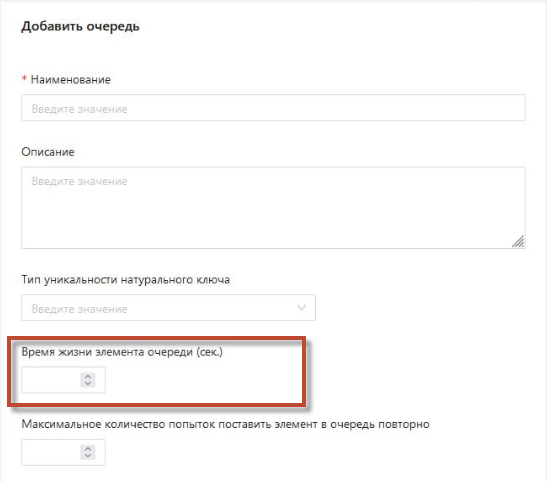

# Оркестратор 1.24.6

История изменений в Primo RPA Orchestrator за июнь 2024-го года. 

## Обновления

1. Добавлена возможность автоматического удаления элементов очереди, находящихся в статусе `InProgress` дольше заданного таймаута. По умолчанию функция отключена. Чтобы ее активировать, необходимо в конфигурационном файле Оркестратора установить параметру `EnabledInProgressTimeout` значение `true`. Только после этого в веб-интерфейсе появится возможность указать таймаут для элемента очереди. Также важно учесть, что физическое удаление элемента очереди зависит от параметра **AllowPhysicalRemoval**.
    * Физическое удаление элемента очереди при `"AllowPhysicalRemoval": true`:
    Если элемент прочитан роботом, он переходит из статуса `New` в статус `InProgress`. По истечению таймаута элемент удаляется из очереди и из базы данных.
    * Логическое удаление элемента очереди при `"AllowPhysicalRemoval": false`:
    Если элемент прочитан роботом, он переходит из статуса `New` в статус `InProgress`. По истечению таймаута элемент помечается как `Удалённый` и продолжает отображаться в списке. Запись в базе данных не удаляется.

 

2. Улучшена безопасность почтовых рассылок с параметром `SecureSocketOption` в службе [Notifications](https://github.com/PrimoRPA/Docs.Rus/pull/1290/commits/021a09c4cdc9232eed5b0e9cddfbaeb93f692499)

3. Улучшено логирование Оркестратора: теперь при выводе сообщения в логе отображается полное сообщение, а не только первые 200 символов. В БД запись сохраняется полностью.

4. Добавлен новый виджет **Мерцающие RDP-сессии** во вкладке **Обзор**. Виджет отображает таблицу активных RDP-сессий. При отсутствии активных сессий таблица в виджете отсутствует.

5. Добавлена опция отключения кнопок массовой остановки и запуска заданий. В файл конфигурации добавлены два поля для управления отображением кнопок `Остановить все` и `Запустить все остановленные`.

6. Добавлена интеграция с [**CyberArk**](https://docs.primo-rpa.ru/primo-rpa/orchestrator/security#integraciya-s-cyberark)  в форме **Добавить/Редактировать ресурс** для централизованного управления учетными данными.

7. Добавлена возможность фильтрации проектов по источнику публикации. 

 

При нажатии на поле открывается выпадающий список с тремя значениями: Orchestrator, Studio, Git.
При выборе значения из списка записи фильтруются в соответствии с выбранным значением и отображается количество отфильтрованных записей.

## Улучшения в UI 3

1. Улучшено управление элементами:
   * Упрощено удаление и клонирование элементов из очереди. Теперь элементы можно удалять или клонировать прямо через меню **Действия** на странице Очереди без предварительного выбора чекбоксом. Ранее требовалось отдельное выделение каждого элемента.
   * Добавлена возможность выделения элементов двойным кликом мыши.

2. Улучшено отображение данных:
- На вкладке **Очереди** теперь отображается количество удаленных элементов (`countRemoved`) под общим количеством через разделительную черту.
- Если значение `countRemoved` отсутствует, данные показывается в стандартном виде.
- В форме редактирования очереди добавлена подсказка для поля `Физическое удаление`.

3. Добавлено отображение удаленных элементов в статистике очереди обмена данными.

4. Добавлен статус 'Выключенный' для машины робота (Агента). Теперь отключенные Агенты исключаются из выборки опроса и предупреждения о недоступности их машин больше не записываются в логи.

5. Улучшено отображение параметра `Таймаут` в форме **Ресурсы**. Параметр указывается в секундах в формах добавления и редактирования.

6. Улучшено отображение информации в статистике очередей при создании большого количества очередей.

7. Во вкладке Ресурсы в формах Добавить/Редактировать ресурс добавлены новые поля: `Тип внешнего хранилища` и `Учетная запись CyberArk`.

8. Улучшена навигация между страницами **Запуски** и **Логи задания** 
 
9. Добавлена возможность редактирования аргументов в заданиях. 

10. Улучшено отображение элементов очереди (транзакций). Теперь при изменении количества отображаемых записей все страницы элементов очереди показываются корректно.

11. Улучшено отображение тегов проекта. Теперь добавленные теги проекта отображаются под описанием проекта или под наименованием проекта, если описание отсутствует. 

12. Улучшено окно предпросмотра метаданных элементов очереди Оркестратора, теперь корректно отображаются все пробелы.

13. Улучшена функциональность сохранения пользовательских настроек при отображении столбцов таблицы. Теперь пользовательские настройки не теряются при переключении разделов или перезагрузке браузера.

14. Исправлена ошибка, при которой таблица заданий не экспортировалась в файл `CSV`.

15. Добавлена возможность редактирования ассетов через новое контекстное меню во вкладке **Ресурсы** (Assets)

16. Добавлена кнопка **Повторить**  во вкладке **Запуски**. 

17. На странице **Роботы > Добавить Робота** добавлены поля для учетной записи `Пользователь Оркестратора` и `Пароль пользователя Оркестратора`, с всплывающими подсказками, разъясняющими требования к паролю.

18. Добавлена поддержка предрелизных версий (RC) и установлены права доступа к релизным версиям.

## Исправленные ошибки

1. Исправлена ошибка запуска заданий. Ранее при попытке запустить задание, находящееся в статусе `Ошибка`, возвращалась `Команда Start не применима к заданию`. Теперь состояние задания корректно обновляется перед запуском, позволяя перевести задание в статус **Выполняется**

2. Исправлена ошибка, при которой робот в Оркестраторе оставался в статусе `Завершается работа` после выполнения проекта.

3. Исправлена ошибка, при котором запросы в журнал робота по ID шли без даты по всем секциям. Теперь к запросу добавлено условие по датам, чтобы запросы попадали в конкретную секцию.

4. Устранена ошибка запуска робота по E-mail, при которой робот не запускался при получении письма с темой на кириллице.

5. Исправлена ошибка в логе агента: теперь идентификаторы процессов могут переиспользоваться при интенсивном запуске и остановке множества роботов.

6. Устранена ошибка, при которой RDP сессии на учетных записях робота оставались в статусе `Disconnected`. Теперь учетные записи корректно разлогиниваются.

7. Исправлена ошибка с кнопками запуска и остановки заданий. Теперь кнопки `Запустить` и `Остановить` корректно работают как для разовых, так и для множественных запусков/остановок заданий.

8. Исправлена ошибка, при которой значения полей во вкладке **Мониторинг** сбрасывались. Теперь записи корректно фильтруются в соответствии с выставленными значениями.

9. Внесены изменения в настройки очередей **RabbitMQ**: удалены атрибуты `autoDelete` для соответствия с политиками высокой доступности (HA).

10. Исправлена проблема с загрузкой логов в Журнале роботов. 

11. Внесены изменения в работу службы **States**: исправлена утечка памяти и проблема с применением миграций. 

12. Исправлена ошибка, из-за которой транзакция, выполняемая роботом на второй машине, не отображалась в очереди задач Оркестратора.

13. Исправлена ошибка, из-за которой робот оставался заблокированным после принудительного завершения процесса. Теперь при повторном запуске робот корректно разблокируется и проект запускается без проблем.

14. Исправлена ошибка, при которой пропадали аргументы в задании при повторной загрузке ZIP-файла проекта. Теперь после повторной загрузки архива все аргументы остаются неизменными.

15. Исправлена ошибка при удалении проекта из очереди. Теперь проект сразу исчезает из списка, и в правом верхнем углу отображается уведомление `Элемент очереди успешно удален`.

16. Исправлена ошибка, при которой тег проекта не удалялся после подтверждения операции. Теперь тег удаляется корректно и появляется всплывающее уведомление `Тег успешно удален`.

17. Исправлены индексы в форме шаблона развертывания роботов. Теперь режимы запуска окон `Tray` и `Maximized`  работают корректно.

18. Изменен статус ошибки `Нехватка лицензий` на более понятный `Достигнуто максимальное количество работающих роботов на машине`.

19. Исправлена ошибка блокировки триггера **Запуск при получении E-mail**. Ранее при указании неверных учетных данных триггер оставался заблокированным и не срабатывал при последующих попытках. Теперь при ошибке/исключении в обработке триггер автоматически разблокируется.

20. Исправлена ошибка в разделе **Запуски**, из-за которой фильтрация по дате не работала с другими фильтрами. Теперь фильтры по дате можно сочетать с другими фильтрами.

21. Исправлена ошибка удаления проекта при удалении двух его версий. Теперь корректно удаляются только выбранные версии проекта. 

22. Исправлена ошибка, при которой проект, запускаемый с триггером **Запуск при завершении проекта Роботом**, выполнялся дважды. Теперь задание корректно срабатывает один раз.

23. В разделе **Задания** исправлена ошибка, связанная с отображением и управлением заданий в статусе **Ошибка** (статус 4). Ранее задания в этом состоянии не позволяли использовать кнопки   **Запустить** и **Остановить**

24. Устранена ошибка с выбором времени запуска в повторных расписаниях. Теперь при установке времени запуска в повторном расписании выпадающий список работает корректно.

25. Исправлена ошибка, при которой теги обрезались по высоте при изменении масштаба страницы на странице элементов очереди. Теперь теги корректно отображаются вне зависимости от масштаба страницы.

26. Исправлена ошибка приоритета робота в проекте. Теперь при удалении робота с приоритетом `1`, приоритет оставшихся роботов корректно сдвигается, увеличиваясь на 1.

27. Исправлена ошибка некорректного пересчета статистики в очереди обмена данными. Теперь данные на диаграмме статистики и в списке элементов этой очереди отображаются корректно.

28. Исправлена ошибка отображения наименований событий в логах запусков. Теперь наименования, которые не помещаются в размер колонки, корректно обрезаются с отображением троеточия в конце, а при наведении появляется всплывающая подсказка с полным наименованием.

29. Кнопка `Сохранить` на странице **Стратегия очереди проектов** теперь доступна только после внесения изменений в настройки, предотвращая ненужное сохранение.

30. Исправлена ошибка в разделе **Запуски** на вкладке **Очереди проектов**, при применении фильтра `Продолжительность`. Теперь таблица `Очередь проектов` корректно фильтруется по установленному значению.

31. Устранена ошибка, которая возникала при одновременном удалении более одного элемента очереди. Теперь при выделении нескольких элементов и нажатии на кнопку **Удалить**  элементы удаляются корректно. При логическом удалении - их статус меняется на `Удаленная`, при физическом - полностью исчезают из очереди.

32. Исправлена некорректная работа чек-бокса `Архив` с фильтрами в разделе **Запуски**. 

33. Исправлена ошибка `BadRequest` при создании транзакции в очереди Оркестратора.

34. Исправлена уязвимость с Nuget.Packaging в службе **RobotLogs**. Использованы последние версии пакетов NuGet.

## Где найти
[Скачать комплект поставки Оркестратора](https://disk.primo-rpa.ru/index.php/s/t9BHBjR6PP06Yax?path=%2FRelease%2FOrchestrator)
* **Primo RPA Orchestrator 1.24.6 FULL.zip** — полный комплект поставки, в который входят дистрибутивы Оркестратора и внешних компонентов: например, базы данных PostgreSQL Server, брокера сообщений RabbitMQ и др. 
* **Primo RPA Orchestrator 1.24.6.zip** — облегченный вариант поставки.

[Скачать дистрибутив Robot Enterprise](https://disk.primo-rpa.ru/index.php/s/t9BHBjR6PP06Yax?path=%2FRelease%2FRobot). Архив должен иметь название **Primo RPA Robot Orchestrator <архитектура> 1.24.6.zip**. Дистрибутив этого робота загружается непосредственно в Оркестратор.
