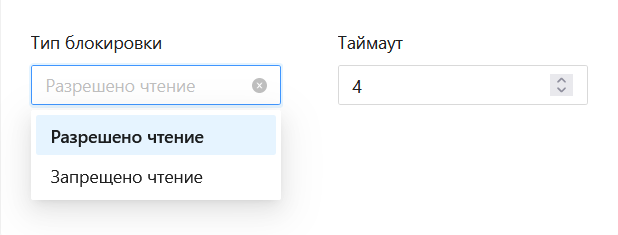

# Оркестратор 1.24.6

История изменений в Primo RPA Orchestrator за июнь 2024-го года. 

## Обновления
1. Добавлена возможность завершения задач, находящихся в статусе `InProgress`, по истечении таймаута.
https://azure-dos.s1.primo1.orch/PrimoCollection/Orchestrator/_workitems/edit/355

2. Добавлена опция **Тип блокировки** во вкладке Роботы > Ресурсы (Assets) в форме Добавить/Редактировать ресурс, позволяющая роботам устанавливать временную блокировку на ресурс. Это предотвращает чтение или запись заблокированного ассета другими роботами до снятия блокировки или истечения таймаута. Для работы с этой функцией в Студии реализован новый элемент **Заблокировать ассет**.

https://azure-dos.s1.primo1.orch/PrimoCollection/Orchestrator/_workitems/edit/10069

3. Добавлена возможность конфигурировать параметр `SecureSocketOption` для почтовой рассылки в LTools.Orchestrator.Notifications. Данный параметр улучшает безопасность почтовых рассылок.

https://azure-dos.s1.primo1.orch/PrimoCollection/Orchestrator/_workitems/edit/18609

4. Улучшена информативность ошибок и исключений в процессах. Теперь ошибки доступа и лицензий предоставляют более точную информацию о причинах проблем.

https://azure-dos.s1.primo1.orch/PrimoCollection/Orchestrator/_workitems/edit/1151

5. Улучшено логирование Оркестратора: теперь при выводе сообщения в логе отображается полное сообщение, а не только первые 200 символов. В БД запись сохраняется полностью.

https://azure-dos.s1.primo1.orch/PrimoCollection/Orchestrator/_workitems/edit/7807

6. Добавлен новый виджет **Мерцающие RDP-сессии** во вкладке **Обзор**. Виджет отображает таблицу активных RDP-сессий. При отсутствии активных сессий таблица в виджете отсутствует.
https://azure-dos.s1.primo1.orch/PrimoCollection/Orchestrator/_workitems/edit/11314

### Улучшения UX/UI

1. В разделе **Задания** исправлена ошибка, связанная с отображением и управлением заданий в статусе **Ошибка** (статус 4). Ранее задания в этом состоянии не позволяли использовать кнопки   **Запустить** и **Остановить**

https://azure-dos.s1.primo1.orch/PrimoCollection/Orchestrator/_workitems/edit/19306

2. Устранена ошибка с выбором времени запуска в повторных расписаниях. Теперь при установке времени запуска в повторном расписании выпадающий список работает корректно.

https://azure-dos.s1.primo1.orch/PrimoCollection/Orchestrator/_workitems/edit/19054

3. Добавлена интеграция с **CyberArk**  в форме **Ресурсы** -> **Добавить/Редактировать ресурс** для централизованного управления учетными данными.

https://azure-dos.s1.primo1.orch/PrimoCollection/Orchestrator/_workitems/edit/15622

4. Исправлена ошибка, при которой теги обрезались по высоте при изменении масштаба страницы на странице элементов очереди. Теперь теги корректно отображаются вне зависимости от масштаба страницы.

https://azure-dos.s1.primo1.orch/PrimoCollection/Orchestrator/_workitems/edit/17346

5. Исправлена ошибка приоритета робота в проекте. Теперь при удалении робота с приоритетом `1`, приоритет оставшихся роботов корректно сдвигается, увеличиваясь на 1.

https://azure-dos.s1.primo1.orch/PrimoCollection/Orchestrator/_workitems/edit/17156

6. Исправлена ошибка с потерей пробелов в предпросмотре метаданных элементов очереди Оркестратора. 

https://azure-dos.s1.primo1.orch/PrimoCollection/Orchestrator/_workitems/edit/972

7. Добавлена возможность фильтрации проектов по источнику публикации.

https://azure-dos.s1.primo1.orch/PrimoCollection/Orchestrator/_workitems/edit/13127

8. Исправлена ошибка некорректного пересчета статистики в очереди обмена данными. Теперь данные на диаграмме статистики и в списке элементов этой очереди отображаются корректно.

https://azure-dos.s1.primo1.orch/PrimoCollection/Orchestrator/_workitems/edit/11617

9. Исправлена ошибка отображения наименований событий в логах запусков. Теперь наименования, которые не помещаются в размер колонки, корректно обрезаются с отображением троеточия в конце, а при наведении появляется всплывающая подсказка с полным наименованием.

https://azure-dos.s1.primo1.orch/PrimoCollection/Orchestrator/_workitems/edit/13754

## Улучшения в UI 3

1. Улучшено управление элементами:
   * Упрощено удаление и клонирование элементов из очереди. Теперь элементы можно удалять или клонировать прямо через меню **Действия** на странице Очереди без предварительного выбора чекбоксом. Ранее требовалось отдельное выделение каждого элемента.
   * Добавлена возможность выделения элементов двойным кликом мыши.
https://azure-dos.s1.primo1.orch/PrimoCollection/Orchestrator/_workitems/edit/18627
https://azure-dos.s1.primo1.orch/PrimoCollection/Orchestrator/_workitems/edit/19017

2. Улучшено отображение графика:
- На вкладке **Очереди** теперь отображается количество удаленных элементов (`countRemoved`) под общим количеством через разделительную черту.
- Если значение `countRemoved` отсутствует, показывается график в стандартном виде.
- В форме редактирования очереди добавлена подсказка для поля `Физическое удаление`.

https://azure-dos.s1.primo1.orch/PrimoCollection/Orchestrator/_workitems/edit/18174

3. Добавлено отображение удаленных элементов в статистике очереди обмена данными.

https://azure-dos.s1.primo1.orch/PrimoCollection/Orchestrator/_workitems/edit/17612

4. Изменено отображение параметра `Таймаут` в форме **Ресурсы**. Параметр указывается в секундах в формах добавления и редактирования.

https://azure-dos.s1.primo1.orch/PrimoCollection/Orchestrator/_workitems/edit/17285

!!!5. Исправлена ошибка, из-за которой не отображалась информация в статистике очередей при создании большого количества очередей.

https://azure-dos.s1.primo1.orch/PrimoCollection/Orchestrator/_workitems/edit/17181

6. Во вкладке Ресурсы в формах Добавить/Редактировать ресурс добавлены новые поля: `Тип внешнего хранилища` и `Учетная запись CyberArk`.

https://azure-dos.s1.primo1.orch/PrimoCollection/Orchestrator/_workitems/edit/17162

7. Улучшена навигация между страницами **Запуски** и **Логи задания** 

https://azure-dos.s1.primo1.orch/PrimoCollection/Orchestrator/_workitems/edit/18102 

8. Исправлена ошибка отображения элементов очереди (транзакций). Теперь при изменении количества отображаемых записей все страницы элементов очереди показываются корректно.

https://azure-dos.s1.primo1.orch/PrimoCollection/Orchestrator/_workitems/edit/17547

9. Исправлена ошибка при удалении проекта из очереди. Теперь проект сразу исчезает из списка, и в правом верхнем углу отображается уведомление `Элемент очереди успешно удален`.

https://azure-dos.s1.primo1.orch/PrimoCollection/Orchestrator/_workitems/edit/17545

10. Исправлена ошибка, при которой тег проекта не удалялся после подтверждения операции. Теперь тег удаляется корректно и появляется всплывающее уведомление `Тег успешно удален`.

https://azure-dos.s1.primo1.orch/PrimoCollection/Orchestrator/_workitems/edit/17470

11. Выровнена иконка контекстного меню  в разделах **Очереди** и **Транзакции**. Теперь она соответствует стилю других вкладок.

https://azure-dos.s1.primo1.orch/PrimoCollection/Orchestrator/_workitems/edit/17290

12. Исправлены индексы в форме шаблона развертывания роботов. Теперь режимы запуска окон `Tray` и `Maximized`  работают корректно.

https://azure-dos.s1.primo1.orch/PrimoCollection/Orchestrator/_workitems/edit/9283

13. Исправлена ошибка в разделе **Запуски** на вкладке **Очереди проектов**, при применении фильтра `Продолжительность`. Теперь таблица `Очередь проектов` корректно фильтруется по установленному значению.

https://azure-dos.s1.primo1.orch/PrimoCollection/Orchestrator/_workitems/edit/20491

14. Исправлено некорректное отображение тегов проекта. Теперь добавленные теги проекта отображаются под описанием проекта или под наименованием проекта, если описание отсутствует. 

https://azure-dos.s1.primo1.orch/PrimoCollection/Orchestrator/_workitems/edit/17618

15. Исправлена некорректная работа чек-бокса `Архив` с фильтрами в разделе **Запуски**. 

https://azure-dos.s1.primo1.orch/PrimoCollection/Orchestrator/_workitems/edit/18170

## Исправленные ошибки

1. Исправлена ошибка запуска заданий. Ранее при попытке запустить задание, находящееся в статусе `Ошибка`, возвращалась `Команда Start не применима к заданию`. Теперь состояние задания корректно обновляется перед запуском, позволяя перевести задание в статус **Выполняется**

https://azure-dos.s1.primo1.orch/PrimoCollection/Orchestrator/_workitems/edit/19450

2. Исправлена ошибка, при которой робот в Оркестраторе оставался в статусе `Завершается работа` после выполнения проекта.

https://azure-dos.s1.primo1.orch/PrimoCollection/Orchestrator/_workitems/edit/17429

3. Исправлена ошибка, при котором запросы в журнал робота по ID шли без даты по всем секциям. Теперь к запросу добавлено условие по датам, чтобы запросы попадали в конкретную секцию.

https://azure-dos.s1.primo1.orch/PrimoCollection/Orchestrator/_workitems/edit/17271

4. Устранена ошибка запуска робота по E-mail, при которой робот не запускался при получении письма с темой на кириллице.

https://azure-dos.s1.primo1.orch/PrimoCollection/Orchestrator/_workitems/edit/18169

5. Исправлена ошибка в логе агента: теперь идентификаторы процессов могут переиспользоваться при интенсивном запуске и остановке множества роботов.

https://azure-dos.s1.primo1.orch/PrimoCollection/Orchestrator/_workitems/edit/18008

6. Устранена ошибка, при которой RDP сессии на учетных записях робота оставались в статусе `Disconnected`. Теперь учетные записи корректно разлогиниваются.

https://azure-dos.s1.primo1.orch/PrimoCollection/Orchestrator/_workitems/edit/17554

7. Исправлена ошибка с кнопками запуска и остановки заданий. Теперь кнопки `Запустить` и `Остановить` корректно работают как для разовых, так и для множественных запусков/остановок заданий.

https://azure-dos.s1.primo1.orch/PrimoCollection/Orchestrator/_workitems/edit/17532

8. Исправлена ошибка, при которой значения полей во вкладке **Мониторинг** сбрасывались. Теперь записи корректно фильтруются в соответствии с выставленными значениями.

https://azure-dos.s1.primo1.orch/PrimoCollection/Orchestrator/_workitems/edit/11622

9. Внесены изменения в настройки очередей **RabbitMQ**: удалены атрибуты `autoDelete` для соответствия с политиками высокой доступности (HA).

https://azure-dos.s1.primo1.orch/PrimoCollection/Orchestrator/_workitems/edit/17291

10. Исправлена проблема с загрузкой логов в Журнале роботов. 

https://azure-dos.s1.primo1.orch/PrimoCollection/Orchestrator/_workitems/edit/15678

11. Внесены изменения в работу службы **States**: исправлена утечка памяти и проблема с применением миграций. 

https://azure-dos.s1.primo1.orch/PrimoCollection/Orchestrator/_workitems/edit/15663
https://azure-dos.s1.primo1.orch/PrimoCollection/Orchestrator/_workitems/edit/13978

12. Исправлена ошибка, из-за которой транзакция, выполняемая роботом на второй машине, не отображалась в очереди задач Оркестратора.

https://azure-dos.s1.primo1.orch/PrimoCollection/Orchestrator/_workitems/edit/4089

13. Исправлена ошибка, из-за которой робот оставался заблокированным после принудительного завершения процесса. Теперь при повторном запуске робот корректно разблокируется и проект запускается без проблем.

https://azure-dos.s1.primo1.orch/PrimoCollection/Orchestrator/_workitems/edit/13751

14. Исправлена ошибка, при которой пропадали аргументы в задании при повторной загрузке ZIP-файла проекта. Теперь после повторной загрузки архива все аргументы остаются неизменными.

https://azure-dos.s1.primo1.orch/PrimoCollection/Orchestrator/_workitems/edit/11468

!!! Уточнить к Екатерины 15. Исправлена ошибка с незавершающимися процессами `astra-event-watcher` после работы робота. Теперь процессы завершаются корректно, без накопления зависших процессов.

https://azure-dos.s1.primo1.orch/PrimoCollection/Orchestrator/_workitems/edit/13677

16. Исправлена уязвимость с Nuget.Packaging в службе RobotLogs. Использованы последние версии пакетов NuGet.

https://azure-dos.s1.primo1.orch/PrimoCollection/Orchestrator/_workitems/edit/17505

17. Изменен статус ошибки `Нехватка лицензий` на более понятный `Достигнуто максимальное количество работающих роботов на машине`.

https://azure-dos.s1.primo1.orch/PrimoCollection/Orchestrator/_workitems/edit/10073

18. Исправлена ошибка блокировки триггера **Запуск при получении E-mail**. Ранее при указании неверных учетных данных триггер оставался заблокированным и не срабатывал при последующих попытках. Теперь при ошибке/исключении в обработке триггер автоматически разблокируется.

https://azure-dos.s1.primo1.orch/PrimoCollection/Orchestrator/_workitems/edit/18180

19. Исправлена ошибка в разделе **Запуски**, из-за которой фильтрация по дате не работала с другими фильтрами. Теперь фильтры по дате можно сочетать с другими фильтрами.

https://azure-dos.s1.primo1.orch/PrimoCollection/Orchestrator/_workitems/edit/20484

20. Исправлена ошибка удаления проекта при удалении двух его версий. Теперь корректно удаляются только выбранные версии проекта. 

https://azure-dos.s1.primo1.orch/PrimoCollection/Orchestrator/_workitems/edit/19001

## Где найти
[Скачать комплект поставки Оркестратора:](https://disk.primo-rpa.ru/index.php/s/primo?path=%2FRelease%2FOrchestrator)
* **Primo RPA Orchestrator 1.24.6 FULL.zip** — полный комплект поставки, в который входят дистрибутивы Оркестратора и внешних компонентов: например, базы данных PostgreSQL Server, брокера сообщений RabbitMQ и др. 
* **Primo RPA Orchestrator 1.24.6.zip** — облегченный вариант поставки.

[Скачать дистрибутив Robot Enterprise](https://disk.primo-rpa.ru/index.php/s/primo?path=%2FRelease%2FRobot). Архив должен иметь название **Primo RPA Robot Orchestrator <архитектура> 1.24.6.zip**. Дистрибутив этого робота загружается непосредственно в Оркестратор.
