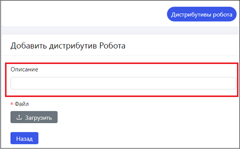
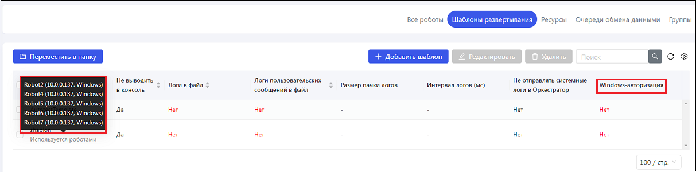
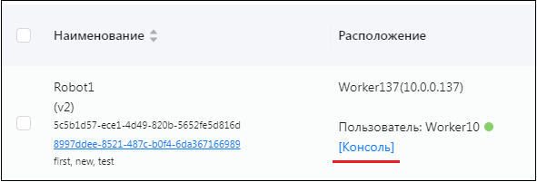

# Primo RPA Orchestrator 1.25.3

Данный документ описывает улучшения и исправления ошибок, внесенные в релиз **Primo RPA Orchestrator 1.25.3** за март 2025 года.

## Основные обновления и улучшения

1. Оптимизирована выборка элементов очереди по тегам, что сократило время получения данных при больших объемах (от 10 000 элементов).
2. Теперь триггер 'Запуск при получении Email' поддерживает указание конкретной подпапки почтового ящика. В интерфейс добавлено необязательное поле **"Папка"**, доступное для заполнения при выборе почты типа **IMAP** или **Exchange**. Если письмо приходит в указанную подпапку, задание с данным триггером запускает проект.
3. Патч безопасности: Теперь тип шифрования (название переменной PRIMOSALT) и ключ подписи JWT (PRIMOSIGNINGKEY) могут задаваться через переменные окружения, обеспечивая гибкую настройку для разных контуров. Primo.Orchestrator.PasswordEncryptor использует значение переменной окружения PRIMOSALT на машинах, где эта переменная задана.


### Обновления и улучшения (Agent, RobotLogs и другие службы)

1. Реализована возможность задавать фильтрацию для событий робота, что позволяет исключить дублирование записей в логах. Для включения фильтрации в конфигурационном файле **RobotLogs** необходимо указать:
```json
"RobotEventFilter": {
  "Enabled": true,
  "ParsedElementClasses": [ "LTools.Workflow.Elements.WFAddToLog" ]
}
```
2. Реализована и подключена к службам **Agent, MachineInfo, RDP2, RobotLogs, Notifications, Analytic, LogEventsWebhook** настраиваемая подсистема мониторинга. Настройка осуществляется в разделе **Monitoring** файла конфигурации конкретной службы. Внешняя служба сбора данных может использовать **Zabbix** или **Prometheus**. Пример:
```json
"Monitoring": {
  "Provider": "Zabbix", // "", "Zabbix" or "Prometheus"
  "Port": 10052,
  "DotNetMonitoringEnabled": true
}
```


## Обновления и улучшения веб-интерфейса 2.24.0

1. В форму загрузки дистрибутива робота добавлено поле **Описание** (**Description**), которое отображается в списке дистрибутивов роботов и при выборе дистрибутива в форме создания нового робота.



2. Добавлена возможность **останавливать несколько заданий одновременно** — теперь при выборе нескольких заданий доступна кнопка **"Остановить"**.
3. Изменен внешний вид вкладки **Роботы > Шаблоны развертывания**:
   - Скрыты по умолчанию колонки: "Формат журнала", "Приоритет потока", "Приоритет приложения", "Кол-во потоков", "Индекс первого потока", "Минимальное кол-во потоков".
   - Добавлена колонка **"Windows-авторизация"**.
   - Добавлен вывод **IP-адреса и операционной системы** во всплывающей подсказке.
   
   
 
4. На странице **Все роботы** кнопка **[Консоль]** перенесена в столбец "Расположение".



5. Оптимизирована компоновка элементов на вкладке **Роботы > Очереди обмена данными**.
6. Добавлена **горизонтальная полоса прокрутки** для таблиц, позволяющая при перетаскивании просматривать не поместившееся содержимое.
7. Исправлена ошибка, из-за которой во вкладке **Настройки > Система > Дистрибутивы агента** при перетаскивании архива в область загрузки дублировалась строка с файлом.
8. Решена проблема, из-за которой при повторном открытии вкладки **Задания** отображалось некорректное количество доступных кнопок.
9. В форме **Роли** добавлены чекбоксы в заголовках колонок, позволяющие выделять все элементы в данной колонке одним кликом.


## Исправленные ошибки

1. Исправлена ошибка работы служб **Notifications, States и WebApi** после сброса очередей **RabbitMQ** — теперь службы корректно подключаются и не завершаются с ошибками **NOT_FOUND**.
2. Исправлена ошибка, из-за которой робот мог выполнять задание без взятия свободной лицензии. Теперь лицензии корректно привязываются к конкретному запуску.
3. Исправлена ошибка, из-за которой `ClaimValue = 171` не добавлялся автоматически для ролей **Administrator** и **TenantAdministrator**, что приводило к ошибке **403** при обновлении ролей **KeyCloak**.
4. Исправлена ошибка, из-за которой параметр **"Разрешить наложение"** в заданиях Оркестратора не работал корректно. Теперь при одновременном срабатывании нескольких триггеров проект не запускается параллельно на нескольких роботах и не отправляется в очередь для отложенного параллельного запуска.
5. Исправлена ошибка, в результате которой не отображались логи клиентского робота в Оркестраторе, и при попытке открытия вкладки **Журнал > Клиентские роботы** выдавалось сообщение об ошибке "Server error".
6. Исправлена ошибка, из-за которой теги отображались в случайном порядке вместо заданного.
7. Устранена ошибка, возникавшая в Оркестраторе с **PostgreSQL**, когда при выставленной галочке **"Одновременно"** для фильтра по тегам элементов очередей результирующая выборка возвращала в том числе элементы, у которых отсутствовали требуемые теги.
8. Исправлена ошибка, из-за которой при использовании MsSqlServer 2016 роботы массово не запускались при большом количестве одновременно активных заданий.
9. Исправлена ошибка в работе фильтра в журнале клиентских роботов, из-за которой было невозможно выбрать **дату последнего завершения** для использования в фильтре (выдавалось сообщение об ошибке **"Server Error"**).
10. Исправлена ситуация со срабатыванием триггера **"Запуск на изменение папки"** на временные файлы **MS Office (Word/Excel)**, создающиеся при редактировании файлов. Теперь триггер игнорирует файлы, имя которых начинается с `~`, и не запускает старт робота при появлении подобных файлов.


## Где найти

[**Скачать Primo RPA Orchestrator**](https://disk.primo-rpa.ru/index.php/s/t9BHBjR6PP06Yax?path=%2FRelease%2FOrchestrator)

[**Скачать дистрибутив Primo RPA Robot Enterprise**](https://disk.primo-rpa.ru/index.php/s/t9BHBjR6PP06Yax?path=%2FRelease%2FRobot)

Если у вас возникнут сложности с установкой или использованием данной версии, обращайтесь к вашему менеджеру или в [чат поддержки в Telegram](https://t.me/primo_RPA_chat).

