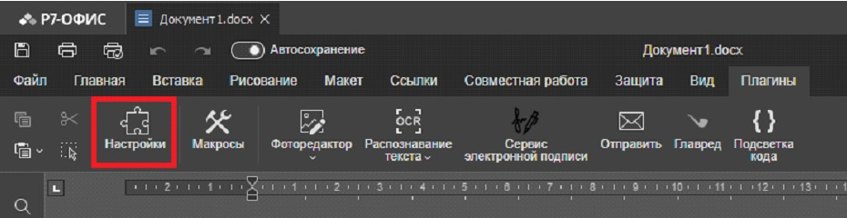
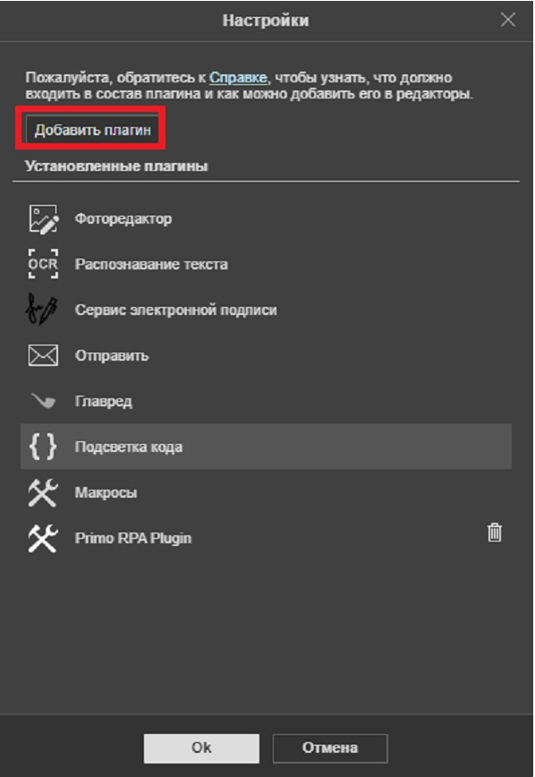
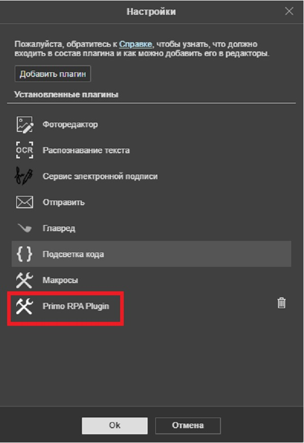

# Primo.Office.P7 

Пакет **Primo.Office.P7** предназначен для взаимодействия платформы **Primo RPA** с российским офисным пакетом **Р7-Офис**. Интеграция с Primo RPA позволяет существенно ускорить работу с документами и таблицами при выполнении повторяющихся задач.

Пакет доступен для скачивания двумя способами:
#### 1. С сайта NuGet:
Скачать пакет по следующей ссылке:  
- [Primo.Office.P7 на NuGet.org](https://www.nuget.org/packages/Primo.Office.P7)

#### 2. Через управление зависимостями в Primo RPA Studio:
Чтобы установить пакет через Primo RPA Studio, выполните следующие шаги:

1. Откройте Primo Studio и перейдите в меню *Управление зависимостями*.
2. В левой части окна выберите источник *NuGet.org*.
3. В поле поиска введите *Primo.Office.P7*.
4. Найдите пакет *Primo.Office.P7* и выполните одно из следующих действий:
   - Если пакет еще не установлен, нажмите *Установить*.
   - Если пакет уже установлен, но требуется обновление, нажмите *Обновить до последней версии*.
5. После выбора нажмите кнопку *Сохранить*.
6. В появившемся окне подтверждения установки нажмите *Установить*.
7. Дождитесь завершения установки и проверьте, что пакет успешно добавлен.

### Активности, добавляемые после установки

**Для работы с текстовыми документами (Документ Р7):**
1. *Ввод текста* — добавление текста в документ.
2. *Документ Р7* — открытие или создание текстового документа.
3. *Заменить текст* — поиск и замена текста в документе.
4. *Запустить макрос* — выполнение встроенного макроса.
5. *Запустить скрипт* — запуск пользовательского скрипта.
6. *Сохранить документ* — сохранение изменений.
7. *Удалить текст* — удаление текста из документа.
8. *Чтение текста* — извлечение текста для обработки.

**Для работы с таблицами (Таблицы Р7):**
1. *Добавить страницу* — создание новой страницы.
2. *Переименовать страницу* — изменение названия страницы.
3. *Список страниц* — получение списка всех страниц.
4. *Удалить страницу* — удаление указанной страницы.
5. *Запись диапазона* — запись данных в диапазон таблицы.
6. *Запустить макрос* — выполнение встроенного макроса.
7. *Запустить скрипт* — выполнение пользовательского скрипта.
8. *Изменение цвета фона* — настройка цвета фона ячеек.
9. *Изменение ячейки* — редактирование содержимого ячеек.
10. *Сохранить документ* — сохранение изменений в таблице.
11. *Таблица Р7* — открытие или создание таблицы.
12. *Удаление диапазона* — удаление данных из указанного диапазона.
13. *Чтение диапазона* — извлечение данных из диапазона таблицы.

Cписок изменений по версиям:
[Primo.Office.P7 0.0.2](https://docs.primo-rpa.ru/primo-rpa/release-notes/packages/windows/primo-office-p7/0.0.2)

### Плагин Primo RPA Plugin для P7-Офис

Для корректной работы в **Документ P7-Офис** необходимо выполнить следующие шаги:

#### 1. Получение файла плагина Primo RPA Plugin
Файл плагина `primo_p7.plugin` предоставляется по запросу. Чтобы получить его, свяжитесь с технической поддержкой **Primo RPA**.

#### 2. Установка плагина Primo RPA Plugin
1. Скачайте файл `primo_p7.plugin`.
2. Откройте *P7-Офис* и перейдите в меню *Настройки*.

3. Нажмите кнопку *Добавить плагин*.

4. Укажите путь к файлу `primo_p7.plugin`.
5. Подтвердите установку плагина.
6. Убедитесь, что *Primo RPA Plugin* появился в списке установленных плагинов.

