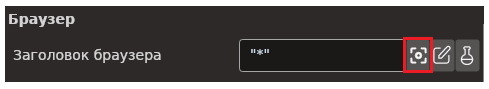
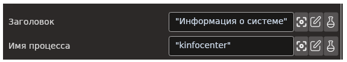
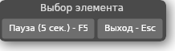

# Primo RPA Studio Linux 1.25.3

Раздел содержит описание изменений для версии приложения **Primo RPA Studio Linux 1.25.3**, выпущенной в марте 2025 года. 

## Новые функции и улучшения

1. Реализована возможность захвата заголовка браузера селектором для активности **Присоединиться к браузеру**. Для этого в интерфейс была добавлена кнопка *Выбрать страницу*, которая при помощи селектора позволяет выбрать открытый в системе браузер (при условии если браузер совпадает с параметром *Тип браузера*). В результате работы селектора получаем заполненный параметр *Заголовок браузера*.  
  
1. Реализована возможность захвата заголовка окна и имени процесса селектором для активности **Присоединиться к приложению**, для чего в интерфейс была добавлена соответствующая кнопка. При нажатии кнопки появляется возможность захватить окно десктопного приложения. При выборе захваченного элемента необходимые данные сохраняются.

1. Реализован элемент группы **Программирование** - **Командная строка**.
1. Для элементов группы **Работа с UI** реализована возможность выбирать *Область* для уточнения местоположения элементов.
1. Реализована задержка захвата для выпадающих списков в браузере. Для этого в редактор шаблона поиска было добавлено окно **Выбор элемента**, появляющееся во время работы с браузером. Кнопка *Пауза* в данном окне выполняет паузу во время поиска элементов.  
 
1. Добавлено свойство *Видимость* в активность **Присутствие элемента**. Это свойство дополняет шаблон поиска дополнительным фильтром. Если значение свойства установлено, то из элементов, подходящих шаблону поиска, отфильтровываются те, у которых сброшено свойство Visible, то есть те, которые нельзя увидеть на форме приложения или на странице браузера. 
1. При работе селектора, запущенного кнопкой *Выбрать элемент* на активности группы **Работа с UI**, теперь нет необходимости указывать какой тип селектора использовать, для рабочего стола или для браузера. Система сама автоматически определит тип приложения, которое находится под мышкой и запустит соответствующий селектор.  
1. Логика работы с лицензиями для Robot Runner и Студии приведена в соответствие с логикой работы Windows-версий продуктов. Реализована возможность использования локальной лицензии; кроме того, при отсутствии лицензии пользователь имеет возможность запросить ее у вендора через всплывающее окно генерации запроса лицензии.
1. Обновлена  браузерная версия расширений для браузеров Яндекс и Chrome до 3.78 (1.78).  
1. Улучшена производительность браузерного селектора, теперь не происходит деградации производительности при работе с большими страницами.
1. Реализована возможность валидации настроек шаблона для проверки корректности шаблона (селектора) на этапе выбора свойств.
1. Добавлены кнопки *Раскрыть все элементы* и *Свернуть все элементы* для сворачивания/разворачивания каталогов, содержащих активности, в панели **Элементы**.  
  
1. При создании нового проекта и использовании типа процесса *Последовательность*, создаваемой последовательности теперь присваивается название, совпадающее с названием проекта.
1. Расширена документация, описывающая эмуляцию работы горячих клавиш при использовании Студии Линукс.
16. Расширена документация по запуску робота из командной строки - обновлен список аргументов, используемых для запуска робота

## Исправленные ошибки 

1. Исправлена ошибка, из-за которой не работал флажок *Искать во фреймах* для активностей **Работа с UI** при использовании в браузере.
1. Исправлена работа десктопного редактора шаблона поиска для активностей группы **Работа с UI**: теперь если очистить поле *Наименование процесса* в редакторе шаблона, заголовок окна остается на месте (не исчезает).
1. Исправлена ошибка, из-за которой при запуске проекта с активностью **Клик мышью** группы **Работа с UI**, если клик был сделан в приложении на рабочем столе или в браузере, происходил аварийный выход из активности с сообщением "Отсутствует элемент с классом "" из сборки """.
1. Откорректировано приведение типов в активности **Json to Object**: теперь при преобразовании строки json в переменную записывается корректный тип данных.
1. Решена проблема, из-за которой процесс *yandex_browser* не закрывался при попытке уничтожить его активностью **Уничтожить процесс**. 
1. Для активности **Рабочий стол: Прокрутка** исправлен тип данных в подсказке для вывода прокрутки (теперь он корректно указан как `System.Nullable`).
1. Для элементов группы **Рабочий стол** устранена проблема, из-за которой при выборе пикером не сохранялись атрибуты в шаблон поиска.
1. Исправлено поведение всплывающей подсказки во время работы селектора для элементов групп **Браузер** и **Рабочий стол** - всплывающая подсказка "Выбрать компонент" исчезает корректно.
1. Исправлена ошибка, из-за которой в Robot Runner на Astra Linux при вызове окна **О программе** (или **About**) во всплывающем окне появлялось сообщение об ошибке "Object reference not set to an instance of an object".
1. Исправлена ошибка, из-за которой в Robot Runner при прокрутке содержимого выпадающих списков *Проект* и *Процесс* происходило динамическое изменение ширины этих выпадающих списков.
1. Внесены исправления в работу с Python кодом - устранено некорректное подсвечивание ошибок синтаксиса в активностях внутри Python-процессов.
1. Откорректировано поведение редактора шаблона поиска: теперь окно редактора открывается в единственном экземпляре, новое окно открыть невозможно, пока не будет закрыто предыдущее. 
1. Найдено решение проблемы с аварийным выходом из Студии при попытке скопировать текст вывода консоли (в UI Студии) с помощью комбинации клавиш "Ctrl + C".
1. Исправлена проблема, с из-за которой валидация настроек шаблона поиска в малом редакторе шаблона игнорировала снятие флажков из чекбоксов.
1. Решена проблема с аварийным выходом из Студии при попытке открытия свойств активности из Nuget пакета.
1. Внесены исправления в работу браузерного селектора: теперь он корректно выделяет элементы, а рамка подсветки не исчезает.

## Где найти 

[Скачать дистрибутив Primo RPA Studio Linux](https://disk.primo-rpa.ru/index.php/s/t9BHBjR6PP06Yax?path=%2FRelease%2FStudio)

[Скачать дистрибутив Primo RPA Robot](https://disk.primo-rpa.ru/index.php/s/t9BHBjR6PP06Yax?path=%2FRelease%2FRobot)

